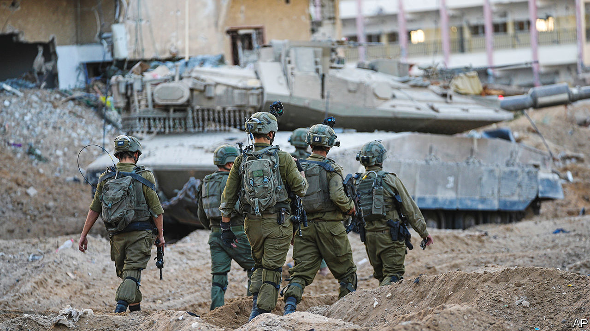
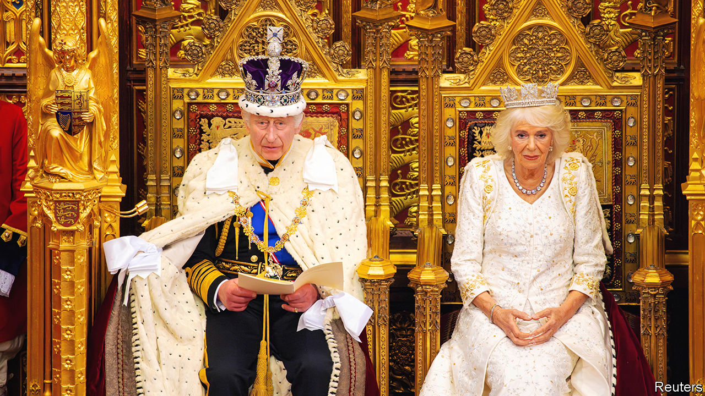

###### The world this week

# Politics 

#####  

 

> Nov 9th 2023 

said that its soldiers were operating in the “heart” of Gaza city, where it believes Hamas’s underground headquarters are located. Yoav Gallant, Israel’s defence minister, said that Yahya Sinwar, the head of Hamas in Gaza, had been isolated in his bunker (though he did not say where). Binyamin Netanyahu, the Israeli prime minister, said that Israel would be responsible for Gaza’s security for an indefinite period after the war.

The next day , America’s secretary of state, said that after the war Gaza and the West Bank should be unified under the control of the . Mr Blinken sought to persuade Mr Netanyahu to agree to a humanitarian pause. The American diplomat met Mahmoud Abbas, the president of the PA, who demanded an immediate ceasefire. American warplanes struck a weapons depot in Syria used by Iran.

More than 10,500 , including 4,300 children, have been killed in the , according to Gaza’s Hamas-run health ministry. Civilians continued to flee from the north of the enclave where the fighting is fiercest.

A year out from America’s presidential election, triumphed in several state races. They took full control of the General Assembly in Virginia, and in Andy Beshear was re-elected as governor. Voters in  passed a constitutional amendment to guarantee abortion access.

 lashed out at his accusers in a civil fraud trial in New York. In a four-hour testimony the former president disputed claims that he had deceived banks in his real-estate dealings. In September he was found liable for fraud; the trial will determine his punishment. Separately, Mr Trump skipped the third debate of Republican presidential hopefuls.

launched its biggest drone attack on  in weeks, targeting infrastructure in the country’s west and south. It also struck homes in Kharkiv, the second-largest city, and a civilian ship in Odessa, on the Black Sea. Volodymyr Zelensky, Ukraine’s president, warned that Russia was ramping up its attacks ahead of the winter.

The more the merrier

The  executive recommended opening accession talks with  and  when the bloc’s leaders next meet in mid-December. Ukraine, which was granted candidate status after it was invaded by Russia last year, was lauded for its reforms. The EU’s annual enlargement report also flagged some remaining problems with corruption and the mistreatment of minorities.

António Costa,  prime minister since 2015, resigned after police searched his residence and detained his chief of staff, as part of a corruption probe. The investigation is looking into lithium mines and a green-hydrogen plant, which Mr Costa’s Socialist government has enthusiastically endorsed.

 president, Andrzej Duda, gave the right-wing prime minister, Mateusz Morawiecki, the first shot at forming a government after his party, Law and Justice, came first in a general election in October. Mr Morawiecki is unlikely to succeed. The liberal opposition has the numbers in parliament to rule in coalition, so Mr Duda’s move will merely delay the handover of power.

 opposition replaced its long-time leader, Kemal Kilicdaroglu, half a year after he lost that country’s presidential and parliamentary elections. The CHP’s new head, Ozgur Ozel, promised to shake up its “passive politics” before local elections early next year.

In a sign of warming relations,  visited  He was the first  prime minister to do so in seven years. Tensions had mounted over Chinese tariffs on Australian goods. Mr Albanese, who took office last year, has slightly softened his country’s hawkish stance towards its biggest trade partner. He said talks with Xi Jinping, the Chinese president, yielded “significant progress”.

A month of elections in which nearly one-sixth of will pick representatives in five states kicked off with voting in Chhattisgarh and Mizoram. The polls are an early test for Narendra Modi, India’s popular prime minister, who wants to win a third term in next year’s election.

worst earthquake since 2015 killed at least 157 people. The 6.4-magnitude quake struck shortly before midnight on Friday. Around 4,000 homes were damaged or destroyed in the districts of Rukum and Jajarkot.

The UN said that the cultivation of  in Afghanistan, until recently the world’s biggest producer, had dropped by 95% since the Taliban government banned the crop in April 2022. 

Paper refuses ink

 president, Gabriel Boric, has called a referendum on another  to replace the country’s charter. In September Chileans rejected a radical left-wing proposal; next month they will consider a conservative constitution that includes a total ban on abortion. Polls suggest voters will sink the second attempt, too.

Mediators failed to get the two sides in  civil war to agree to a ceasefire. The fighting has forced millions from their homes and sparked extreme violence.

Dozens of UN peacekeepers have been injured in attacks on their convoys as they were withdrawing from northern . The UN mission also destroyed equipment that could not safely be withdrawn after Mali ordered it to leave by the end of the year while also denying its requests to provide air support for the withdrawal.

 


 delivered his first King’s Speech at the official state opening of . The address laid out the Conservative government’s agenda for the last full parliamentary year before the . The proposed bills include a phased ban on cigarettes, tougher sentences for serious criminals and expanded drilling for oil and gas in the North Sea.

Britain criminalised the possession of —the third-most popular drug among young people in the country. Users could face two years in jail. Prolonged use of nitrous oxide can cause nerve damage. The gas’s medical and culinary uses, to dull pain and whip cream respectively, will remain legal.

Rain and drought dragged down this year’s  to a six-decade low, and 7% below last year’s harvest, the International Organisation of Vine and Wine estimated. France overtook Italy as the world’s largest winemaker.

