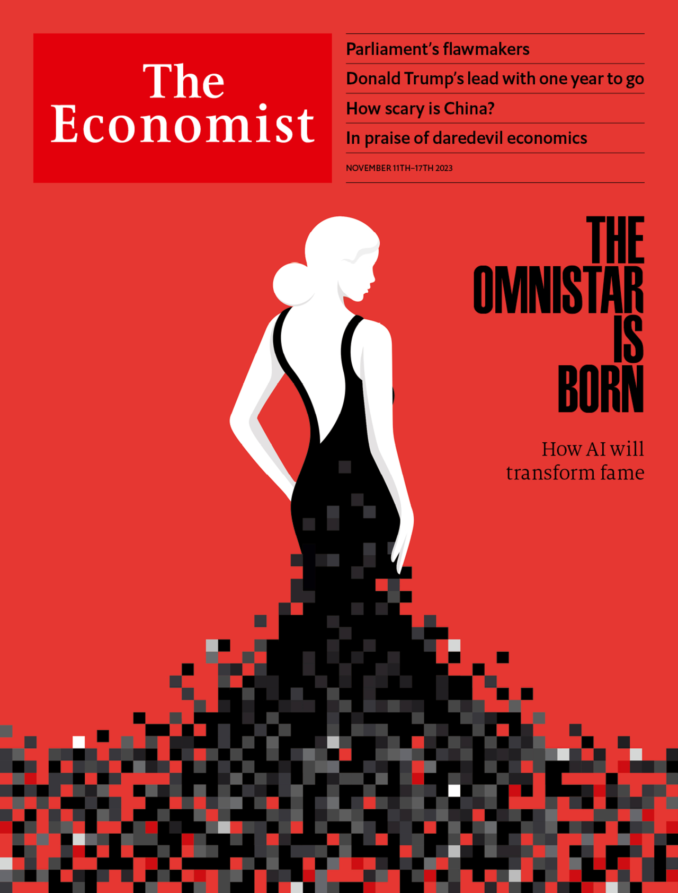

###### The world this week

# This week’s covers 

##### How we saw the world 

> Nov 9th 2023 

We have two covers this week. In America and Asia we focus on China. For most of next year, the race for the White House will be a cacophony of China-bashing. But there is a risk that America’s view of Chinese power slides into caricature, triggering confrontations and, at worst, an avoidable conflict. America needs a sober assessment not just of China’s strengths, but also of its military, economic and political weaknesses.

 


 

 


Our European cover looks at artificial intelligence (ai), and the idea that after decades of disruption by computers of humdrum jobs, AI is now coming for the most glamorous ones. Stars of film, music and literature worry that ai is stealing their work and giving less talented performers the skills to snatch their audiences. But far from diluting star power, ai will make the biggest celebrities bigger than ever, by allowing them to be in all markets, in all formats, at all times.

 


 

