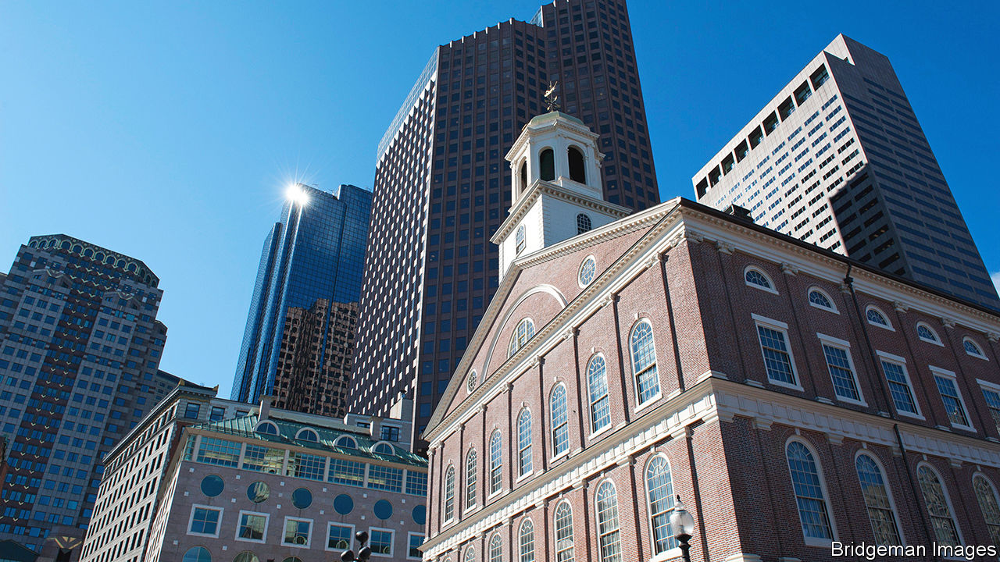

###### Indefensible, unpronounceable

# Boston’s “cradle of liberty” was paid for with slavery profits 

##### But it still may not be right to rechristen a building named after a slave trader 

 

> Nov 9th 2023 

TO MANY AMERICANS, Faneuil Hall is sacred ground. Built in 1742 as a market place and meeting hall, it became the centre of Boston’s civic life. In the years leading to the American revolution, town-hall meetings became debates on the Sugar Tax of 1764, the Stamp Act of 1765 and taxing tea. It was where Bostonians like Samuel Adams voiced dissent against what they saw as oppressive British policies. Later it became a forum where anti-slavery advocates held rallies and organised against fugitive-slave laws. Abolitionists such as William Lloyd Garrison and Frederick Douglass, who had escaped from slavery, gave impassioned speeches. Suffragists also used Faneuil Hall to rally support for political and social rights for women. 

But the building known as the “cradle of liberty”, like much of American history, is scarred by slavery. Its construction was funded by, and named after, Peter Faneuil, a wealthy merchant who owned slaves and profited from the slave trade, including partially financing ships that went to Africa. Last month Boston’s city council passed a resolution asking the city to give Faneuil Hall a nobler name, such as “Liberty Hall”, or perhaps rename it after Douglass or Crispus Attucks, a sailor of African and indigenous ancestry, who was killed by British soldiers in the Boston massacre. The resolution is toothless, because only the city’s public-facilities commission can rename buildings owned by the city. But it is symbolically important. 

Boston is the latest to contemplate changing a landmark name. Earlier this year America’s military establishment began changing army-base names referring to Confederate officers: Fort Bragg became Fort Liberty. The navy renamed the  , which commemorates a Confederate victory, for Robert Smalls, a black civil-war hero. Since 2015, more than 480 Confederate symbols have been renamed, removed or moved from public places, according to the Southern Poverty Law Centre, which keeps count.

Renaming Faneuil Hall is perhaps not such an obvious move. Arguments to remove Confederate names, many of which came into being decades after the civil war and were designed to reinforce segregation and Jim Crow laws, are clearer. Peter Faneuil is a bit more complicated, given the building’s role in creating America and helping the abolitionist movement. “If you’re not changing how the story exists,” says Noelle Trent of the Museum of African-American History in Boston &amp; Nantucket, “if you’re not changing people’s awareness around that name-change and the conversation around it, then its impact is minimal.”

A newish exhibition in Faneuil Hall about slavery in Boston highlights individual slaves, including “Peter”, who ran away from the Faneuil family. It aspires to teach Faneuil Hall’s visitors—the building welcomes 18m of them a year—about Boston’s role in the slave trade, as well as about how its enslaved people lived. A portrait of Faneuil hangs in the meeting hall. Until recently, visitors would have assumed he was one of the country’s founding fathers. George Washington’s portrait hangs nearby. Now, there is context. Byron Rushing, a civil-rights activist and a former state representative, is reluctant to see the name change. “Eradicate it and no one will ever ask again, ‘Who was Faneuil?’”■


