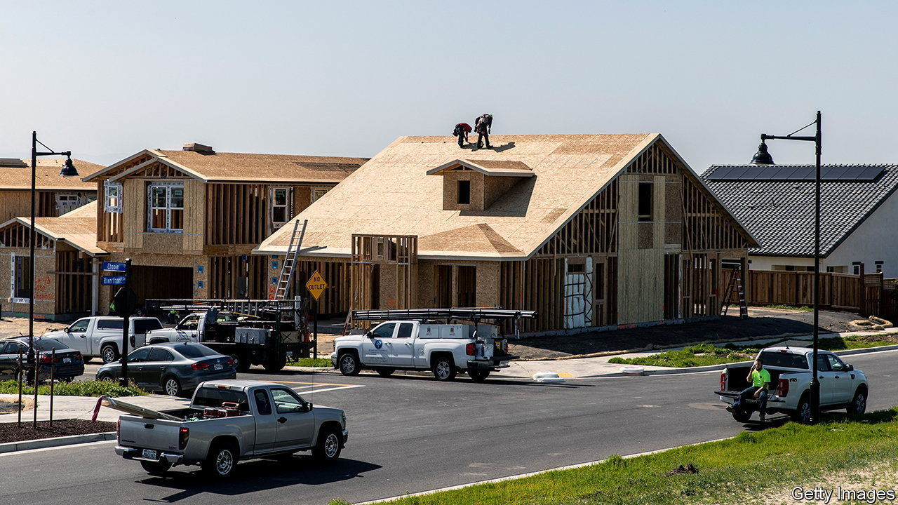
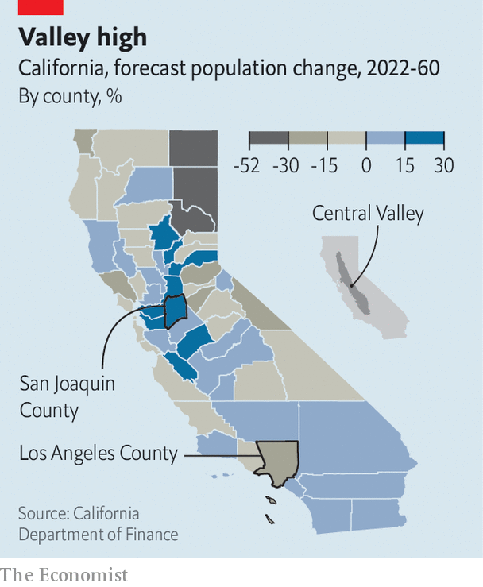

###### East of Eden

# California is losing people, but this region wouldn’t know it 

##### Growth in inland areas comes with its own risks 

 

> Nov 9th 2023 

TO DRIVE AROUND Lathrop, a small town in California’s Central Valley, is to see a rural community in the throes of rapid development. Shelley Burcham is the town’s economic-development administrator. She takes your correspondent round in a silver Tesla, explains which fast-food joints are new (In-N-Out Burger), when new apartments were built (now leasing!) and where almond groves will be ploughed under to create an industrial park. “There’s goats there now,” she says, pointing to a field, “but if you come back again there will be something built there.” 

The biggest story in California recently has been the reversal of what had hitherto been the state’s defining characteristic: population growth. The Golden State lost people for the first time in its history in 2021. Republican governors claim that people are “voting with their feet”, and that California’s population loss is a reflection of poor governance. But not every place in in the state is shrinking. Recent estimates from California’s Department of Finance suggest that the counties projected to grow most over the next four decades are inland from the coast and in the Central Valley, the state’s agricultural heartland.

 


Two factors explain this. First, birth rates in Central Valley counties are higher than in more populous areas, a trend which is mirrored in rural and urban counties across America. The second reason valley communities are growing is because there is a migration under way within California. More San Franciscans moved to Alameda County, across the Bay, than anywhere else between 2020 and 2021. Roughly a quarter of those who left Alameda County, which includes Oakland, moved to two neighbouring counties to the east. The Silicon Valley investors who want to build a  in Solano County, between Napa’s vineyards and the state capital, Sacramento, are no doubt aware of the area’s allure to members of the techsodus. 

Something similar is unfolding in Southern California. During the first year of the covid-19 pandemic, nearly a quarter of all LA  moved east to San Bernardino or Riverside counties, an area aptly known as the Inland Empire. It is true that many Californians have left for Texas or Arizona. But most Californians who decide to move are not quitting the Golden State, they are just quitting the coast. 

One of the biggest beneficiaries of this inland migration is San Joaquin County, which contains Lathrop. The state’s projections suggest it will be the second-fastest-growing county over the next four decades, by 25%, to nearly 1m residents by 2060. Only Butte County, in the foothills of the Sierra Nevada, will grow faster as it recovers from a wildfire that  in 2018. 

Ms Burcham attributes Lathrop’s growth to its site at the nexus of big highways, and its proximity to the Bay Area. The state attributes it to the fact that Lathrop, unlike coastal California, is building plenty of housing. A master-planned community being built along the western bank of the San Joaquin river will, when complete, boast 15,000 homes. Susan Dell’Osso, the project’s developer, says that before the pandemic about 75% of homes sold were to families moving from the Bay Area. Now that figure is more like 90%. 

In some ways, California’s inland migration is history repeating itself. After the second world war, a population boom and the mass production of suburban tract houses created the urban sprawl that Los Angeles is infamous for. The availability of single-family homes burnished the idea of the California Dream. “The primal mythmakers of California are its real-estate agents,” wrote D.J. Waldie, the author of “”. The development of places like Lathrop suggests that the same suburban ideals are still what Californians want, just cheaper. The average home price in San Joaquin County is roughly two-thirds the state figure.

Coastal Californians expecting to build utopias amid the valley’s farms may be disappointed, though. The valley is  and extreme heat, both of which will worsen as the climate warms. Some years people get lucky and the levees hold, says Jeffrey Mount, a water expert at the Public Policy Institute of California, a think-tank. “But eventually”, he warns, “water finds the flaw.”■


