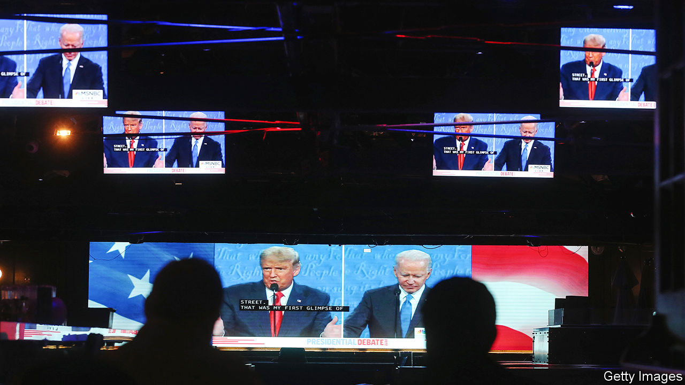
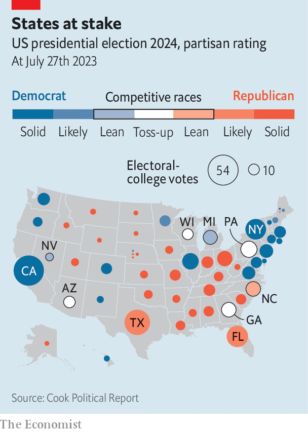
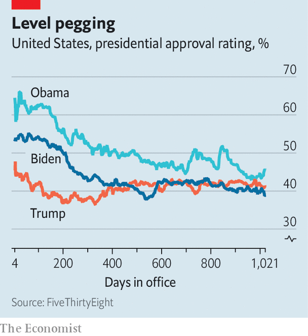

###### It can’t happen here (again)

# Donald Trump looks terrifyingly electable 

##### If America’s presidential election were held tomorrow, he would probably win 

 

> Nov 7th 2023 

WHAT MIGHTY armour Donald Trump wears. It is undented by a post-presidential impeachment trial, four ongoing  for 91 alleged felonies and all the attacks of the Republican challengers for the party’s nomination in 2024. Mr Trump’s hold over his party looks ironclad. His challengers appear quixotic as the first ballots of the primary, to be cast in Iowa in January, draw nearer. Shy to criticise the popular former president, his rivals have repeatedly argued that Mr Trump would be unable to defeat President Joe Biden. Democrats, who refused to even entertain the idea of persuading the octogenarian president to stand aside, seemed to share this analysis. Both have gravely underestimated Mr Trump. He has a considerable chance of being elected president—fair and square—in one year’s time on the first Tuesday in November 2024. If the election were to be held tomorrow, he would even be considered the favourite.

 


Even among Biden fans, . Over the weekend the  released a series of polls conducted with Siena College in the six swing states that will almost certainly decide the result of the 2024 elections (see map). To sleepwalking Democrats, who believe that Mr Trump has been rendered unelectable after his shameless attempt to overturn the previous election, the results were like a bucket of cold water in the face.

In Arizona, Georgia, Michigan, Nevada and Pennsylvania they found Mr Trump to be leading among registered voters by a margin of at least four points. They found a lead for Mr Biden only in Wisconsin, by a margin of two points. Below the disappointing toplines, the crosstabs contained more worrying findings. In these critical states 42% of Hispanic and 22% of African-American voters said they would vote for Mr Trump, which, if true, would mark the collapse of the minority support that Democrats had relied on for decades. 

Voters also said they trusted Mr Trump to do a better job of handling the economy (59% to 37% for Mr Biden); immigration (53% to 41%); and even the Israeli-Palestinian conflict (50% to 39%). Seven in ten voters said they thought Mr Biden was too old to be an effective president—including a majority of Democrats. The polling was so inauspicious that David Axelrod, the prominent Democratic political strategist who helped elect Barack Obama, gently suggested that Mr Biden should consider standing down.

Should Democrats be in such a panic? They might first try to console themselves by appealing to the vagaries of sampling error. Polling is increasingly difficult because fewer Americans respond to pollsters, making construction of a representative sample of voters very hard. This is especially true for measuring sentiment among demographic subgroups, such as African-American or Hispanic voters, for whom sample sizes are even smaller than the several thousand who might be drawn up in a poll. Yet other head-to-head polls show a tight contest, suggesting that the result is not an outlier.

The better argument for those who defend Mr Biden is that polls are a snapshot in time, and that public opinion drifts. As two political scientists, Christopher Wlezien and Will Jennings, found in their study of decades of elections in scores of countries, head-to-head polls conducted one year ahead are almost useless at predicting the eventual outcome. American presidential contests are usually close, and polls tighten in the months leading up to the election. “Are we living in a world where we should see an eight-point shift?” asks John Sides, a political scientist at Vanderbilt University, pointing out that Mr Biden losing by five points in Michigan would be significantly worse than his victory margin of three points in 2020. “It doesn’t seem plausible to me to assume you’re going to get a swing as large as these polls imply…that’s another reason for some degree of caution.”

Yet this is plainly not where the Biden campaign hoped to be a year away from the election. Rather than being fatally flawed, their likeliest opponent looks eminently electable. And the caveat about public opinion shifting may apply less since Mr Trump and Mr Biden are both former presidents. Most Americans have formed deeply set views about them that will be resistant to change. In a memo distributed on November 2nd, Julie Rodriguez, Mr Biden’s campaign manager, argued that “Team Biden-Harris is well-prepared to defeat whoever emerges from the extreme MAGA Republicans’ primary field,” citing the $91m in cash that the campaign already had in hand. But in the past few elections Democrats have enjoyed a sizeable campaign-finance advantage, and it is not at all clear that it has been decisive.

 


Those who eschew predictions based on early polls and instead place stock in fundamentals—like the president’s approval rating and the state of the economy—should also be concerned. Although he has the benefit of incumbency, Mr Biden’s net-approval rating is -17 points, according to a polling average by FiveThirtyEight, a data-journalism outfit. That is essentially identical to Mr Trump’s standing at this point of his presidency and seven points behind Barack Obama (see chart). 

And despite the administration’s attempt to make  a rallying cry rather than a pejorative, 55% of Americans say that the economy is getting worse, according to tracking polls conducted for  by YouGov. “Bidenomics has been a complete failure,” wrote Chris LaCivita and Susie Wiles, Mr Trump’s campaign managers, in a memo to supporters released on November 5th. Their campaign plans to hit the current president on the cost of petrol, groceries and housing. Because of inflation, real wages are down by about 1.4% since Mr Biden took office in January 2021 (which is why Mr Biden prefers to talk about wages relative to pre-pandemic levels in January 2020). 

Another difficulty is age. Mr Biden, who turns 81 soon, understandably has a weary physiognomy and occasionally mangles his words. Given the direction of time’s arrow outside Martin Amis novels, these will probably become more noticeable. American voters seem little reassured by the presence as vice-president of Kamala Harris, who generally polls as badly if not worse than her boss. None of which is to say that Mr Biden has been a bad president: his administration’s approach to  is another reminder of how much the world benefits from having a competent, experienced team in the White House. Yet, come election time, that will not be enough.

Mr Biden appears to have no intention of standing down, and the party appears to have no intention of throwing him over. So what could he do? Some matters, like the health of the man or the health of the economy, are up to a deity (or probability, depending on your creed). Others, like the strength of Mr Biden’s campaign, which will be a billion-dollar operation dedicated to improving his public standing, are within human control.

The president will have to woo working-class voters, both white and non-white, who have been drifting towards the Republican Party. He will have to drum up enthusiasm among progressives who are irritated with the administration’s Israel policy. Young voters will need encouragement to find enthusiasm for their geriatric president. But the best turnout promoter for Mr Biden will be his opponent, whom many Americans have been ignoring. Mr Trump’s reintroduction will hopefully cure them of their nostalgia. ■


