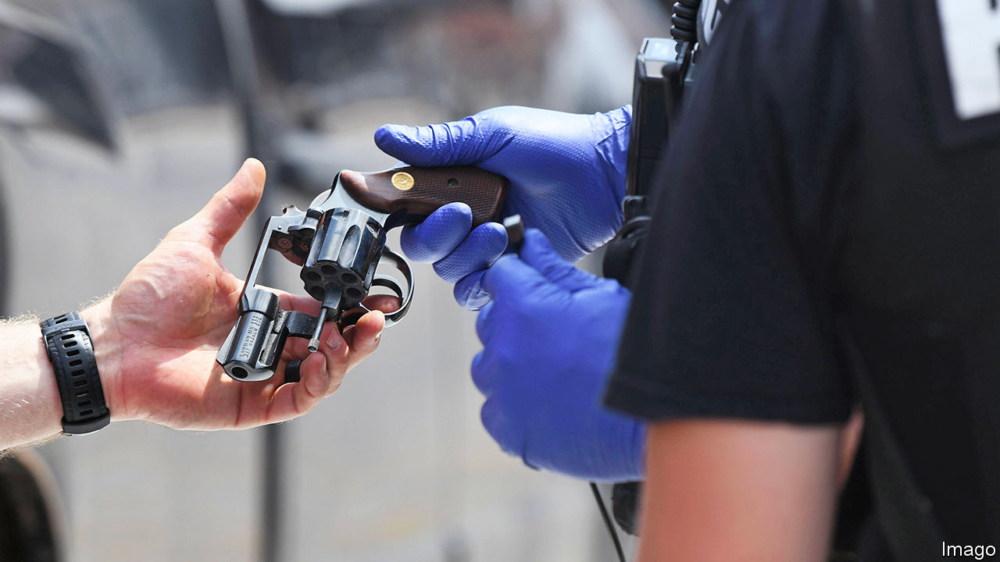

###### Disarming justice

# The Supreme Court has found a gun-control measure it likes 

##### The conservative justices on America’s highest court balked at the prospect of arming domestic abusers 

 

> Nov 9th 2023 

HARD CASES make bad law, warned Oliver Wendell Holmes junior, an early-20th-century justice. Cases reaching America’s Supreme Court often pose tricky, even wrenching, dilemmas. But after 90 minutes of oral argument on November 7th, a case testing the boundaries of the court’s recent expansion of gun rights looked unexpectedly easy to resolve.

 involves Zackey Rahimi, a 23-year-old Texan whose girlfriend was granted a protective order in 2020 two months after Mr Rahimi assaulted her in a parking lot. The couple had been squabbling over custody of their child when Mr Rahimi knocked his girlfriend to the ground, dragged her to his car and pushed her inside. He then shot at an eyewitness and, later, threatened to shoot his girlfriend if she told anyone what he had done. The restraining order came with a suspension of his handgun licence and a caution that federal law prohibited him from possessing a gun. Mr Rahimi did not heed the warning. He shot at several drivers, used an AR-15 to fire into the house of a man to whom he had sold drugs and shot at a fast-food restaurant.

In March, the Fifth Circuit Court of Appeals found that while Mr Rahimi may not be a “model citizen” he is “nonetheless among ‘the people’ entitled to the Second Amendment’s guarantees”. Drawing on the test in the Supreme Court’s  from 2022, the Fifth Circuit searched for a historical analogue to the federal ban on firearms for domestic abusers under restraining orders. Finding no such match—not surprisingly, given that domestic abuse was not on the founders’ list of scourges in 1791—America’s most conservative appellate court found the federal law unconstitutional.

In the 16 months since came down, many lower courts fielding challenges to gun regulations have read the decision in similarly stark terms. But in her presentation to the justices, Elizabeth Prelogar, the solicitor-general, argued that it is the principles undergirding regulations that matter. Judges, she said, should not “nitpick” or insist on a “historical twin” when comparing a firearm restriction of today to the tradition of gun regulation at the founding.

Chief Justice John Roberts and Justice Clarence Thomas pressed Ms Prelogar to defend her position that only people who are “law-abiding, responsible citizens” may keep their guns. Responsibility is a “very broad concept”, Chief Justice Roberts said. Can someone be deemed irresponsible—and thus be disarmed—because he didn’t take the recycling to the kerb or behave at a basketball game? No, the solicitor-general explained, the language comes from  and , the case of 2008 that found the Second Amendment protected an individual right to own guns. It means, she said, that the government can deny guns to felons and people who are otherwise found to be dangerous (due to mental illness, youth or violent tendencies). 

Mr Rahimi’s lawyer, Matthew Wright, crumbled during his stint at the lectern. He raised questions about the fairness of the state-court proceeding that resulted in the restraining order—and was reminded by Justice Neil Gorsuch that the case does not involve a due-process claim. He faltered when Justice Elena Kagan asked him to defend his brief’s main contention that the ban must fall because no such ban existed “while the founding generation walked the Earth”. Jumping on his hesitancy, Justice Kagan turned the knife: “I feel like you’re running away from your argument, you know, because the implications of your argument are just so untenable.” 

Mr Wright’s dismal performance spurred Justice Amy Coney Barrett to admit being “so confused” and left Justice Thomas—author of  and the court’s biggest gun-rights fan—holding his hand over his eyes. Justice Thomas may yet side with Mr Rahimi; he seemed upset that the protective order was “a small matter” with “huge consequences” for the Texan’s right to own guns. But a majority of the court seems unlikely to re-arm Mr Rahimi.■


