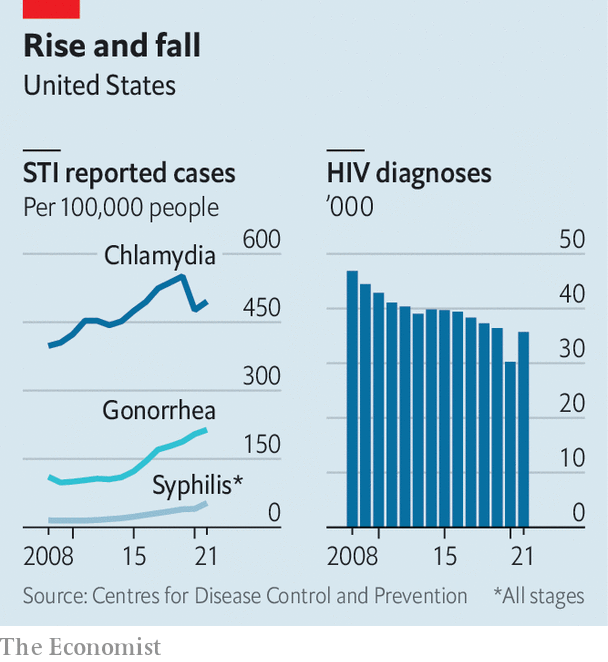

###### The clap is back

# Why sexually transmitted infections are rising in America 

##### The decline of HIV may be partly to blame 

 

> Nov 9th 2023 

Twenty years ago, syphilis seemed close to elimination in America. Gonorrhoea rates were also declining. Fast-forward to today and syphilis, gonorrhoea and chlamydia, three of the most common sexually transmitted infections (STIs), are hitting historic highs (see chart), especially among gay men and certain ethnic-minority groups. In 2021 gonorrhoea reached its highest level since 1991 and syphilis since 1990. Chlamydia’s rates have nearly doubled since 20 years ago. Even babies are being affected. On November 7th the Centres for Disease Control and Prevention (CDC) announced that congenital syphilis—passed to babies from infected mothers—increased tenfold from 2012 to 2022. 

 


Why is this happening? STIs have plagued humans since Biblical times. But when HIV was first identified in the United States in 1981, it was particularly devastating. Whereas most STIs have unpleasant symptoms (chlamydia and gonorrhoea can result in infertility in severe cases and syphilis can be deadly if left untreated), contracting HIV was a death sentence. In 1992 HIV was the leading cause of death among American men aged 25-44.

The fear of contracting HIV and dying from AIDS led to behavioural changes. People used condoms and got screened for STIs more frequently. Public-health programmes received more funding. And as people died from AIDS, there were fewer high-risk people alive to spread STIs, says Jay Varma, a professor at Weill Cornell Medicine. One study found that AIDS-associated mortality may have accounted for up to 50% of the decline in syphilis rates in the early 1990s.

Big improvements have since been made in . Those concerned about contracting HIV can take pre-exposure prophylaxis (PrEP), which reduces the chances of getting the virus, and contracting HIV is no longer a death sentence. Many people infected with HIV live long, healthy lives and only have to take a daily pill to manage the virus.

With the arrival of PrEP and improved treatments, condoms fell out of favour and STIs began to rise. At the same time funding fell for STI clinics. Couple this with the rise of dating apps, which encourage casual and frequent hookups, and the conditions were perfect for STIs to spread. “[PrEP] has been getting all of the attention, all of the resources,” says Antón Castellanos Usigli, a lecturer at the Mailman School of Public Health at Columbia University. “We have largely forgotten…the other side of the coin.”

There is some hope for slowing the rise in infections. In October the CDC released draft guidelines for a “morning-after” pill for STIs. Known as doxycycline or doxy-PEP, the drug can be taken by men after unprotected sex to prevent infection. 

Doxy-PEP may seem like a miracle, but over-use of antibiotics may make some diseases resistant to them. Gonorrhoea is especially hardy—a new antibiotic-resistant strain was recently detected in America. To the relief of public-health officials, a  has entered phase three of clinical trials, but this antibiotic may in time become irrelevant too. 

 Dr Varma says public-health officials should aspire to do more than just help people avoid and heal from STIs. The target should be “to have sex be infection-free”. He points to the strides made with HIV prevention and treatment, which few thought possible. “I think it’s aspirational, but I don’t think it’s totally unachievable.”■


