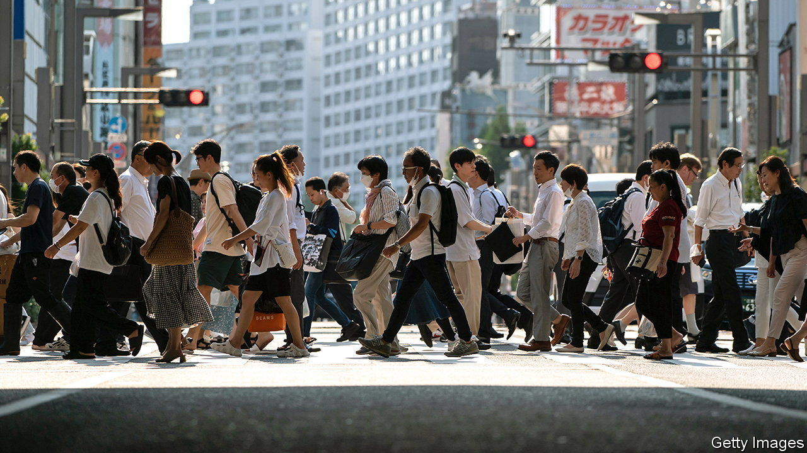
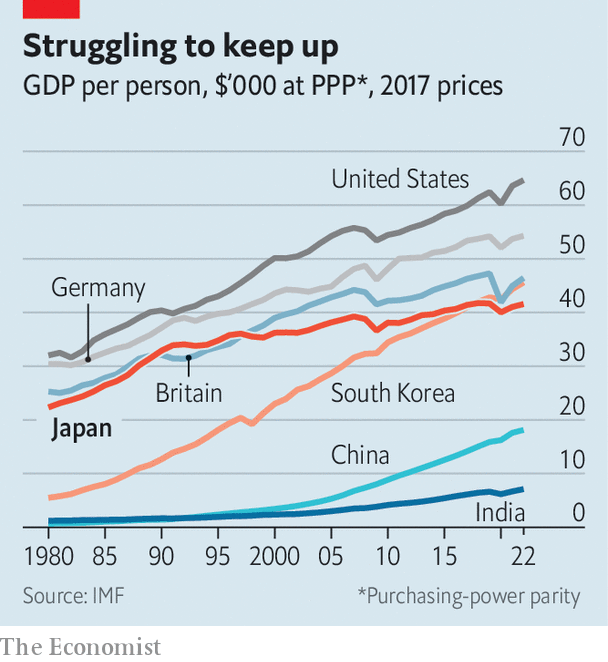
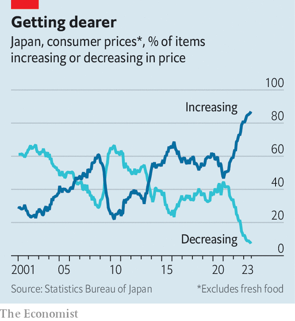

###### A chance to rise again

# Is Japan’s economy at a turning point? 

##### Wage and price inflation is coinciding with an exciting corporate renewal 

 

> Nov 16th 2023 

Aoki Masahiko, a prominent Japanese economist, once predicted it would take 30 years for his country’s economy to emerge from the “lost decades” that began in the early 1990s. At that time, an asset bubble burst and the sun set on the model that had helped Japan grow rapidly. Though the country remained rich, it slid into deflation and its growth rate slowed. Aoki reckoned generational change would be necessary for a new model to coalesce. He started the clock at the moment the bubble had definitively burst and the long-time ruling party, the Liberal Democratic Party, first lost power: the year of 1993. 

Fast forward to 2023 and Aoki’s words ring prophetic. The world’s third-largest economy is awakening from its decades-long torpor. After years of deflation or low inflation, Japan is seeing its fastest price growth in more than 30 years. Wages, long stagnant, are rising faster than at any time since the 1990s. Both increases are driven largely by global supply shocks. But they are not the only changes afoot. As Aoki predicted, gradual institutional and generational shifts are bearing fruit and changing Japan Inc from within.

 


This confluence of external shocks and internal evolution represents a chance for Japan to change its economic trajectory. The country’s share of global GDP in PPP terms has fallen from 9% in 1990 to under 4% today; its GDP per person in PPP terms slid from 81% of America’s level to 64% over the same period (see chart). Goldman Sachs, a bank, projects that Japan will drop out of the top five economies by 2050 and out of the top ten by 2075. A shrinking population limits the upsides to its growth. Even so, if Japan can reset inflation expectations, boost productivity and unleash corporate dynamism, its fall from the top league could perhaps be halted. 

Investors are excited. Morgan Stanley, an investment bank, reckons Japan has “convincingly emerged from three decades of economic stagnation”. Warren Buffett has built up large holdings in five Japanese trading houses. Earlier this year, the benchmark Nikkei stock index hit its highest level since the bubble burst. “Japan is undergoing a series of extraordinary economic transformations,” gushed Larry Fink, the CEO of BlackRock, an asset-management firm, while in Tokyo in October. 

The past 30 years have seen many false dawns in Japan. There are reasons for scepticism this time, too. Japan’s post-pandemic recovery remains fragile: after growing 4.5% year-on-year in the second quarter, GDP contracted by 2.1% in the third quarter, according to data released on November 15th. Wages have not kept pace with price increases. Consumption is flat. The yen’s depreciation led the International Monetary Fund to project that Japan’s nominal GDP in dollar terms will slip this year from third largest to fourth in the world, behind America, China and Germany. 

Servicing Japan’s massive government debt is already a heavy burden. It will become more of one if the Bank of Japan (BoJ) moves away from its ultra-loose policy based on negative interest rates and yield-curve control, as it hints it may do next year. Many firms that rely on interest-free capital would struggle to stay solvent, too.

Japan’s workforce is still shrinking and ageing. Its firms continue to hoard cash. Over 40% of firms listed on Japan’s TOPIX 500 trade below book value, compared with under 5% on America’s S&amp;P 500. Foreign-investor interest has as much to do with Japan’s relative stability and cheap currency as excitement about new growth.

Yet those familiar flaws obscure other developments. In recent decades “the fundamental problem of the Japanese economy was dynamism,” says Hoshi Takeo of the University of Tokyo. Too few new companies were formed, too many old ones hung around, prices barely changed and talent was trapped within firms for life. “Now we’re seeing that begin to change.” 

 


Start with prices. Headline annual inflation has been above the BoJ’s 2% target for 18 straight months. Even if much of that is due to higher import costs the psychology of price-setting is changing as a result. Firms have been forced to test the long-held assumption that pushing up prices would mean losing customers. “We came to understand we can raise prices,” says Niinami Takeshi, the CEO of Suntory, a big drinks maker, and the chair of Keizai Doyukai, an influential association of corporate executives. The practice has become widespread: prices for nearly 90% of items monitored by the BoJ are rising (see chart).

Demographic opportunity

Higher inflation has outsized implications for wages, which have stagnated for decades. Inflation of 1% in Japan produces wage growth of just 0.2%, but the sensitivity jumps when inflation exceeds 2%, reckons Ota Tomohiro of Goldman Sachs. Demographic change ought to provide another push. Though Japan’s population started shrinking more than a decade ago, women and old people entering the workforce largely offset the decline. But that trend has slowed in recent years, leaving employers feeling the crunch and needing to entice workers with higher pay. Though wage growth still lags price growth, if next year’s annual wage negotiations produce big gains again, a long-awaited virtuous cycle of price and wage growth would be tantalisingly close.

Geopolitical turbulence, from war in Ukraine to tension between America, Japan’s security provider, and China, its largest trading partner, has also changed the landscape for Japan Inc. A growing number of executives recognise that “we can’t keep the status quo,” says Mr Niinami. As firms prioritise supply-chain resilience and worry about location risk, Japan stands to benefit. Even if manufacturers do not build factories in Japan, they may rely on its factory-automation firms to help build them elsewhere. America once perceived Japan as an economic rival, yet it now wants to see Japan thrive. American officials cheered as IBM, an American tech giant, entered into a joint venture with Japanese counterparts to design chips in Japan. 

Japanese firms are poised to put their cash to use. The growth rate for planned capital investments is at its highest level since the BoJ began collecting survey data in 1983. The government is encouraging this trend: big subsidies have gone to the semiconductor industry; the government has pledged to spend 2trn yen ($13.2bn), or 0.3% of GDP, per year for the next decade to fuel the green transition. With defence spending set to rise substantially, officials want to spur defence-industrial-driven innovation of a kind that was formerly taboo. 

Corporate-governance reforms that began over a decade ago have become entrenched. Pressure to enhance corporate value and return on equity no longer comes solely from foreign activists—Japanese institutional investors are also pushing. The pressure will increase. The government announced an “asset-doubling plan” that seeks to encourage Japanese savers to invest their cash holdings, with tax incentives set to come into effect next year. The JPX, which oversees the Tokyo Stock Exchange, is another force for change under its new president, Yamaji Hiromi. Beginning next year, the bourse plans to publish a list of firms that meet corporate-governance guidelines. Mr Yamaji says that when CEOs approach him at the golf club to grumble, he answers: “Good luck.” 

These shifts have coincided with generational change in Japanese business. The average age of CEOs at firms in the Nikkei stock index has dropped by 12 years in a decade, according to Jesper Koll of Monex Group, a brokerage. Many are moving beyond old mores such as lifetime employment and seniority-based pay. Young Japanese are happy to switch jobs. The best and brightest increasingly join or start new firms. “We should be betting on these groups of people,” says Namba Tomoko, a vice-chair of Keidanren, a business group. 

The startup ecosystem is small relative to Japan’s gDP, yet increasingly vibrant. “The old Japan is still there, but in parallel to that a new Japan coexists and grows,” says Kushida Kenji of the Carnegie Endowment for International Peace, an American think-tank. Investment in startups rose from 88bn yen in 2013 to 877bn yen in 2022; the number of Japanese venture-capital funds has quadrupled in that time. 

Where many Japanese entrepreneurs were once content to be big in Japan, a new class of founders with global ambitions is rising. Shin Taejun, founder of Gojo, a microfinance firm, wants it to be “the World Bank of the private sector”. Maeda Yosuke, founder of Wota, which builds decentralised water-treatment infrastructure, aspires to “solve the global water crisis”. Rather than inheriting his family’s construction firm, he decided to build his own. “The old industrial structure can’t solve the problems we want to solve,” he says. Okada Nobu, founder of Astroscale, is leading global efforts to clean up debris in outer space. Japan needs new “champions”, Mr Okada says. “We still refer to Sony and Honda—let’s forget about them.”

This new generation also seeks to reshape corporate culture. Many young Japanese want to shed the post-war model based on lifetime employment, male domination and age-based hierarchies, says Takeshita Ryuichiro of Pivot, a media startup that focuses on the new Japan Inc. “Change used to be seen as negative or traitorous,” he says. “But we aim to portray pivot or change as positive.” In just over a year Pivot has racked up over 1m subscribers on YouTube, where it broadcasts interviews with founders, investors and inventors. 

Many Japanese executives and policymakers seem not only to understand that Japan stands at a significant juncture; they are determined to make the most of it. “People who know Japan really well ask me, is this time different?” Mr Yamaji says. “My answer is it could be—we should make it be.” The opportunity may not present itself again soon. Unlike the sun, Japan’s chance to rise does not come every day. ■

