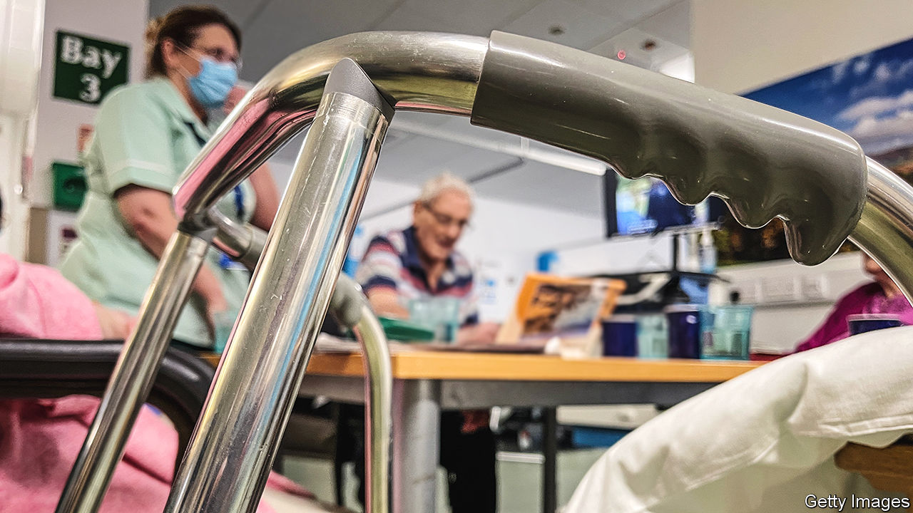

###### Do not forget

# The British government is not paying dementia enough attention 

##### And it is not ready for the projected rise in case numbers 

 

> Nov 16th 2023 

ACCORDING TO THE Office for National Statistics, dementia was the leading cause of death in England and Wales last year, accounting for 65,967 deaths, or 11.4% of the total, up from 10.4% in 2021. The National Health Service reckons that 940,000 people in Britain are living with the condition. Many need care, either in their own homes or in residential facilities. Graham Stokes, director of dementia care at HC-One, a care-home provider, says 75% of its beds are filled by people with . Yet to the frustration of many, the issue seems to have sunk down the government’s list of priorities.

It may feel that the problem is less acute than once feared. New drugs are offering hope for those with Alzheimer’s, the most common cause of dementia, that the incurable disease’s progress can at least be slowed. Evidence is mounting that the risk of developing dementia can be sharply reduced by lifestyle changes that are being encouraged anyway—giving up smoking and excessive drinking, exercising, eating and sleeping well, and so on. 

International evidence suggests that the age-related incidence of dementia has been falling quite rapidly. A study published in 2020, for example, of 50,000 people in America and Europe between 1988 and 2015 found that the risk of developing dementia had declined by an average of about 13% a decade. It went from about a one-in-four chance for a 75-year-old in 1995 to less than one in five by 2015.

But optimism about Britain’s ability to cope with the rising numbers of people with dementia was scarce at two recent gatherings of professionals and charities. A dementia summit in London in October and the 17th UK Dementia Congress in Birmingham in November, organised by the , were animated more by a mood of beleaguerment—a sense that Britain’s care sector is undervalued and that, in Mr Stokes’s words, “dementia has lost its place in the sun”.

This is one rare corner where David Cameron’s term as prime minister is remembered as something of a golden age. In 2012 he launched a dementia “challenge”, building on a “national dementia strategy” from 2009. Scotland still has one, but England’s has lapsed, subsumed, with cancer and other diseases, into a “Major Conditions Strategy” published in August. Suzanne Mumford, head of nursing at Care UK, another residential-care provider, regrets the change: “It does matter because it doesn’t give the right sort of focus.” Dementia, she points out, is unusual in that people can live with it for decades. Care homes, she says, have become the specialist centres for dealing with it.

A recent study has meanwhile cast doubt on the notion that rates of dementia in Britain are indeed in long-term decline. Published in , it found that its incidence, allowing for age and sex, fell sharply in 2002-08, in line with what had been happening in other rich countries, such as America, France and the Netherlands. But the trend reversed itself abruptly in England and Wales in 2008-16, with an increase in the incidence of dementia in that period of 25%. If that rate were to persist, the number of people with dementia in Britain would rise to 1.7m by 2040; the figure would be 1.3m if the long-term trend prevailed and 1m if the improvement in 2002-08 endured.

That is a huge range of outcomes. But all imply a level of demand for care services that will be hard to meet. It will rely on the continued efforts of underpaid care-workers, charities and, most of all, unpaid carers, usually family members, usually women. One promising idea that has spread from the Netherlands is for dementia “meeting centres”, of which 70-odd, each catering to a few dozen people, have opened in Britain so far. They offer just that—a place for people with dementia to meet regularly and be supported while they live at home. It is a cheap intervention that is very effective in slowing cognitive decline. Yet, says Shirley Evans, director of the Association for Dementia Studies at Worcester University, which is leading the initiative, it receives no central-government support. That seems a shame. ■


