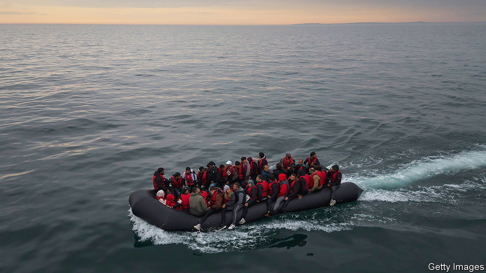

###### Stopping the planes

# The Supreme Court rules against Britain’s Rwanda plan. What now? 

##### The Tories’ flagship immigration policy is blocked 

 

> Nov 15th 2023 

IT WOULD NEVER have “stopped the boats”. But the Supreme Court’s ruling on November 15th that the government’s plan to fly  was unlawful is still a hefty blow to Rishi Sunak. The prime minister has pledged to tackle the problem of  crossing the English Channel in small boats. The court’s decision puts a big hole in the Illegal Migration Act, which allows for asylum-seekers who have entered Britain via another safe country to be detained and deported.

The prime minister is not giving up. Shortly after Britain’s highest court ruled unanimously against the scheme on the ground that Rwanda was an unsafe destination for asylum-seekers, Mr Sunak said he would pass an “emergency” law asserting that it was in fact safe. He also said that he would not allow a “foreign court” to block the scheme. Tough talk may cheer hardliners, but it is hard to see how any planes will take off for Kigali soon. 

The scheme always had an obvious logistical flaw. The British government claimed it was “uncapped”, but its counterpart in Rwanda said it could take only a few hundred people a year. Since security was stepped up on ferry and tunnel Channel crossings, the number of small-boat migrants has surged. In 2022 it reached a record 46,000, up from 299 in 2018.

The bigger problem was legal. Many of those who enter Britain in this way are granted asylum: Afghans and Syrians have grant rates above 95%. In June the Court of Appeals said the risk of refoulement—sending asylum-seekers back to unsafe countries—meant the Rwanda plan breached the European Convention on Human Rights (ECHR). The European Court of Human Rights, which upholds that convention, had been the first court to block the government’s scheme in 2022. 

In its verdict this week the Supreme Court cited several cases, documented by the UN High Commissioner for Refugees, of asylum-seekers from decidedly unsafe countries, including Afghanistan and Syria, being sent home from Kigali. The rule against refoulement, it said, was contained in several laws ratified by Britain, not just the ECHR.

That is a problem not just for Mr Sunak but also for his opponents on the right of the Tory party. In a furious letter to Mr Sunak shortly after she was sacked as home secretary on November 13th,  said the prime minister had betrayed his promise to “stop the boats” by rejecting calls to leave the ECHR. Claims that the convention prevents decisions that are Britain’s to make are less persuasive when the Rwanda plan breaches other laws, too. 

What now? Britain has already paid £140m ($175m) to the government in Kigali, though observers note the money has not been spent on improving its asylum processes. As well as legislation, Mr Sunak also said he would publish a new treaty with Rwanda giving “assurances” that when “we send someone to Rwanda they won’t be incorrectly returned to their own country”. Mr Sunak is pushing for reforms to “rule 39 orders”, too—interim injunctions issued by the echr. Yet it is unclear whether any treaty would satisfy the courts, whether any law would get through the Lords or how exactly the echr could be stopped from blocking things. 

Beyond such theatrics, the government will look for other safe third countries for asylum-seekers to be sent to. None of the court judgments that ruled against the Rwanda scheme found that the idea itself was illegal; only that Rwanda was an unsuitable destination. There was “clearly” an appetite for the concept in , said James Cleverly, the new home secretary. 

Mr Sunak can point to some progress elsewhere. So far this year the number of small-boat migrants is markedly down on last year’s. That is largely because of a deal the government struck with Albania to return Albanian citizens who come illegally. Sunder Katwala of British Future, a think-tank, says it should seek to make similar deals with those countries whose citizens have asylum grant rates of, say, below 60%. Stopping the boats will not depend on one big policy, but a number of small ones. ■


