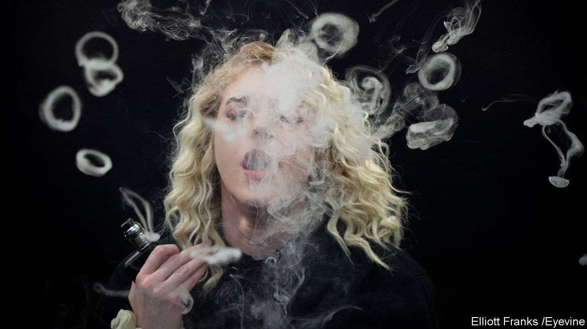
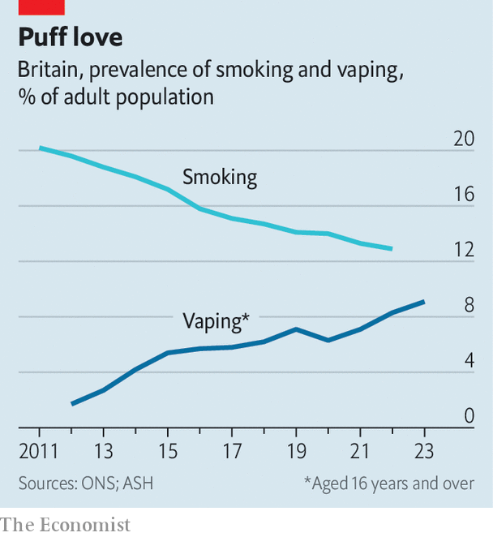

###### Going up in smoke?

# Vaping is big business in Britain 

##### But a government consultation may signal a crackdown 

 

> Nov 14th 2023 

Even after Britain’s ban on indoor smoking came into force in 2007, the smell of cigarette smoke was never far away. It wafted across pub gardens and lingered outside workplaces. Today you are almost as likely to inhale the scent of blue razz lemonade or the “refreshing, mellow tones” of watermelon. 

 


Almost one in ten Britons is now a regular or occasional user of . On current trends (see chart) vaping is set to become more common than smoking by the mid-2020s. But many in the industry fear that a government consultation, due to conclude in December, will be followed by a regulatory clampdown. 

Catering to Britain’s 4.7m vapers is increasingly big business. A report for the industry, carried out by the Centre for Business and Economic Research, a think-tank, put the industry’s turnover at £2.8bn ($3.4bn) in 2021 and calculated that it supported almost 18,000 jobs. The number of vapers has risen by almost a third since. 

The country has almost 3,500 specialist vape shops, according to the Local Data Company, a research firm. The largest chain, VPZ, was founded in Leith, in Edinburgh, in 2012 and now has more than 150 stores across Britain. The firm began manufacturing its own liquids in Scotland in 2016. It reported turnover of £36m in 2022, up by almost 60% over five years. 

The industry’s rapid growth partially reflects a supportive stance from public-health authorities. Although many governments have sounded cautious on the potential health benefits of inhaling nicotine by breathing in a vapour rather than tobacco smoke, the National Health Service has consistently made the case for switching. In April the government announced a “swap to stop”’ scheme that will give free vape starter-sets to up to 1m smokers, the first scheme of its type globally.

In recent years the industry has also been one of few direct beneficiaries of Britain’s cost-of-living squeeze. An average packet of 20 cigarettes now costs £14.57, compared with around £5 for roughly the same number of puffs from a disposable vape and half that for the equivalent amount of nicotine in a refillable device. More and more cost-conscious smokers have been making the switch. 

But clouds loom. Just six months after announcing the giveaway of vaping kits, the government unveiled a consultation on vaping regulation that appears to herald a much tougher line. The change in attitude has been driven by two related issues—rising use of disposable devices and concerns over under-age vaping. 

Material Focus, a charity, thinks that sales of single-use devices have doubled since 2022 and are running at 360m a year. Rex Zhang, the strategy director at China-based Smoore International, the world’s largest vape manufacturer, reckons that Britain accounts for about 40% of the European disposables market. Supermarkets, convenience stores, petrol stations and launderettes all stock them. 

Both the Local Government Association and the Scottish government have called for a total ban on disposables. That’s partly because most of them wind up in landfill. It’s also because youngsters can get hold of them easily. Although sales to under-18s are already illegal, enforcement is patchy. Responses to freedom-of-information requests covering ten London boroughs and the 11 largest provincial cities revealed that between 2018 and 2021 there were only 21 successful prosecutions for illicit vape sales and the total value of all fines was a minuscule £2,188. 

Incumbents are open to more regulation. Douglas Mutter, a director at VPZ, says that sales of disposable devices account for less than 15% of its revenue. The industry is calling for a licensing scheme, similar to that required to sell alcohol, and automatic fines of up to £10,000 for breaches. 

What it does not want is for the government to follow Australia and some American states by banning flavours to reduce the appeal of vaping to young people. Even ex-smokers tend to prefer flavours. “Just because kids are buying alcohol doesn’t mean we should only be allowed methylated spirits to drink,” is how one attendee at a vaping-industry bash in London put it this week. According to Mr Zhang, Britain is a global leader on vaping regulation. International manufacturers will be watching to see if the industry’s prospects smell as sweet as the vapours it produces. ■


