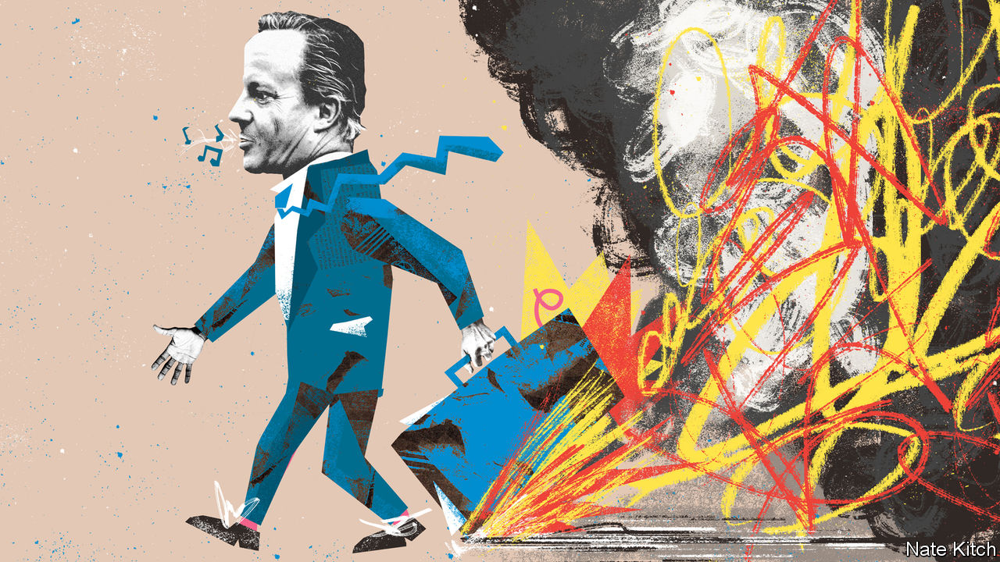

###### Bagehot

# What David Cameron’s return says about British politics 

##### A man who caused many of Britain’s problems is now offering to fix them 

 

> Nov 13th 2023 

David Cameron always looked the part. Even the most powerful man on Earth was taken aback by the ease with which the jacketless, tieless British prime minister behaved. Barack Obama, a former American president, noted that Mr Cameron “possessed an impressive command of the issues, a facility with language and the easy confidence of someone who’d never been pressed too hard by life”. Mr Cameron had the attributes to be an excellent prime minister: intelligence, diligence, a quick wit and a smooth manner. Instead, he managed to be . 

Seven years after Lord Cameron left office in 2016, in the wake of losing the Brexit referendum, the former prime minister has returned to front-line politics as foreign secretary. (He has been hurriedly ennobled, to do the job from the House of Lords.) The decision of Rishi Sunak, the prime minister, to fire Suella Braverman, a hard-line home secretary, cleared the way. James Cleverly, a barrel-chested reservist, was shunted to take Ms Braverman’s spot, leaving a vacancy as the country’s top diplomat. And so, on the morning of November 13th, the familiar figure of Mr Cameron wandered through the door of 10 Downing Street again. 

Mr Cameron’s return is a peculiar one, given his record. A man who bungled British foreign policy will help shape it once more. A government struggling to figure out how to repair public services has appointed the man who, more than any other, caused their current difficulties. A man who deserted his office is now painted as an example of duty. In British politics, the appearance of competence is more important than the evidence of it. Aesthetics trump achievement. Nothing demonstrates this more than the renaissance of Mr Cameron.

A plausible manner hides many of Mr Cameron’s flaws. In foreign policy his errors were numerous. For half a millennium Britain aimed to ensure Europe did not unite against it; as a result of the referendum he promised to call in 2013, Mr Cameron managed it in three short years. He was too doveish on China. Chinese firms were cajoled into investing in British infrastructure, from telecoms to nuclear power stations—investment that has now largely had to be scraped away like an unwanted Artex ceiling. When Vladimir Putin invaded Crimea in 2014, Britain was supposedly one of Ukraine’s security guarantors; yet Mr Cameron allowed France and Germany to take the lead on negotiating a peace. 

Liberals cling to a distorted vision of Mr Cameron’s politics, hailing him as a bulwark against populism. Centrists rejoice that Ms Braverman has departed, but it was he who first promised the impossible on immigration. His government pledged to bring the numbers of newcomers down to fewer than 100,000 per year while also staying in the EU, which demanded free movement of people. Between the government’s promise to cut immigration and Britain’s membership of the club, something had to give. That thing was Britain’s membership of the EU.

Mr Cameron’s image is one of a successful political strategist brought low by one error: the Brexit referendum. In fact Mr Cameron’s philosophy of fiscal conservatism combined with social liberalism was never a popular vision. In 2010 Mr Cameron could not win an outright majority even after a gargantuan recession. In 2015 it required a tantrum in Britain’s Celtic fringe—when south-west England deserted the Liberal Democrats and Scotland ditched Labour—for Mr Cameron to scrape the smallest winning majority since the 1970s. Mr Cameron won significantly smaller vote shares than either Theresa May or Boris Johnson. There are not many Cameroons in Britain. Outside some newspaper op-ed pages, there never were. 

After the chaotic experimentation of Liz Truss’s government, Mr Cameron’s own economic policy might be painted as cautious conservatism. It was anything but. Austerity was a radical experiment, and it largely failed. The size of the state was not sustainably reduced; his tax cuts have been unpicked; years of underinvestment, which began under him, have resulted in decrepit schools and hospitals. Only by comparison does he look cautious.

Old allies have praised Mr Cameron’s sense of duty in returning to government. But he did not have to disappear from public life in the wake of Brexit. Mr Cameron once chided a prospective MP for cheekily asking whether he might be made a minister. “You will find that being a backbench Member of Parliament is the greatest honour you can have in life,” said Mr Cameron. “When I cease to be prime minister I will return with great pride to the backbenches as Member of Parliament for Witney, for the rest of my life.” In reality, Mr Cameron served for eight weeks on the backbenches before leaving. When he would have been most useful, during the years of screeching over Brexit between 2016 and 2019, he deserted his post. Now he is bored with private life, he has returned. 

Manners maketh the mandarin

After the clownshow of Mr Johnson’s tenure as prime minister, Westminster wallahs project a dignified air onto Mr Cameron. Yet he embarrassed himself out of office. Practically every senior British politician attempts to fill their boots once they have left Parliament, but most do so quietly and effectively. In contrast Mr Cameron lobbied on behalf of Greensill Capital, a failed supply-chain payments company, in simpering text messages to cabinet ministers at the height of the pandemic (“I know you are manically busy—and doing a great job, by the way”). 

This kind of record is clearly no obstacle to high office. Mr Cameron has returned largely because Mr Sunak is desperate. He may reassure some wavering southern Conservative voters, who provided the former prime minister’s narrow base. Mercifully, he will do less damage as foreign secretary than he did as prime minister. But the fact is that Mr Cameron maintains a good reputation in certain quarters because of how he comes across rather than what he actually did. It still helps to look the part. ■ 


