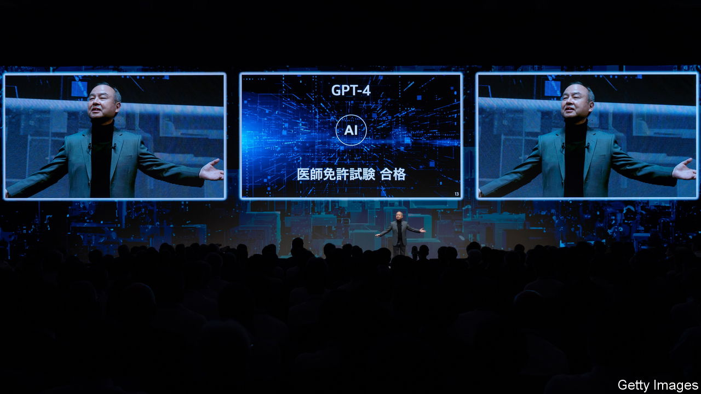
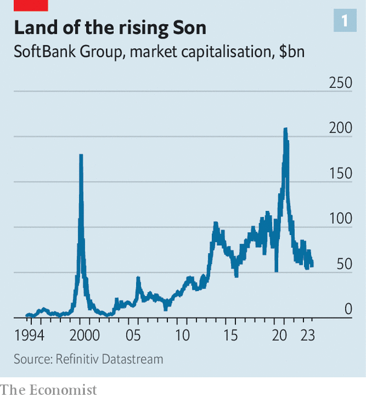
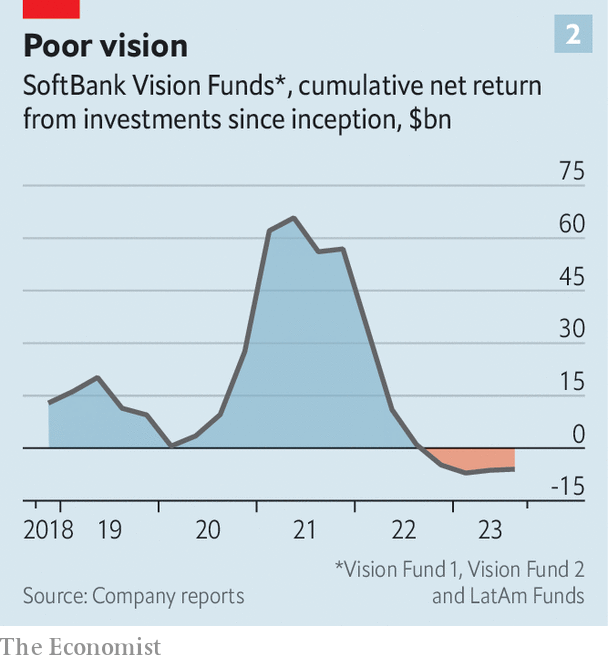

###### Son rise, Son set

# After WeWork’s fall, what next for SoftBank? 

##### Son Masayoshi is ready to splurge again 

 

> Nov 16th 2023 

“His eyes were very strong. Strong, shining eyes.” So Son Masayoshi explained his decision back in 2000 to invest $20m in a Chinese e-commerce startup founded by Jack Ma. By the time SoftBank, Mr Son’s investment group, finished selling most of its stake in Alibaba earlier this year, it had made $65bn from the gamble. Less successful was the Japanese billionaire’s bet on Adam Neumann, the charismatic founder of WeWork, an office-rental firm that declared bankruptcy on November 6th. SoftBank is estimated to have torched around $14bn backing it.

 


Mr Son’s career has been a tale of soaring highs and crushing lows that have followed the hype cycles in tech. A strategy of doling out big cheques to buzzy firms has served SoftBank well in the upswings but poorly in the downswings. Now, after a bruising year, the indefatigable Mr Son is jumping on tech’s latest craze for all things artificial intelligence (AI). It promises to be a wild ride.

SoftBank, which began life as a software distributor in Japan, reinvented itself amid the dotcom boom of the 1990s as an investment vehicle, buying stakes in hundreds of startups, including Yahoo, a once-popular search engine. At the height of dotcom mania, Mr Son was briefly the richest man in the world. After the bubble burst, he reoriented SoftBank around mobile internet, launching a telecoms business in Japan in 2005, buying a majority stake in Sprint, an American carrier, in 2013, and acquiring Arm, a British designer of smartphone chips, in 2016.

A year later Mr Son launched SoftBank’s Vision Fund, a $100bn war chest bankrolled in part by Saudi Arabia’s sovereign-wealth fund, and began pouring capital into loss-making startups. Despite some notable flops, including WeWork, by the summer of 2021 the investment binge looked like a resounding triumph, with the Vision Fund and its successors having made a cumulative gain of $66bn. Since then, a collapse in tech valuations has flipped that into a $6bn loss (see chart).

SoftBank is doubly exposed to higher interest rates, which decrease the value of startups whose profits lie mostly in the future and increase the cost of debt, of which the investment group has plenty. In May S&amp;P Global, a rating agency, downgraded SoftBank’s credit deeper into junk territory. To ease jittery investors, it has sold assets and expanded its cash pile from $25bn two years ago to $34bn, equal to a quarter of its interest-bearing debt. The initial public offering of Arm, in which SoftBank retains a 90% stake, has also made its portfolio more liquid.

 


Mr Son is now itching to start writing cheques again, having declared SoftBank ready to switch back into “offence mode”. The firm has done only 23 deals so far this year, compared with 125 last year and 251 in 2021, according to PitchBook, a data provider. Mr Son has his eyes on AI, which he predicts will “surpass the total intelligence of humankind by ten times in ten years”.

The danger is that the investment giant is entering the market at its frothiest. Valuations of AI companies have rocketed in recent months as investors have piled into competitive fundraising processes. As a result, SoftBank is also looking to carve out novel investment opportunities for itself, says Alex Clavel, co-head of the group’s Vision Funds. 

He gives the example of GreenBox, a new joint venture between SoftBank and Symbotic, a robotics company, that will develop and rent out automated warehouses. In September SoftBank was also reported to be in discussions with OpenAI, the startup behind ChatGPT, and Jony Ive, a designer of the iPhone, to fund the development of an AI device powered by Arm’s chips.

Yet other elements of SoftBank’s approach to investment will remain. “We usually put our eggs in fewer baskets,” says Mr Clavel, a pattern he expects to continue. Mr Son’s willingness to trust his gut is also unlikely to change.

In a decade’s time, when Mr Son’s prognostications on AI have been tested, he will be 76, pointing to another question hanging over SoftBank: succession. Mr Son, who hopes the business will endure for at least 300 years, began talking publicly of handing over the reins in 2015. A string of potential successors have since left and SoftBank continues to revolve around its enigmatic founder. If it is to last, Mr Son must ready it for a future without him. ■


