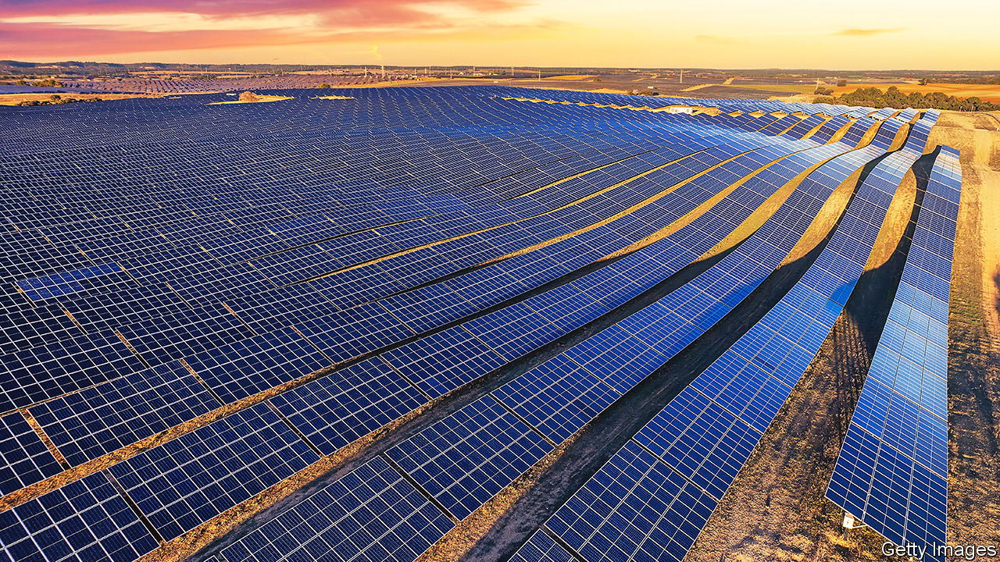
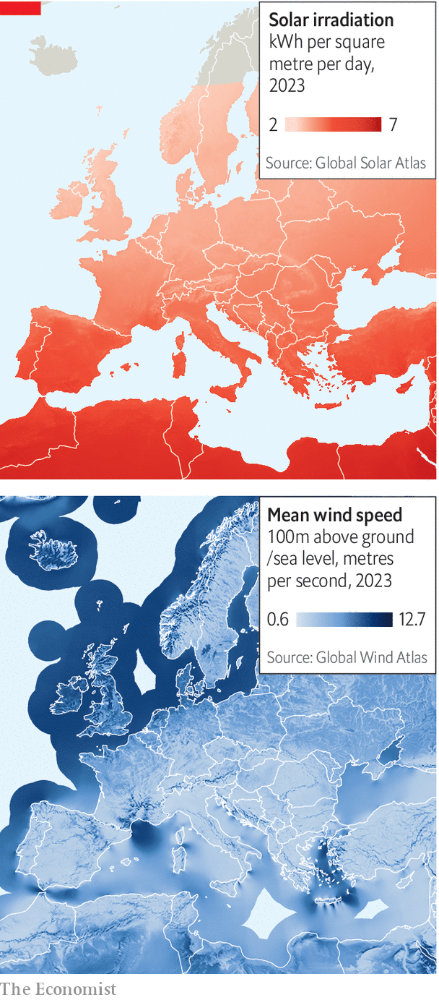

###### A place in the sun

# Can the Mediterranean become Europe’s energy powerhouse? 

##### Inside the push to make the sunny south a “green” hydrogen hotbed 

 

> Nov 13th 2023 

Tourists on Mallorca might now marvel at a new attraction on the Mediterranean island: a miniature economy entirely energised by “green” hydrogen. At its heart, two solar plants power an electrolyser, which splits water into oxygen and hydrogen, creating carbon-free fuel. The hydrogen can then propel buses, be injected into the island’s gas grid, and power fuel cells at hotels and the port. “The project shows what is possible,” says Belén Linares, head of innovation at Acciona Energía, a renewable-energy firm that is one of the project’s investors.

There is one snag: the hydrogen has yet to materialise. Because of a design flaw, the electrolyser, which is made by Cummins, an American firm, has been recalled. Importing green hydrogen, which is derived from renewable sources, is impractical. Buses and fuel cells stand unused. A newly elected local government also appears less interested. The previous administration talked “a lot of hot air”, according to a quote in the local press by the new mayor of Palma, the island’s capital.

Boundless possibilities, or hot air? The same question also hangs over a wider green-hydrogen economy, which European governments hope to see emerge in the Mediterranean basin, turning the region into a sun-fuelled counterpart to a wind-driven northern dynamo already taking shape around the North Sea. The prize is large. If plans for Europe’s southern powerhouse go well they will give the continent access to plenty of cheap renewable energy and allow it to clean up its carbon-spewing heavy industry. 

 


The Mediterranean has always been a conduit for energy. From the days of Roman dominance to the 19th century it was manpower in the form of slaves. Today it is mostly natural gas. Half-a-dozen pipelines connect Europe to Africa and the Middle East. The EU depends on the region for over a third of its natural-gas imports. In the age of renewable energy, countries on the Med boast some of the best conditions on Earth for harvesting natural forces.

Solar capacity shows vast potential (see map). Spain basks in a daily average of 4.6 kilowatt-hours (kWh) of sunlight per square metre and Morocco in 5.6kWh, double what Germany can expect. Sparse populations mean that Spain and Portugal have ample land for such plants, as do the deserts of north Africa and the Middle East. In parts of Morocco and Mauritania both sun and wind are abundant, forming rare sweet spots where electrolysers can run virtually non-stop. “There are only ten such locations around the world,” explains Benedikt Ortmann, who runs the solar business of BayWa, a German energy and construction company.

Tapping this reservoir of renewable energy is not a new idea. In the early 2000s an association backed by dozens of corporations, mostly German, came up with the idea of plastering the Sahara with giant solar plants. But support for Desertec, incorporated in 2009, quickly evaporated mainly because of the cost of the technology. The development of better and cheaper means of harvesting the sun’s rays is behind a revival of the idea. According to the International Renewable Energy Agency, the average cost of electricity from utility-scale solar plants declined from $0.45 per kWh in 2010 to $0.05 last year. 

Transporting the energy north, to where it is needed, is now also more feasible. Desertec’s plan involved undersea cables, which have limited capacity. But now cheap and efficient electrolysers can convert electricity into hydrogen at source. This can then be transported as a gas or a derivative, such as liquid ammonia. Analysts expect that in a few years green hydrogen from north Africa will cost under $1.50 per kilogram, probably making it cheaper than “blue” hydrogen, which is derived from natural gas and requires the resulting carbon to be captured and stored.

Demand for energy from the south is much more likely to materialise than in the days of Desertec, too. Hydrogen and its derivatives will be badly needed as carbon-free feedstocks for Europe’s steel and chemicals industries. Of the 20m tonnes that the eu has set as a consumption target by 2030, much will come from its southern fringe and north Africa. 

The Mediterranean’s position as Europe’s southern powerhouse is not, however, a given. Europe has to jump-start a market for a new source of energy and do so in a deregulated arena with many competing players. “It’s a chicken-and-egg problem,” says Kirsten Westphal of the German Association of Energy and Water Industries, a lobby group. Simultaneously ramping up demand and supply is a delicate balancing act. Companies are hesitant to commit themselves to signing long-term offtake agreements if they are unsure about the future availability and pricing of hydrogen. This, in turn, discourages producers from making crucial investment decisions. It does not help that political instability in north Africa increases risks and thus the cost of capital. 

Yet the biggest problem is linking both sides of the market, which starts with establishing physical connections. Most of the hydrogen will first need to be transported by ship, probably in the form of ammonia (liquid hydrogen, which has to be kept at -253°C, is tricky to move around). But shipping capacity is limited. James Kneebone of the Florence School of Regulation estimates that, even if it were technically possible, repurposing the entire existing global fleet of vessels able to transport liquefied natural gas could only deliver some 6.5m tonnes per year. That leaves a reliance on pipelines.

Pipe dreams

Experts are divided over whether existing gas networks can be upgraded for hydrogen, and building new pipelines is expensive. Geopolitical turmoil may deter investments in pipelines as well as hydrogen production. All three corridors identified by the eu through which hydrogen could flow in the Mediterranean basin cross troublesome territory. Hydrogen piped from Mauritania would ideally go through Western Sahara but Morocco’s control of the region is disputed. An alternative under consideration is an offshore route via the Canary Islands. 

Once built, pipelines are vulnerable to political interference. In November 2021 Algeria’s rocky relations with Morocco led to a cutting off of diplomatic relations and an interruption of gas flows through the Maghreb-Europe pipeline, which connects Algeria’s gasfields with Spain, via its neighbour’s territory.

Closer to home, things are no less complicated. An agreement for an underwater pipeline connecting Barcelona to Marseille, whence hydrogen could be transported from Spain through existing infrastructure via France to Germany, could still get caught up in a spat between Germany and France over whether nuclear power should be considered “green”. Moreover, Air Liquide, a French firm that is the world’s largest producer of industrial gases, is lobbying hard against a project that would devalue its own network of hydrogen pipelines.

Europe has no choice but to confront the myriad problems if it wants to meet its ambitious targets to reduce carbon emissions. Steps already taken include the European Commission’s launch of half a dozen initiatives from a “hydrogen accelerator” to spread the use of the gas to a “European hydrogen bank” to jump-start trade. More important, the commission has allowed subsidies to flow by relaxing state-aid rules, so member countries can support firms in their efforts to decarbonise. Funds have also been earmarked for hydrogen pipelines, such as a 3,300km link from Algeria and Tunisia to Austria and Germany. Hydrogen projects in north Africa will benefit from investment from institutions such as the European Bank for Reconstruction and Development.

Some member states want to move faster. Spain and Portugal have embarked on ambitious national strategies aiming to transform the Iberian peninsula into a green-hydrogen hub. But it is Germany, which will have to import up to 70% of the hydrogen needed to decarbonise its mighty heavy industry, that is keenest. Germany has set aside over €8bn ($8.6bn) to help its firms go green and on November 14th its government announced further subsidies for building a network of hydrogen pipelines. In a show of zeal a couple of years ago, the country’s foreign office embarked on “hydrogen diplomacy”, complete with half a dozen “hydrogen embassies” in key countries. More recently, the ministry of economic affairs spawned H2Global, a platform for trading hydrogen. 

Most important, Germany seems to acknowledge that it needs to give in order to get. It appears not just happy to see the installation of solar plants and electrolyser farms in Africa, but is ready to help create local jobs, upgrade grids and build desalination plants (electrolysers need a lot of pure water). In time Germany may even accept that parts of its heavy industry could migrate to where the hydrogen is produced. “The industrial map always follows the energy map,” observes Simone Tagliapietra of Bruegel, a think-tank.

Such schemes are vital if Germany is to avert a dependency on unpredictable authoritarian regimes for energy, as it did with Russia and gas. “To avoid a repeat with hydrogen, Germany needs to build true partnerships,” says Andreas Goldthau of Erfurt University. If all goes to plan and Europe’s southern dynamo gets up to speed, places like Mallorca will be buzzing not just because of its beaches and nightlife, but with the energy sparked by hydrogen electrolysers. ■


