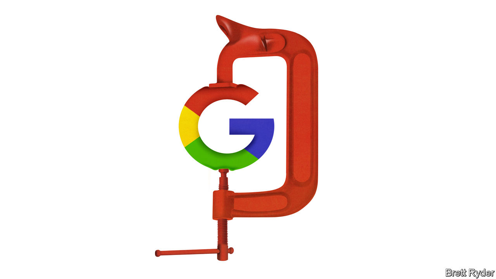

###### Schumpeter

# How to think about the Google anti-monopoly trial 

##### As told by “The Man Who Ate Microsoft” 

 

> Nov 16th 2023 

Forgive yourself if you have forgotten that Google, owned by Alphabet, is on its third month in the dock during the biggest anti-monopoly trial since America’s Department of Justice (DoJ) won a conviction against Microsoft, another tech giant, a quarter of a century ago. Though some in antitrust circles hoped it would be the “trial of the century”, so far the proceedings, which are expected to wrap up shortly, have had little of the  of the historic Microsoft showdown. The excitement may increase when the verdict is announced next year. For now, no one can confidently predict the outcome because Amit Mehta, the judge, keeps his cards close to his chest. But in the meantime, Schumpeter spoke to someone once lionised by , a magazine, as “The Man Who Ate Microsoft”. How does David Boies, the government’s lead trial lawyer in the Microsoft case, see the similarities and differences between the two antitrust battles?

Mr Boies makes clear that he has not been present in the District of Columbia courtroom to witness the Google trial. At 82, he is still busy, including serving as counsel on two pending cases against Google (which suggests he may not be an impartial observer). Yet he says media coverage of the trial is sufficient to form some opinions, and two things stand out. First, like Microsoft, Google came to court with a history of innovation and consumer success, effectively saying “Trust us, we know what’s best for consumers.” Second, the DoJ may not have challenged that trustworthiness forcefully enough. “During the Microsoft case, even if you were a casual observer, you were constantly confronted with attacks on Microsoft’s credibility. I haven’t seen that in the press,” he says. He is not alone. Broadly, the feeling is that the DoJ has not yet dealt Google a spectacular knockout blow. 

Mr Boies has had some setbacks in an otherwise illustrious career, including representing The Weinstein Company, co-founded by Harvey Weinstein, a former Hollywood producer jailed for rape. But when it comes to antitrust, he has played starring roles in two trials that have helped shape the tech landscape for 50 years. He first led IBM’s successful defence against an antitrust case in the 1960s. Though the personal-computer giant won, it was so rattled by years of investigations, he says, that it gave Microsoft, then an upstart,  to sell its Windows software widely, rather than insisting on exclusivity. Microsoft subsequently leapfrogged IBM. Mr Boies’ role in the IBM case drew the attention of the DoJ’s prosecutors, who recruited him years later to take the lead in their anti-monopoly battle against Microsoft. The government’s victory in that case may have so distracted Microsoft that it helped Google steal a march in the internet-search business.

Whether Google is similarly hobbled in the future will depend, above all, on an issue that is at the crux of the DoJ’s case. That is the annual payments that Google provides to Apple, maker of the iPhone, other smartphone-makers such as Samsung, who use Alphabet’s Android operating system, and providers of browsers such as Mozilla, to ensure it is their default search engine. The amounts are staggering. During the trial it emerged that Google’s payments were as high as $26bn in 2021. The  reported that $18bn of that went to Apple. This week, an economist testifying in Google’s defence disclosed that Google pays Apple 36% of the revenues it earns from search advertising via Apple’s Safari browser, suggesting it generates advertising revenues of $50bn from Safari alone. The DoJ argues that these payments prevent competitors from challenging Google, and that because they are generated from digital-advertising revenues that Google shares with the recipients, the latter have less incentive to offer competing search products. It likens the deals to Microsoft’s practice in the 1990s of bunding its Internet Explorer browser with its Windows operating system, making rival browsers such as Netscape harder to install. Mr Boies, who zeroed in on bundling in the Microsoft case, says it is not only harmful to competitors. It hurts consumers, because it deprives them of choice. 

Google rejects that claim. It says that default search engines can be changed with a couple of clicks. They are not sticky. For instance, the top search globally on Microsoft’s Bing, a rival, is “Google”, suggesting users willingly switch to their preferred platform. Nor are they exclusive; Bing, too, pays Apple for space on Safari. Google argues that its default payments help lower the cost of phones and other devices to consumers. It says its success in search comes from innovation, not from an illegal monopoly. 

Will that narrative prevail? Mr Boies says an antitrust trial is part “morality play”, in which the successful prosecutor should seek to destroy the defendant’s credibility. At the start of the Google trial, the DoJ’s lead lawyer, Kenneth Dintzer, raised the trustworthiness question, accusing Google of trying to conceal documents under attorney-client privilege and turning off the history function on group chats. But on the witness stand weeks later, Sundar Pichai, Alphabet’s boss, proved unflappable. He demonstrated none of the brittle defensiveness Bill Gates, then the boss of Microsoft, had showed during his depositions. 

Search and destroy 

So the verdict will come down to how Judge Mehta views the default payments. His decision may rest on whether he buys the DoJ’s argument that they foreclose competition, or Google’s defence that they benefit consumers by improving the product. Defeat will cost both sides a lot. If Google loses few believe it would be broken up, but the status of default payments would be thrown into doubt. If deprived of Google’s cash, Apple might build a rival search engine. A loss for the DoJ would be yet another setback for the Biden administration’s efforts to move antitrust cases beyond a focus on consumer welfare. It might try to console itself that a loss would prompt Congress to write new laws to rein in big tech. But given the woeful state of bipartisanship, dream on.■


