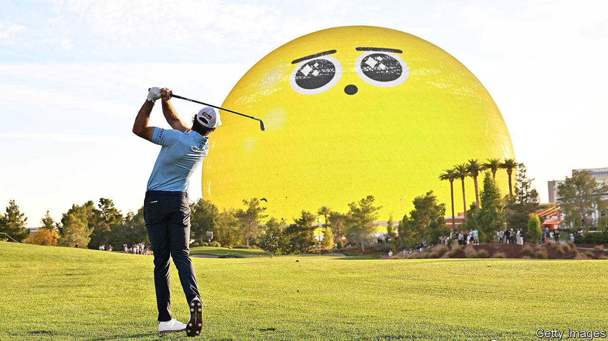

###### Putt option

# Netflix takes a swing at live sport 

##### A celebrity golf tournament could tee up something bigger 

 

> Nov 14th 2023 

From Korean horror to Palestinian romance, Netflix covers every genre—almost. Among tens of thousands of hours of video on its servers, the world’s largest streaming platform has long ignored the category that draws bigger audiences to television than anything else: live sport.

That changed at 3pm on November 14th in Las Vegas with the Netflix Cup, a celebrity golf tournament which was streamed live to the company’s 250m subscribers. The unconventional show, featuring teams made up of professional golfers and Formula One racing drivers, was billed as a one-off. It may turn out to be a warm-up for something bigger.

Netflix says the purpose of the cup was to promote “Full Swing” and “Drive to Survive”, its successful docu-series about golf and racing. Lately the company has been active in a niche that it calls sports shoulder-programming, commissioning factual series such as “Break Point” (following professional tennis players) and “Unchained” (tracking the Tour de France), as well as profiles of stars such as David Beckham.

Showing sport itself has not tempted the streaming giant. Rights are wildly expensive—America’s National Football League (nfl) earns more than $10bn a year from its media deals—as well as low margin: the more value broadcasters get out of the games, the more the leagues demand when the rights come up for renewal. Last year Ted Sarandos, Netflix’s co-chief executive, said the company was “not anti-sports, we’re just pro-profit”.

That wording left the door open to a different approach—and the Netflix Cup suggests one. By owning the tournament, Netflix will keep any upside. “If they create value, they will enjoy the fruits of that, as opposed to creating value for another sports league who might turn around and ask them for an increase,” says Brandon Ross of LightShed Partners, a research firm. Netflix has reportedly explored buying small sporting outfits such as the World Surf League on this basis.

The bigger question is whether the company might one day bid for rights to established leagues. Analysts increasingly believe that it will, though they disagree on when. “Netflix’s next frontier has to be more sports rights,” says Michael Nathanson of MoffettNathanson, another research company, who sees the golf cup as a test of sport’s ability to attract viewers to the platform, and of Netflix’s ability to execute live programming. He sees rights to America’s National Basketball Association, which come due for renewal in 2025, as a possible future target. Mr Ross thinks that is too soon.

Netflix downplays all such talk. But it has more reason than in the past to bid for sports. Since its subscriber growth stalled early last year, leading to a plunge in its share price, Netflix’s executives have racked their brains for new ways to expand. Last year the company introduced advertising, which it had previously dismissed. This year it has cracked down on users sharing passwords, which it once encouraged. Sport could help to attract new subscribers, particularly in foreign markets where the streamer has struggled to break through. Cricket turbocharged the early growth of Disney+ in India—though it proved so expensive that Disney eventually dropped it.

Netflix’s newish ad business also makes sport more attractive. Sport appeals to advertisers, who say that it engages audiences like nothing else, while being reliably brand-safe (some clients balk at showing off their products alongside, say, the bloody drama of “Squid Game”). Live action means commercial breaks can’t be skipped; fans are loth to slip out to put the kettle on for fear of missing the action. And sport offers advertisers unmatched scale, with nfl games reliably drawing more than 20m concurrent viewers in America on Sunday nights.

If Netflix were to take to the field it could be game-changing. Sports-rights holders have cashed in following interest from deep-pocketed streamers such as Apple, Amazon and Google (which last year bought nfl rights for YouTube). But they are nervous that old-media bidders are tightening their belts. Disney (which owns espn, a giant sports network) and Warner Bros Discovery are both aggressively economising as their legacy cable networks shrink. “The entire [sports] content world right now…is hoping that Netflix gets involved in bidding for sports rights,” says Mr Ross. “And all of the traditional media buyers are praying that Netflix doesn’t.”

Netflix, meanwhile, is simply praying that its live-streaming technology holds up. Its first live show, a comedy special with Chris Rock in March, went well. But in April a live episode of “Love is Blind”, a dating contest, was a technical fiasco. The Netflix Cup again demonstrated that live television is tricky to pull off. Presenters struggled to explain the complicated format of the tournament, microphones malfunctioned and within the show’s first ten minutes an animal-rights protester burst onto the course, before being wrestled out of shot. Whether or not Netflix can do sport, it can certainly do drama.■


