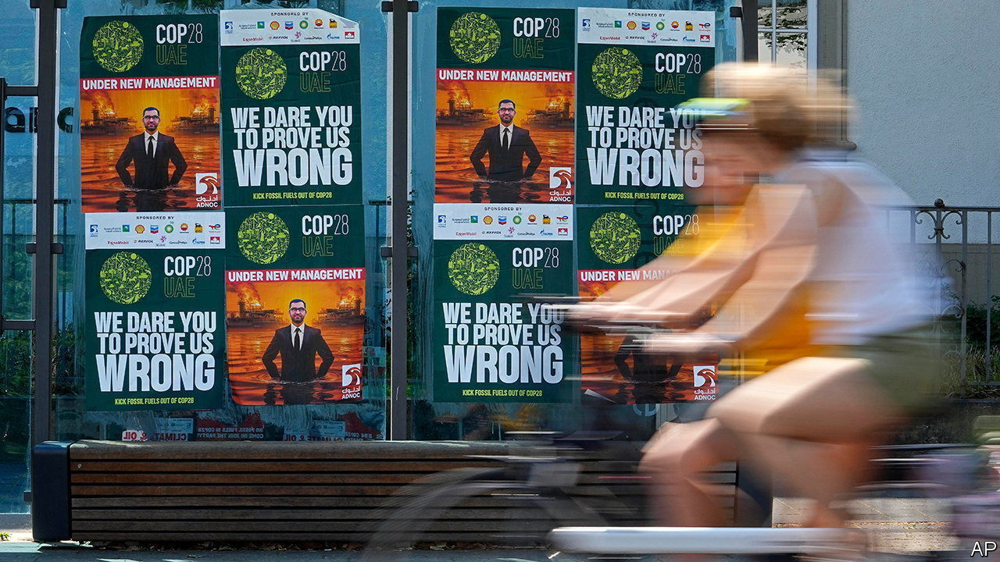
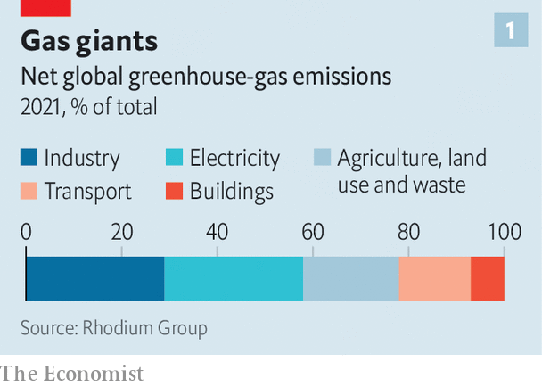
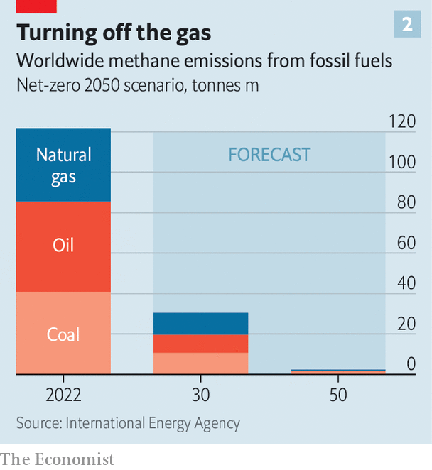
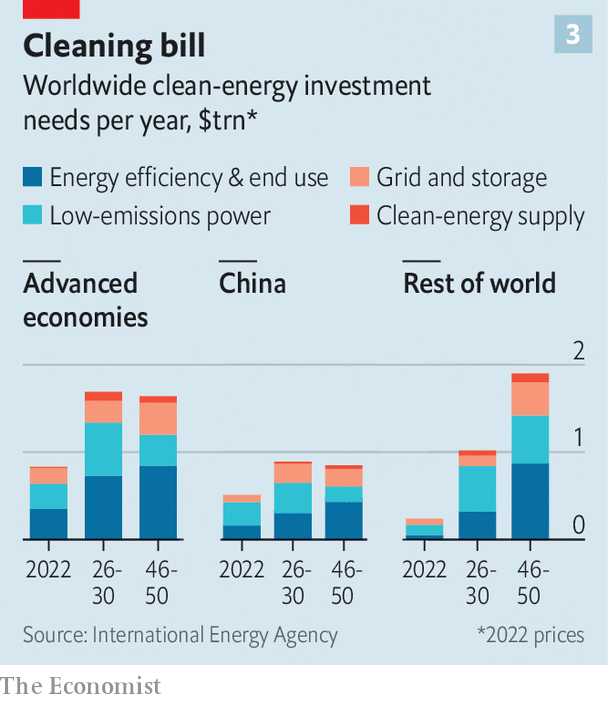
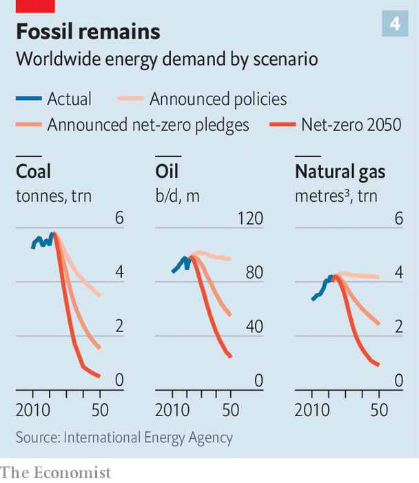

###### A gulf between them?

# Three climate fights will dominate COP28 

##### Whether the summit ends in breakdown or breakthrough depends on one man 

 

> Nov 16th 2023 

The United Arab Emirates, venue for cop28, the latest climate summit convened by the United Nations, is a controversial choice. Some 70,000 climate advocates, diplomats and other hangers-on will attend an event that begins on November 30th in Dubai, one of the gleaming cities built on wealth that fossil fuels have brought to the region. The fact that the world’s most important climate gathering will be hosted by a leading oil producer has sparked outrage among environmentalists. That the summit’s president, Sultan Al Jaber, runs adnoc, the uae’s national oil company (noc), is proof, whisper conspiracists, that the fix is in on behalf of Big Oil. 

Yet from Abu Dhabi on the Persian Gulf, the shipping route to global markets for the world’s greatest concentration of oil reserves, to Fujairah on the Gulf of Oman, an entrepot abuzz with tankers carrying Russian oil evading Western sanctions, comes a sense of vulnerability to climate change. The region is short on water and home-grown food. The rising heat of summer is becoming inhumane. The cities built on these desert sands are at risk from a rising sea level. That the uae shares the threat from increasing global temperatures makes the gathering no less fraught. 

 


So low is trust among many delegates that the talks may break down. That would be alarming. A un report analysing the national climate-action plans of the 198 parties to the cop found them woefully inadequate for tackling emissions (see chart 1) and hence achieving the goal of limiting the global temperature rise called for in the Paris agreement of cop21 in 2015. In short, the stakes are high. Amid the summit’s myriad technical and procedural goals, three big topics cry out for action.

The first is the task of cracking down on emissions of methane, an overlooked greenhouse gas (ghg). The second is the need to fill massive shortfalls in climate finance. And the third is an ideological battle over how and how fast to end the use of fossil fuels. The outlook for meaningful progress can be summed up as good, bad and ugly, respectively.

The good news surrounds methane, a ghg that is much shorter-lived in the atmosphere than carbon dioxide but causes at least a quarter of atmospheric warming. Fred Krupp, head of edf, an environmental group, insists that addressing methane “is the single fastest opportunity available to slow the rate of global warming”. 

 


As methane is the main component of natural gas, tackling emissions from the energy industry would have a significant impact (see chart 2). And often the payback is quick since methane neither vented nor flared during gas extraction can be sold, says Bjorn Sverdup of the Oil and Gas Climate Initiative (ogci), a consortium of a dozen leading oil and gas firms. Its members have reduced their methane emissions roughly by half since 2017, from a leakage rate of 0.3% of total marketed gas to 0.15% in 2022, using technologies that monitor leaks and improve operations. They have pledged to keep that level below 0.2%.

Rumours suggest that many nocs are resistant but Mr Sverdup reports that “momentum is building for action at cop” even among those companies. As part of a deal struck this week with America, China (the world’s largest methane emitter) says it will, for the first time, include the gas in its national climate plan. The eu has also just agreed strict curbs on methane emissions from fossil fuels, including imports. A credible side deal involving many big oil companies “would mean more than an ambitiously worded diplomatic communiqué” from official proceedings, reckons Mr Krupp. Mr Al Jaber has been pressing big oil and gas firms hard in private to commit to slash methane emissions.

The prospects for improved climate finance are gloomier. Emerging economies will complain about the failure of the rich world to keep its promises. The $100bn that was due to have been provided by 2020 by rich countries has yet to turn up in full. At cop27 in Egypt last year a “loss and damage” fund was agreed in principle, to compensate vulnerable countries (which often contribute the least emissions). After an acrimonious process, negotiators recently agreed to give the World Bank a temporary role in hosting this new facility but failed to agree to fund it. The eu may announce some funding for it at cop28. 

 


Armond Cohen, head of catf, an environmental group, calls $100bn “the tip of the iceberg” compared with the trillions of dollars needed annually by 2030 and beyond to transform energy systems, mostly in energy-hungry economies of the developing world (see chart 3). Carlos Pascual of S&amp;P Global, a financial-data firm, insists “those trillions of dollars will not come from the public sector, so we have to leverage the private sector.” Rumours suggest that the uae wants to play a catalytic role by launching a $25bn global climate-finance fund seeded with its own oil riches. 

The third arena of battle is the ugliest. Much blood will be spilt over the question of whether fossil fuels should be “phased down” or “phased out” and whether the use of “abatement” technologies (which enable the capture and storage of ghg emissions from energy use) should permit the continued use of fossil fuels.

 


A deal is hard to reach because the legitimate climate ambition of a rapid end to burning fossil fuel runs into the equally legitimate reality of fossil dependence (see chart 4). As Mr Cohen observes, “You can wish fossil fuels away, but they still comprise 80% of world energy supply and are growing.” A new scenario from the iea, a global forecaster, for achieving net-zero emissions envisions a significant amount of fossil-fuel use even in 2050 (albeit at much lower levels than today), making a mockery of talk of rapid phase-out.

At least the direction of travel is clear if not the pace, with fossil fuels likely to peak and decline in coming decades as efficiency, renewables and alternative clean fuels take off. But when it comes to technologies for abatement of emissions like carbon capture and sequestration (ccs), scepticism runs deep in some quarters, including countries that want a fast end to fossil fuel and which think this will be a “get-out-of-jail-free card” for dirty energy.

If negotiators can agree to allow well-monitored use of abatement, it would permit a managed end to fossil-fuel use that spares consumers painful supply shocks. The ipcc, the un’s official climate-science body, makes clear that technologies for “negative” emissions could well be needed at massive scale in the second half of the century, which means nascent abatement technologies need a big push now.

The uae wants to play a leading role on climate innovation, too. It has been investing heavily in decarbonisation. A big ccs project capable of removing ghgs equivalent to the annual emissions of half a million petrol-powered cars was unveiled in September. adnoc recently brought forward its net-zero ghg target for its operations by five years to 2045. It stopped routine methane venting and flaring long before its peers. The company is spending nearly $4bn on undersea cables to ship carbon-free electricity to offshore rigs to replace burning natural gas. 

Huge solar farms run by Masdar produce the world’s cheapest renewable energy. This Emirati clean-energy giant, in which adnoc has a stake, is the world’s second-biggest developer of clean energy. It has committed to installing 100 gigawatts of renewable-energy capacity globally by 2030, up from 15 gigawatts in 2021. How did this green behemoth emerge in a land flush with oil riches? It was started back in 2006, before the solar revolution took off and climate tech became fashionable—by Mr Al Jaber. ■


