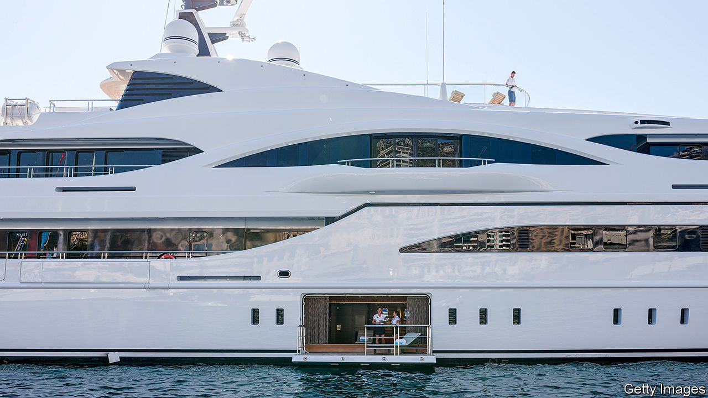

###### A lifestyle on the ocean waves

# Why the market for superyachts is booming 

##### The mega-rich are taking to the waves like never before 

 

> Nov 16th 2023 

Even oligarchs, tech barons and other super-rich folk might have been expected to reconsider spending hundreds of millions of dollars on a superyacht amid gathering global turmoil. In 2020, as covid-19 spread, “I spent my days doing worst-case scenarios and drawing up the budgets to go with them,” says Giovanna Vitelli, chairwoman of Azimut Benetti, the world’s biggest maker of such craft. Then Western sanctions on Russia after its invasion of Ukraine lost her a tenth of her customers.

Rather than sinking, the makers of superyachts are riding a wave. Recent events, says Ms Vitelli, are “unexpected”. Her firm’s turnover has surged by around 20% since the start of 2022, as has that of the entire sector. A recent survey by Fortune Business Insights, a market-research firm, found that “Most, if not all, yacht-brokerage firms are reporting record sales at the world’s leading shipyards.” Future Market Insights, another market-researcher, expects the industry’s annual revenues to more than double over the next ten years, to $19.9bn. 

In the past surging sales have been the result of ever more would-be mariners joining the ranks of the mega-rich. Yet this year the number of the world’s billionaires dropped to 2,640 from 2,668 in 2022, according to magazine. A yearning for the lonely sea and the sky could be another explanation. The pandemic first hit sales but has since fostered what Fortune Business Insights terms an “increase in the desire for seclusion and social distancing among affluent individuals”. Ms Vitelli detects a deeper psychological effect of the pandemic: “a realisation that life is short and that it can give us surprises”. 

The latest designs reflect that introspective mood. There is less emphasis on ostentation and more on customising vessels to suit the tastes and enthusiasms of owners and their families. Owners are also considering their outsized environmental impact. Solar panels, wind turbines and hybrid-propulsion systems are increasingly common on luxury yachts.

Jeff Bezos, the boss of Amazon, may be setting a new trend. He took delivery in April of , the world’s largest sailing yacht at 127 metres. There is a drawback to relying on wind power.  is followed everywhere by a diesel-engined support vessel carrying extra supplies and even a helicopter pad. At 75 metres it almost qualifies as a mega-yacht, too.■


