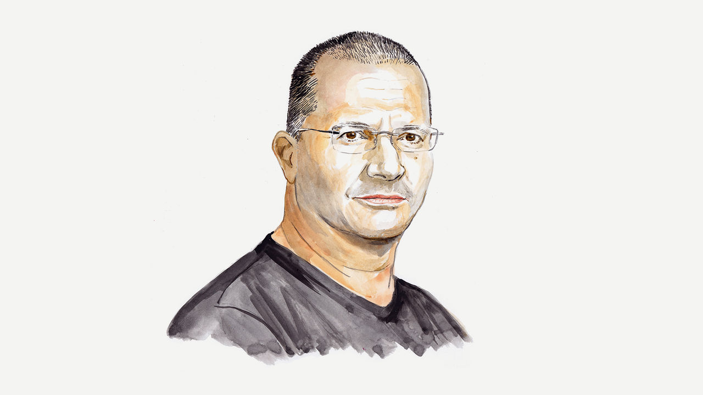

###### The fog of war

# David Enoch argues that much of the public discourse on the Israel-Hamas conflict is depressingly simplistic 

##### Intellectuals should be more honest about the uncertainties, says the legal philosopher 

 

> Nov 10th 2023 

THE MORALITY of war is extremely complicated. So, consequently, are the ethics of commenting on it.

But in the war in Israel and Gaza, some things are simple: the horrendous atrocities committed by Hamas cannot be justified, under any circumstances. Another simple fact is that many Palestinians in Gaza are entirely innocent, victims of both Israel and Hamas, and are suffering a horrible calamity. It is highly disconcerting that these two simple facts are in need of emphasising, but there are plenty who are happy to offer pseudo-sophisticated ways of denying at least one of them.

Even when it comes to the morality of the war effort itself, some things are clear: Israel has not just the right to defend itself, but a duty to its citizens to protect them against the threats Hamas (and others) pose. Just as clearly: even in the pursuit of a just war, civilians must not be targeted. And when harm to innocents is a necessary and foreseeable result of legitimate attacks on combatants, in order to be morally acceptable it must be proportionate to the harm the military operation is intended to prevent.

Some of the underlying principles of the morality of war are, then, straightforward enough. (Not all, by the way: for instance, it is not at all clear whether a state using force should be neutral between harm to its own civilians and harm to the enemy’s, and if it shouldn’t, how much priority it should give to its own people.) But what follows from this as far as real-life conflicts are concerned is an extremely complicated matter, about which most of us don’t have anything like the level of information needed to draw conclusions with any confidence.

What are the dangers to its civilians that Israel is now fighting to eliminate? How likely are future attacks—from Hamas, from Hizbullah, from others—to be attempted? To succeed? Are there alternative measures available to Israel that would result in less harm to innocents? (And no, ending the occupation, morally crucial though it is, is not an alternative measure feasibly available to Israel at this moment as a way of defending its citizens.) How do Hamas tactics, including the use of Palestinian civilians as “human shields”, affect the morbid but indispensable proportionality calculus? How much value should be placed on deterrence, and how can Israel restore a significant deterrence effect after the unbelievable intelligence failures of October 7th? What can Israel do to free the hostages Hamas (and perhaps others in Gaza) continue to hold?

Nothing at all can be responsibly said about what Israel should and should not do right now without at least partial answers to these complex questions. Even well-intended calls for an immediate ceasefire do not escape this fate, for it is far from obvious that a ceasefire is consistent with Israel’s duty to defend its citizens (or even just to free its hostages). 

Calls for an immediate ceasefire are entirely understandable: given the magnitude of the devastation in Gaza, as well as continued threats to Israelis, any decent person may feel a strong desire that it should all just stop. But such a wish, understandable though it is, is not the basis for sound policy. And if you think that a call for a ceasefire is justified, given factual uncertainties, as a way of erring on the side of safety, you should remember that when it comes to war, often there is no side of safety. Any mistakes—using too much force, not using enough—will be paid for in the only relevant currency, the blood of innocents.

It may be hoped that decision-makers have more information than the rest of us do, and that they give appropriate weight in their deliberations to the relevant moral constraints. But it can hardly be denied that in many of its policy actions over many years prior to October 7th, and in some of its current official and unofficial statements, Israel has rightfully earned the distrust of many—myself included.

What is a conscientious public intellectual to do? Surely we must have something to say about a horrible tragedy that is unfolding in front of our eyes? Indeed, philosophers and other intellectuals have chimed in, not just as individuals, but also in groups. In one such intervention, 45 academics from the University of Oxford wrote an  condemning Israel and calling on Britain’s political leaders to urge an immediate ceasefire, without so much as a gesture in the direction of the uncertainties involved. In another , signed mostly by North-America-based academic philosophers, anti-colonialist jargon was lifted unmodified from the nice-sounding-slogans shelf and applied with no sensitivity to any of the facts relevant here.

Intellectuals  comment on public affairs, and it’s okay if they sometimes do it in a way that is not quite as nuanced as their next academic publication. But when they do, they should highlight complexities, not hide them. They may be experts on some of the general principles of the morality of war, but if they do not appreciate how fact-sensitive any application of that knowledge to real-world scenarios is always bound to be, then they do not after all know the first thing about their subject matter. 

When public intellectuals make confident but factually unfounded proclamations on such matters, they degrade their respective fields, and to the extent that they have an effect in the real world they risk taking part in bringing about disastrous policies. In short, they betray their role as intellectuals, serving to fuel legitimate doubts about how much they know or care about the real world, indeed about real people.

Perhaps moral philosophers can contribute to public discourse even now—for instance, in thinking about how decisions should be made given the tremendous uncertainty involved, or to insist on the relevance of some neglected considerations. Or perhaps we should confess that we, too, are embarrassed, that we cannot be confident just what to say. Depending on your expectations, this may be disappointing. But unlike many of the other interventions in today’s public discourse, such a response would at least be honest. And probably less harmful as well.

■

