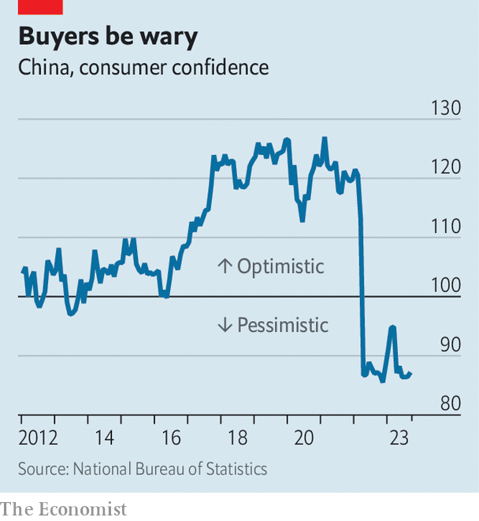

###### Bromptons, not blusher

# China’s shoppers are gloomy and picky 

##### They want to spend on pets and sports, not makeup or perfume 

 

> Nov 16th 2023 

Five years ago Jack Ma, the founder of e-commerce giant Alibaba, briefly tried his hand at selling lipstick. To promote China’s largest online shopping festival, called “Singles’ Day”, Mr Ma attempted to sell more lipstick in five minutes than Li Jiaqi, a live-streaming salesman known as the “Lipstick King”. The king won.

Five years on, Mr Li’s crown has slipped a little. In September he lost his cool with an online commenter who questioned the price of an eyebrow pencil he was showcasing. “How is it expensive? It has been this price for years,” Mr Li asked incredulously. “Maybe you should look at yourself. Has your pay risen? Have you been working hard in these years?”

Mr Li, who later apologised, had touched a nerve. He had also touched on one of China’s deeper economic difficulties. It is hard for firms to increase prices when wage growth is weak.

 


Although the unemployment rate in China’s cities is only 5%, many households are not optimistic about their pay or their job prospects. According to the latest central-bank survey, more people expect their income to fall in the near future than to rise. Consumer confidence collapsed during the pandemic-related lockdowns of 2022. It has yet to recover (see chart). 

The gloom is making customers picky and cost-conscious. In October China slipped into deflation, with consumer prices falling by 0.2% compared with a year earlier. People are not squandering money by redefining their eyebrows. During the Singles’ Day festival—which now runs from late October to November 11th—spending on makeup and fragrance fell by 5.6%, according to Syntun, a data firm.

The e-commerce platforms did their best during the festival to appease, not insult, the price sensitivity of their customers. Pinduoduo offered merchants on its platform extensive subsidies to help them provide discounts to consumers. JD.com, the closest rival to Alibaba, promised to compensate customers if they found a cheaper price for a product within 30 days of buying it. Consumers are also becoming ruthlessly strategic. Some shoppers add a luxury item to their purchases so they can meet the minimum spending threshold for a discount on their bill. They then return the luxury item and keep the rest.

These marketing gambits have, it appears, boosted the volume of sales more than the value. The number of parcels delivered from November 1st to 11th rose by 23% year on year, according to the State Post Bureau. But the amount of spending on e-commerce platforms rose by less than 10%, according to most analysts.

Spending is not universally weak. According to official figures released on November 15th, retail sales (both online and off) rose by 7.6% in October compared with a year earlier. That was faster than expected. Spending on restaurants, cars and phones made big contributions. Huawei’s sales grew by 83%, according to Counterpoint, a research firm. That was thanks in large part to Huawei’s new Mate 60 phones, which boast chips made in China.

The fastest-growing retail category was sports and entertainment products. Sales rose by nearly 30% compared with a year earlier. Lululemon, a maker of athletic wear, reported that its second-quarter revenue in greater China (including Taiwan) grew by 61% year on year. China also became the biggest market for Brompton, the British folding bike. “People are willing to concentrate their budget on something which can actually make them feel happy,” says Chen Luo of Bank of America.

Chinese consumers are not only investing in themselves. Spending on pet foods during this year’s festival increased by almost 30%, according to Syntun. Young people who cannot imagine supporting a child instead lavish attention on their cats and dogs. This affection extends beyond food to fashion and gadgets. Mr Luo cites the example of “smart” cat litters, which help to remove bad smells.

Pets can also be used to market other items. In 2016 Mr Li became the owner of a fluffy Bichon Frisé, which he called “Never”. Together with her pups and grand-pups she has her own collective brand, “Never’s Family”. But not everyone has been won over by Mr Li’s pets—or his tearful apology. For Halloween this year, at least one person dressed up as the Lipstick King, wearing a black top emblazoned with the question: How is it expensive? ■


