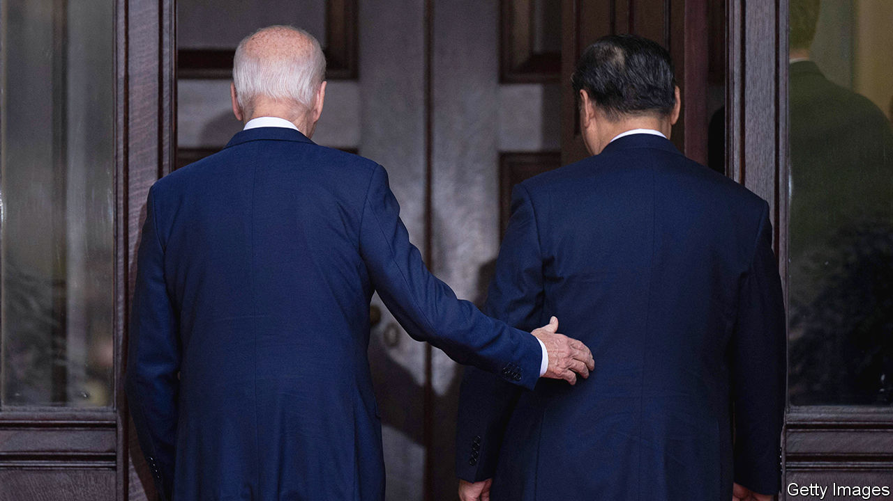

###### Flying Tigers, smiling dragon

# Joe Biden and Xi Jinping rediscover the joy of talking. Good 

##### Military contacts between America and China resume. Will they last? 

 

> Nov 16th 2023 

For months China has accused America of trying to contain its economy and encircle its territory. But in November the Communist Party’s propaganda changed tune: instead of denouncing this “new cold war”, it hailed America’s and China’s shared history of fighting Japan in the second world war, highlighting the role of American volunteer fighter pilots known as the “Flying Tigers”. State media also recalled Xi Jinping’s fondness for a couple that hosted him in rural Iowa in 1985.

Mr Xi, China’s leader, brought that spirit of detente to San Francisco for the summit of the Asia-Pacific Economic Co-operation (apec), hosted by President Joe Biden. The two leaders spoke for four hours at a country house outside the city, only their second in-person meeting as leaders of the world’s two biggest powers.

Both emphasised the fact that they have known each other for more than a decade, since they were both vice-presidents. But they disagreed on many things, not least the nature of their countries’ relationship. Mr Biden said they had to “ensure that competition does not veer into conflict”; Mr Xi warned against the very notion of a contest, saying “major-country competition is not the prevailing trend of current times”. Earth, he added, “is big enough for the two countries to succeed”.

Welcoming “some of the most constructive and productive discussions we’ve had”, Mr Biden made some modest announcements: the restoration of direct contacts between their armed forces; efforts to curb the supply of precursor chemicals to make fentanyl, a synthetic opioid; and future discussions on the dangers of artificial intelligence (ai). 

Perhaps the best that can be said for the meeting is that it took place at all. It promises to rekindle the habit of talking ahead of a turbulent year, with  and America. The meeting may have succeeded where the last one failed, in putting “a floor” under the rivalry, though the test will come only with the next crisis. The previous effort, launched on the margins of the G20 summit in Bali last year, was blown off course by the appearance of a Chinese spy balloon over America that Mr Biden ordered shot down in February.

The leaders agreed to keep open lines of communication, Mr Biden said, promising that if “either one of us have any concern…we should pick up the phone and call one another and we’ll take the call.” This will reassure Asian countries that dread being sucked into the Sino-American rivalry or, worse, a war over Taiwan. 

The status of the self-governing island, which China claims as its territory, is acutely sensitive for China’s leaders. Mr Xi told Mr Biden that Taiwan was the “most potentially dangerous issue in US-China relations”, a senior American official recounted. Mr Biden did not repeat his past off-the-cuff promises to defend Taiwan if it was attacked. But nor did he offer China new reassuring words about America’s opposition to Taiwanese independence. America, he said, has a “one-China policy” and “I’m not going to change that”.

American officials have argued that Mr Biden was meeting Mr Xi from a position of strength, having overseen a strong economic recovery, investments in green technology and semiconductors, and the strengthening of America’s alliances and partnerships in Asia. In contrast, China’s economy has “real problems”, Mr Biden told donors on the eve of the summit. Indeed, Mr Xi sounded downcast, declaring: “The global economy is recovering, but its momentum remains sluggish.”

Yet hamstrung by domestic politics and his own protectionism, Mr Biden struggles to present Asian countries an attractive counter-offer to China’s economic enticements. Ahead of the apec summit, his administration  plans to unveil a digital-trade deal under his Indo-Pacific Economic Framework (ipef), the already thin economic pillar of America’s Asia strategy. ipef is regarded as a poor substitute for the Trans-Pacific Partnership, a trade deal signed by Barack Obama in 2016 and ditched by Donald Trump in 2017. The framework does not offer improved market access, but its trade element was intended to promote open data flows akin to those between the United States, Mexico and Canada. Mr Biden has retreated under pressure from Democrats  freer trade or want tighter regulation of big tech.

The resumption of high-level military contacts, not only between theatre commanders but also between policymakers, is welcome. Whether they help to reduce dangerously close encounters between American and Chinese forces, in the air and at sea, is to be seen. The sides also resolved to pursue talks “to address the risks of advanced ai systems”, but there was no hint of a previously reported agreement to restrict ai in autonomous weapons and nuclear command-and-control systems. 

Before the two presidents met, the State Department announced that America and China—the world’s biggest emitters of greenhouse gases—had agreed to pursue efforts to triple renewable-energy capacity globally by 2030. Perhaps the most emotionally resonant deal was the Chinese promise to help curb the export of chemicals to make fentanyl and pill presses to make tablets. Fentanyl is claiming the lives of about 70,000 Americans a year; Mr Biden said he personally knew people who had lost children to the drug.

The leaders also spent time talking about regional crises, with Mr Biden urging China to help restrain both Russia’s war in Ukraine and Iran’s support for Hamas and other allied militias in the Middle East. They may not have agreed on much. But the long Biden-Xi encounter highlighted a notable absence from the apec summit: Vladimir Putin. He will not be pleased by the sight of his greatest rival and his most important friend discussing Russia over his head. That in itself may count as a win for Mr Biden. ■


