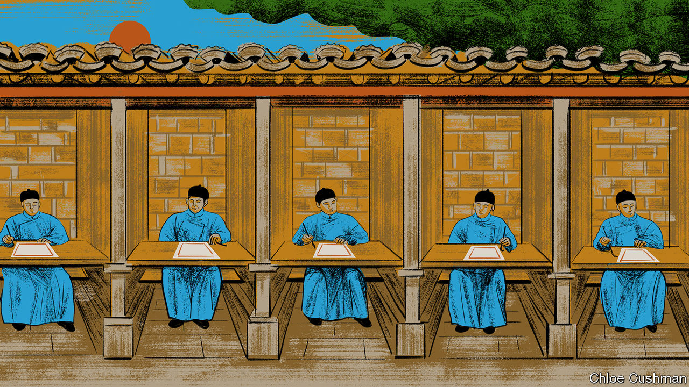

###### Chaguan

# Xi Jinping repeats imperial China’s mistakes 

##### Lessons of a loyalty test that stifled innovation 

 

> Nov 16th 2023 

One hopes Gui Youguang, a 16th-century Chinese bureaucrat, knew how to enjoy success in the moment. By the standards of the time, he was old when he passed the Ming dynasty’s most exacting grade of test for mandarins, after decades of failed attempts. Alas, not long after securing a degree at 59, Gui died.

The rigours of imperial China’s civil-service examination system—the , used to select scholar-officials for over 1,300 years—are described in a new book by Yasheng Huang called “The Rise and Fall of the EAST: How Exams, Autocracy, Stability, and Technology Brought China Success, and Why They Might Lead to Its Decline”. Arguing that the exams stifled innovation in ancient times, Professor Huang sees lessons for Xi Jinping’s China.

The became more doctrinaire over time. First instituted in 587, the exams progressively shed such subjects as mathematics and astronomy. Soon, they only tested candidates’ mastery of dense Confucian texts filled with injunctions to revere fathers, officials and monarchs. The curriculum narrowed again in the 14th century, requiring candidates to memorise ultra-conservative commentaries on Confucian classics. The commentaries advocated unquestioning obedience towards rulers. A final refinement was added during the Ming dynasty: answers had to follow a rigidly scripted format, the “eight-legged essay”, described as “the greatest destroyer of human talent” by Ch’ien Mu, a historian.

The system was a blessing and a curse, the book suggests. At a time when Europeans were recommended for public office by well-connected relations or patrons, the offered diligent commoners a path to advancement (women could not take the exams). Most tests were taken anonymously, enhancing public confidence in them. Corrupt examiners, when unmasked, faced execution or exile. By the time of the Ming dynasty (1368-1644), qualifying tests for the attracted millions of candidates, helping to explain high levels of (male) literacy. With such a large pool of aspiring scholar-officials, serving mandarins knew that they were replaceable, and thus vulnerable. Few dared to start palace coups.

Yet stability came at a cost, argues Professor Huang. Gui Youguang stands out for doggedness. But a dataset of 11,706 Ming-era candidates shows that exam-takers who reached the third and final stage of the got there in middle age, on average. Millions sat the exams and never passed. This focus on bureaucratic glory crowded out other paths to social mobility. It was handy for autocrats, as test preparation left scholars “no time for rebellious ideas or deeds”, the book argues. The ’s Confucian values promoted conformity of thought and disdain for commerce. Over time, the exams smothered the scientific curiosity that saw ancient China develop many technologies before the West, including the compass, gunpowder, movable-type printing and paper, known in China as the country’s “four great inventions”.

The was scrapped in 1905, but its legacy lives on today, in civil-service tests and in the fearsome , the college-entrance examination which rewards relentless toil. In the book’s telling, the curse of the spirit was broken once in China’s history, when Communist Party leaders embraced market-based reforms after the disasters of Maoism and central planning (and revived the , abandoned during the Cultural Revolution). During that reform era, lasting for 40 years after 1978, the book credits the party with successfully balancing stability, economic growth and technological progress. As in imperial times, a strong state overshadowed a weak society. But the reform-era party also praised private entrepreneurs and allowed policy experiments by regional governments. To harness the world’s dynamism, officials sought out foreign capital and international academic exchanges.

Then, in 2018, Mr Xi abolished the only term limits that constrained him as leader. His China is increasingly autocratic, statist and inward-looking. Private businesses endure more meddling by party cadres, and youth unemployment is high. In a flight to safety, almost 2.6m people applied to sit civil-service exams this year, chasing 37,100 posts. Too often, in public institutions that once boasted of being meritocratic, “merit” means fealty to one man. Officials and university students must devote ever more hours to studying Xi Jinping Thought and other dogma. 

Outsiders wonder how ordinary Chinese can bear this more controlling age. One answer is that, to some at least, equality of opportunity matters more than the pursuit of diverse, individual dreams. A good place to hear such views is the Imperial Examination Museum of China in the eastern city of Nanjing. Its white-walled, grey-roofed courtyards are surrounded by statues of prize-winning test-takers from history. Civil-service exams are China’s “fifth great invention”, signs declare. On this site in imperial times, 20,000 candidates took exams alone in tiny brick cells.

Suffering can be endured, but not unfairness

Chaguan met Ms Xing, a medical student, praying at the God of Examinations pavilion in the museum grounds. Yes, China teaches to the test and maybe that limits innovation, she ventured. But China is unequal, with very rich and very poor regions. In such a country, collective interests trump the “personal development” that is important to foreigners, she suggested. “Just as in ancient times, people are equal when they are in the same exam.”

Inside the museum a young doctor, Ms Wang, pointed at a rowdy school group. In Western countries teachers can foster individual creativity, she said. “We have to stick to the tests, and we have no way to do tailored education.” The poor, including her former classmates from rural Henan, can change their destinies only with books and exams, she says. The party knows to take that sort of stubborn, unflashy ambition seriously. Bold talk of delivering a prosperous, high-tech China for all may have to wait, as the economy slows. But in these hard times, guaranteeing a fair shot for the diligent is one promise that rulers can ill afford to break. ■


 (Nov 9th)


