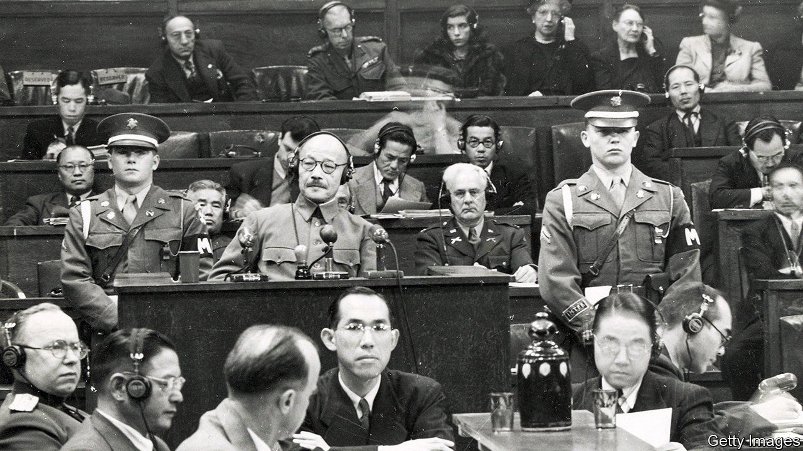

###### The scales of injustice

# Can trials heal the wounds of war? 

##### A new book looks at the legacy of Japan’s war-crimes tribunal 

 

> Nov 16th 2023 

By Gary Bass. 

THE WORLD IS still haunted by 20th-century crimes so grave that any attempt to bring the perpetrators to justice seems feeble. The trials at Nuremberg in 1945-46 did little to salve wounds left by the . And the Tokyo trials of alleged Japanese war criminals, which lasted two and a half years from 1946-48, have not stopped outpourings of anger across Asia whenever, for example, a senior Japanese politician visits , a Tokyo shrine to the war-dead, including convicted war criminals. 

The aftermath of wars has taken on fresh significance with conflicts raging in Israel, Sudan and Ukraine. In much of Asia, the second world war, which was followed by tribunals that tried to dispense justice, is still unfinished business. Japan’s trials concluded 75 years ago. In a meticulously researched history, Gary Bass, a professor at Princeton (and former journalist for ), looks at why attempts to produce a shared sense of justice failed. 

Like Nuremberg, Japan’s tribunal was for the most serious war criminals, those guilty not just of breaking the laws of war but, in addition, of “crimes against peace” (ie, planning the war). This was controversial then and remains so. For America the greatest crime was the attack on  in Hawaii and elsewhere in December 1941. But, as aggressors always do—think Vladimir Putin in Ukraine—the accused pleaded that they and Japan acted in self-defence. Even some of the 11 judges from different Allied countries disputed whether Japan’s aggression was actually a crime. Radhabinod Pal from India, for example, argued the law lets each country decide what counts as self-defence.

Few doubted that Japanese troops had been guilty of outrageous war crimes, exhaustively covered at the trials, which heard months of harrowing testimony, including about the “rape” of Nanjing, China, in 1937 and the Bataan death march of prisoners-of-war in the Philippines in 1942. The issue with these and other horrors was not whether they were crimes, but where responsibility lay—with the individual soldier, his immediate commander, his general, the prime minister or the man who had appointed the prime minister, Emperor Hirohito.

Before the tribunal convened it had been decided not to indict the emperor. This led to a feud between the bibulous chief American prosecutor, Joseph Keenan, and the court’s president, Sir William Webb, a pompous and cantankerous Australian. Webb found himself at odds with most of the other judges. They failed to reach unanimous verdicts. 

Of the 25 defendants who survived the trial, all were convicted and seven were hanged, including the prime minister, Tojo Hideki. But some of the judges dissented, including Pal, who argued in a 1,230-page objection that all the defendants were innocent. Pal became a hero to many Japanese for saying the trials represented “formalised vengeance” and could bring “only an ephemeral satisfaction, with every possibility of ultimate regret”.

His dissent also covered events beyond the scope of the trial: what he called the “inhuman blasts” at  in 1945. The killing of tens of thousands of civilians in these attacks, seen by many as militarily unnecessary, was not a war crime. That will always make the Tokyo trials seem lopsided to many Japanese.

Mr Bass’s assertion that the tribunals’ failure played an important and largely negative role in the making of modern Asia is true enough. But would it have made a difference had, say, the emperor been put on trial? It is hard to believe that would have made the outcome more palatable in Japan, or that it would have changed much in the prosperous democratic country that Japan has become. 

In Tokyo justice was always going to be tempered with compromise and political expediency. For all their flaws, the trials were not the problem. The war was. ■


