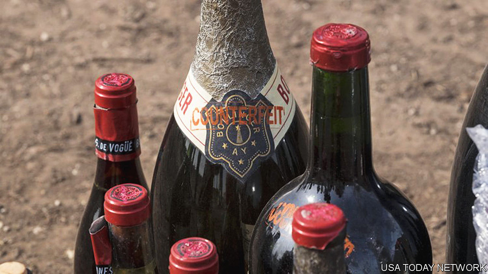

###### Bottle shock

# How to spot a fake wine 

##### “Vintage Crime”, a new history, looks at “Winegate” and other scandals 

 

> Nov 14th 2023 

By Rebecca Gibb. 

To make a 1945 Mouton Rothschild, mix two parts Château Cos d’Estornel to one part Château Palmer and California cabernet. That was the strategy of, a wine fraudster, who poured his mixture of wines into old bottles with fake labels and sold them to gullible collectors. In 2014 he was sentenced to ten years in an American prison and ordered to forfeit $20m and to pay another $28m to victims. 

Deported to his native Indonesia in 2021, Mr Kurniawan is now back in business. At fancy dinner parties, clients ask him to create fake  to taste and compare with the real thing. Many tasters reportedly prefer his concoctions. “Mr Rudy Kurniawan is a vinous genius,” one fawned. If a phoney bottle fulfils its purpose—to give pleasure—does it matter that it is not what it claims to be? 

Mr Kurniawan is one of the high-profile scammers whose exploits are recounted in “Vintage Crime”, a history of wine fraud by Rebecca Gibb, a wine journalist and master of wine. The  shares similarities with the art world. It relies on the opinions of experts, whose belief in the authenticity of a Château Lafite (or a ) can dramatically alter its value. But experts can be duped. Many wine connoisseurs have vouched for dubious bottles. General consumers do not question the labels on their wines. A study involving more than 6,000 blind tastings found that non-expert drinkers actually preferred cheaper wines. Another study found tasters perceived expensive wines to be higher quality only when the prices were revealed. 

Ms Gibb’s history begins in , when winemakers and vendors adjusted wines with herbs and spices to make them taste better. Only the rich could afford wines that did not require adulteration. Soldiers drank a blend of vinegary wine and water, while slaves’ wine was made from the skins of already-trodden grapes. Pliny the Elder insisted that these drinks “cannot rightly be styled wines”. 

Most additives were innocent, but not all. In the 1690s monks in Ulm, Germany, began keeling over. A physician discovered that a dodgy merchant had been sweetening sour wines with lead monoxide. A new law criminalised this practice, but drinkers continued to imbibe toxic wine. Some biographers have suggested that Beethoven, a heavy wine-drinker, may have gone deaf due to lead poisoning. 

Labels can be deceptive. When vineyards in  were ravaged by the phylloxera parasite in the 1880s, French winemakers began importing wine from elsewhere and sold it as Burgundy. In 1889 France passed the which defined wine as fermented fresh grapes (and restricted producers from watering it down or including additives). 

However, the law did not prevent merchants from buying low-quality grapes and turning them into wines labelled “champagne”. Between 1907 and 1911 nearly half of all champagne bottles sold in France were not genuine. Pressure from wine groups eventually led to the creation of the appellation system, which drew borders around regions to ensure that only wine from there could be labelled as such. (The system relies on the concept of , a specific piece of land giving  that cannot be replicated elsewhere.) 

Naturally, scammers have continued to flout the rules. In a case in 1974 that Ms Gibb dubs “Winegate”, merchants were discovered selling cheap wines from the Languedoc region as pricey Bordeaux. When Austrian grapes failed to ripen in 1985, winemakers added diethylene glycol to sweeten their wine. 

China is now the primary purveyor of knock-off wines, which often bear visibly fake labels (for example, saying the producer is “Benfolds” instead of “Penfolds”). One survey found that more than a quarter of outlets across 13 provinces sell fraudulent bottles. No wonder some winemakers demand to see their finest bottles smashed after drinking when they do tastings in China. An empty bottle bearing a coveted label is a fraudster’s dream. ■


