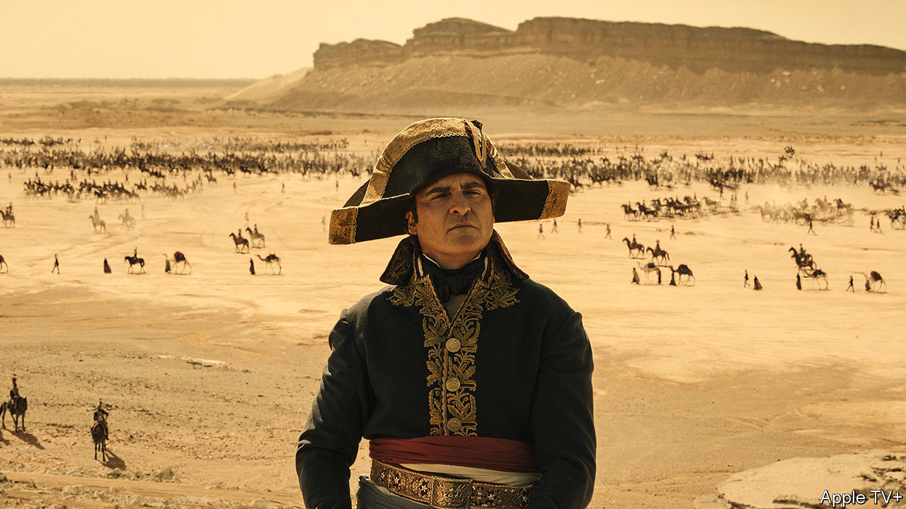

###### Back Story

# Ridley Scott’s “Napoleon” cuts the emperor down to size 

##### His epic new film shows how hard it is to make a good biopic 

 

> Nov 15th 2023 

Two versions of  crop up on screen. The first is a titan of history who marches vast armies across Europe, forging his own destiny and the continent’s. This is the figure with whom men of a certain age and type are often fascinated—such as would-be statesman Connor Roy, who in the TV show  tries to buy Napoleon’s shrivelled penis at auction.

The second Napoleon appears in cartoons and comedies in a bicorne hat. He is touchy about his height (in reality, average for his era) and talks in a pantomime French accent (the actual Napoleon had a Corsican twang). One version casts him as an embodiment of martial power; the other lampoons it.

You might expect the hero of “Napoleon”, a lavish film directed by Sir Ridley Scott and released on November 22nd, to stand firmly in the potentate camp. Oddly, he has a foot in both. The misfiring movie is a case study in handling two big challenges of biopics, one perennial, the other especially acute now: how to shape a luminary’s life into a story, and how to judge and depict his flaws.

The real Napoleon—a general by 24, emperor at 35—lived on fast-forward. Sir Ridley packs lots of the highs and lows into a two-and-a-half-hour extravaganza: victory at Austerlitz, calamity in Russia and the , where a vanquished Napoleon (played by Joaquin Phoenix) is doomed to exile (again). He weaves the triumphs and disasters into a chronicle of Napoleon’s passion for Joséphine de Beauharnais, his first wife.

It’s grisly stuff—and that’s just the love affair. This emperor is not like ’s, the suavest to don the familiar greatcoat, in his case for “Désirée” (1954), which chronicles Napoleon’s passion for, er, Désirée Clary, briefly his fiancée. Instead he is a gauche oddball. Looking distinctly wizened for a 26-year-old (Mr Phoenix is 49), he runs into Joséphine (Vanessa Kirby), fresh out of a Jacobin prison, at a louche ball in 1795. Along with their skimpy bodices, the ladies wear red ribbons around their necks in a ghoulish nod to the guillotine.

“Why are you staring at me?” she asks him. Romance-wise, it’s downhill from there. Napoleon is a selfish, perfunctory lover, and both have affairs. “You are empty,” he bawls at Joséphine at a formal dinner, angry at her failure to give him an heir. “And you are fat,” she volleys back. Then they throw food at each other.

The battles are pretty nasty, too. When the foes of France plunge through the ice at Austerlitz, the underwater shots are bloody yet balletic, as memorable in their way as the scenes of carnage in Sergei Bondarchuk’s “Waterloo” (1970). The real-life Napoleon did not spare the horses, and neither does Sir Ridley. If you were squeamish about Russell Crowe’s tussle with a tiger in , another of the director’s sword-and-soundbite epics, you will not like what a cannonball does to Napoleon’s mount at the siege of Toulon. A closing note estimates that his wars cost 3m human lives.

The film glosses over Napoleon’s industrial-scale looting and habit of skedaddling when his armies got into bother. Still, Sir Ridley’s verdict on his subject, as both husband and leader, is cutting. To Napoleon’s defenders, he was a fiery champion of the  and a swooning romantic. In this incarnation he is a warmonger and a pig. 

The harsh judgment, however, is not what hobbles the movie. Good films can be made about bad people. The problem lies in Sir Ridley’s answer to the other challenge of biopics, namely how to edit such an overstuffed life for the screen.

Among his omissions is: why? His malignant Napoleon is shorn of mystique, but his motivation is a mystery, beside a hint of sexual neurosis, some mummy issues and the odd mean remark about Corsicans. The same goes for his appeal, to both Joséphine and his followers. His laws and reforms—a figleaf for conquest or an enduring legacy, —are neglected. As a statesman he is crass and petulant. “You think you’re so great because you have boats!” he yelps at the British.

Biopics, like statues, are both homages to historical figures and an argument about history itself. Implicitly they claim that some individuals shape the world rather than the other way round. Napoleon did that as much as anyone; yet because Sir Ridley prefers events to explanation, his hero is a slight man in a big film. For all his derring-do, he has a whiff of the grouchy Napoleon in “Bill and Ted’s Excellent Adventure” (1989), who is teleported to modern America, hogs the ice-cream and cheats at ten-pin bowling.■


