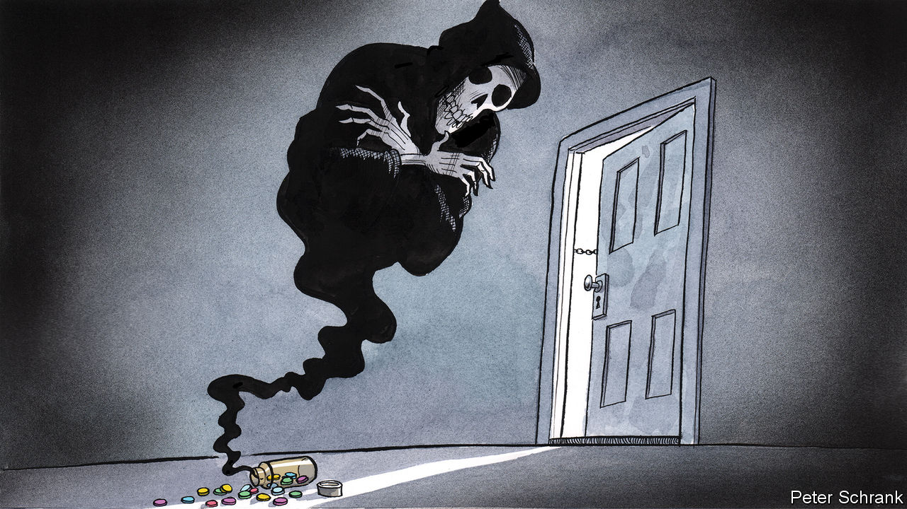

###### Charlemagne

# Fentanyl kills thousands every year in America. Will Europe be next? 

##### The deadly drug may be coming to European shores 

 

> Nov 16th 2023 

On the northern edge of Paris, far from the brasseries and museums, lies a cautionary tale of what happens when humanity trips up. Beneath a slew of motorway interchanges near the Porte de la Chapelle, dozens of dead-eyed drug addicts aimlessly wade through a makeshift campsite of tents and trash. There is no hope left here, just the stench of excrement and despair. On a recent visit, your columnist was too reticent to ask the hollowed-out souls wandering by which poison had caused their fall; but the place is known as or crack hill. Social workers come and go; the authorities otherwise turn a blind eye. Police have moved the encampment around over the years, better to keep the inconvenience of human misery away from gentrifying neighbourhoods nearby.

Many cities in Europe have pockets of such squalor. Yet for all the harm caused to society by drugs commonly scored on the streets of Paris, Berlin or Warsaw, none can match the ravages of fentanyl, a narcotic that has devastated swathes of America. As any recent visitor to downtown San Francisco might attest, the effects of this synthetic opioid, vastly more potent even than heroin, cannot be confined to small areas on the fringes of the city. Drugs of fentanyl’s ilk currently kill around 70,000 Americans a year, more than died in the wars in Vietnam, Iraq and Afghanistan combined. In Europe, that brand of junk never really took off: no more than 200 people are thought to overdose from it every year. Largely as a result of the fentanyl gap, Europe has less than a tenth as many drug deaths as America, despite its bigger population. The ravage that hasn’t happened is a quiet policymaking triumph for Europe. But governments fret that this may not be the case for long. Concern is mounting that the fentanyl onslaught may soon find its way across the Atlantic. 

Why has fentanyl thus far spared Europe when it caused such devastation in America? Given the drug’s origins—it was synthesised in Belgium in 1959, as a legal painkiller—it might have been expected to be discovered by junkies there first. But it took American no-holds-barred capitalism to help turn it into a phenomenon. From the 1990s on, doctors there prescribed painkillers willy-nilly, incentivised by unscrupulous pharmaceutical firms. By 2015 some 227m prescriptions for opioids were made out every year in America, roughly one for every adult. A cohort of patients hooked on pills soon discovered they were available illicitly when prescriptions ran out. (Mexican cartels were eager to help, often using the requisite chemicals from China.) Europe, by contrast, broadly resisted, in part thanks to universal medical care. Unlike Americans, those with ailments could get the procedures they needed to alleviate pain, instead of turning to painkillers for a quick fix. What addiction there was could be tackled with opioid-substitution treatment schemes.

Alas, that may not be enough to keep Europe out of fentanyl’s deadly clutches. The authorities have two concerns. One is around heroin, which Europe’s 1m users of illicit opioids are most often hooked on. Nearly all of the stuff injected or snorted in Europe is derived from poppies grown in Afghanistan. The Taliban, since returning to power, have enforced production cuts of perhaps 95% this year, which is expected to severely curtail the availability of cheap heroin in Europe, come 2024. Facing a dearth of supply, drug gangs are expected either to mix fentanyl into what little heroin they have, to give it extra potency, or to peddle the synthetic drug as a wholesale replacement. A similar shortage of heroin after the last Taliban crackdown in the early 2000s caused fentanyl to take root in Estonia, so far the only part of Europe to have faced a durable outbreak of addiction. This replacement theory is now being tested in Ukraine, where the heroin supply has been disrupted by war but synthetic drugs remain relatively available.

The shortage of heroin might coincide with a glut in illegal fentanyl shipments to Europe. Unlike cocaine or heroin, which require elaborate manufacturing and smuggling operations, the drug is cheap to make and ship. Europol, the EU’s law enforcement arm, has warned that Mexican cartels are co-operating with criminal networks in Europe to expand the market for drugs including fentanyl. (What problems Europe currently has with synthetic opioids are overwhelmingly caused by pills made legally being misused.) Antony Blinken, America’s secretary of state, has warned his European counterparts that either they already have a problem with fentanyl-like drugs but don’t know it yet, or they will soon have one. The switch from one type of opioid to another can be sudden, and all but irreversible in the case of fentanyl, given the huge margins gangs can make from it: a single kilogram can generate over $1m in profits, much more than other drugs. Some factors that were once thought to have protected Europe may prove fleeting: Canada has state-funded health-care systems to rival any in Europe, yet it too has fallen prey to fentanyl. 

The drugs do work, sadly

Europeans have one sizeable advantage in their fight against fentanyl, says Keith Humphreys, an addiction expert at Stanford University: they have seen the ravages opioids have caused in America, and know how important it is to keep the genie in the bottle. The authorities are monitoring wastewater for traces of the drug, the better to stamp out any outbreaks. What little fentanyl police come across is subject to rapid crackdowns. Doctors are careful about prescribing addictive painkillers unnecessarily. Treatment of fentanyl addiction is better understood, too.

Europe can allow itself a little crowing. The welfare state, maligned by many on the political right as having turned European economies sluggish, turns out to have upsides, too: it played its part in sparing its citizens the worst outcomes in life. Only a few have fallen between the cracks, in Paris and beyond. But ensuring that this remains the case will require vigilance and grit. ■


