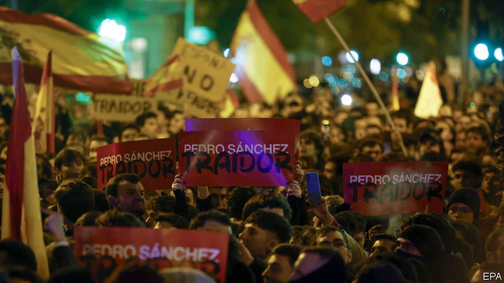

###### On the verge of a nervous breakdown

# Spain’s prime minister secures his job, at a high cost 

##### An amnesty for separatists may calm some Catalans, but it infuriates other Spaniards 

 

> Nov 9th 2023 

A BUS MARKED “Sánchez traitor” driving past the Prado. Talk of a “coup” and a “dictatorship through the back door”. Boisterous protests every night in front of the Socialist party headquarters. Spain is seeing its biggest constitutional clash in years. And it is not likely to end soon.

The crisis has been gestating for months. In July’s general election, the conservative opposition People’s Party (PP) came first, but fell short of a majority even with support from the hard-right Vox party. But the Socialist party of the incumbent prime minister, Pedro Sánchez, fell even shorter, despite its alliance with Sumar, a farther-left party. Since then, however, Mr Sánchez has won support from five regional parties, including two Catalan separatist ones that held an illegal independence referendum in 2017. Junts per Catalunya (“Together for Catalonia”) held out for the biggest prize: an amnesty for hundreds of people prosecuted for the referendum. It would allow, most notably, its leader and Catalonia’s former president, Carles Puigdemont, to return from exile in Belgium.

The prospect of this amnesty has brought Spain’s politics, at an angry simmer at the best of times, to a raging boil. Mr Sánchez’s solid control over his party ensured that he won a vote in parliament on November 16th to reinstall him as prime minister. But the new term comes at a heavy cost.

Mr Sánchez had insisted before the election that any amnesty would be unconstitutional, a view shared by many other Socialists, including Felipe González, modern Spain’s longest-serving prime minister (1982-1996). Mr Sánchez refused to use the word for weeks while negotiating. When he finally broke the taboo, he presented it as a high-minded opportunity to turn the page on the Catalan conflict—while admitting he would not have done so if the parliamentary maths had turned out differently. But in a speech on November 15th he said more frankly than ever before: “The circumstances are what they are. It’s time to make a virtue of necessity.”

What are those virtues? The deal in question consists of two documents: a four-page political agreement between Junts and the Socialists, and the amnesty bill itself, released several days later, on November 13th. The Junts-Socialists deal reads as though written by Junts, even referring—as Catalan independence narratives invariably do—to an 18th-century defeat in which the region lost much of its self-governance. Coming to the present day, it says that a commission will investigate the use of politically motivated criminal prosecutions against separatists. This is a big concession to Junts, and earned a rare public rebuke from a clutch of judges’ organisations over fears that their independence would be subsumed. 

But the prevailing view in Madrid—that the deal “was cut as though by a tailor” for Junts, in the words of one PP leader—is hardly universal in Catalonia. The documents make no mention of a Catalan “nation”, something the separatists crave (because it would, in their view, ground independence in international law). And the only mention of a future independence referendum is in fact a major concession by Junts: the agreement says Junts will seek another vote under Article 92 of the constitution—which only the prime minister may initiate, and in which “all citizens” (not just Catalans) could vote, in effect dooming it to failure.

That means, at least for now, a renunciation of unilateral action—a concession that has infuriated the pro-independence hard core. Clara Ponsatí, a separatist member of the European Parliament who went into exile with Mr Puigdemont, calls it an “insult to the people who trusted and protected him” and a “humiliation”. The Catalan National Assembly (ANC), the main grassroots organisation for the independence cause, says the deal “continues the [Catalan] submission to Spain”. The group’s president, Dolors Feliu, told  before the agreement became public that the ANC may create a new independence party if the deal was insufficient—as it now says it is. 

The amnesty bill includes an unprecedented 11-page prologue explaining its purpose. It makes repeated reference to the rule of law and the importance of the constitution (which guarantees the territorial integrity of Spain). In other words, it is intended to render the law bulletproof before a challenge at the constitutional court. More than 300 referendum supporters now facing trial will see their charges annulled, as will 70-odd police in trouble for their part in the government’s brutal breaking-up of the referendum in 2017. 

The way Mr Sánchez has repeatedly trampled through red lines and gone back on categorical promises has gravely damaged the country’s , peaceful coexistence between people of different places and politics. But Mr Sánchez not only has a grip on his party that prevented anti-amnesty voices from prevailing; he has also populated other parts of the state with allies. This includes the constitutional court that will scrutinise the amnesty, and which now has a left-leaning majority. Mr Sánchez’s opponents seem to take it for granted that the court will wave the amnesty through. The PP controls the Senate but it can only delay, not block, the law. 

Hence efforts to internationalise the dispute. The right wants the European Union to intervene; many take it for granted that the bloc will take disciplinary action as it has against Hungary and Poland for rule-of-law backsliding. But two European Commission spokesmen played down any such talk this week. Mr Sánchez has gambled and won before. He now hopes tempers will cool with time, as they have before. But each time he takes another unprecedented step, he makes that harder. ■

