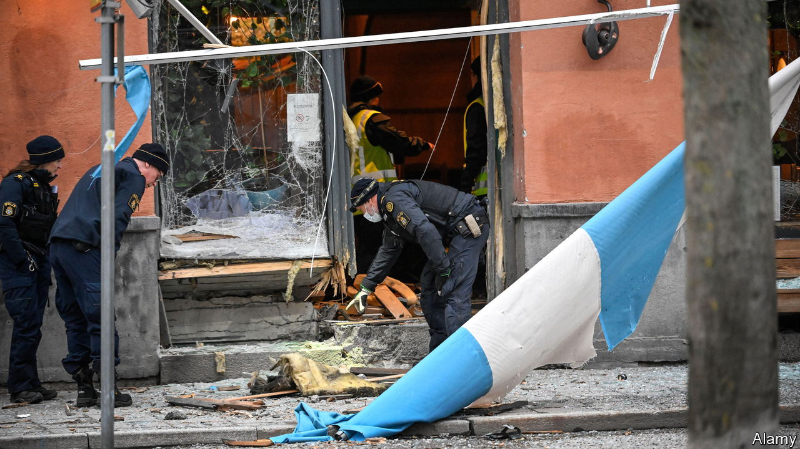

###### Gang of rivals

# Sweden is suffering a grim wave of gang violence 

##### The country has Scandinavia’s highest rate of shootings and bombings 

 

> Nov 13th 2023 

ON OCTOBER 15TH thousands of followers of 5iftyy, a Swedish rapper, tuned into his Instagram channel for what he said would be an important livestream. They found themselves watching a bearded man brandish a gold-plated AK-47 while hurling insults at , backed by three rifle-toting thugs in balaclavas. The man with the golden gun was Mustafa “Benzema” Aljiburi, a leading member of a  known as Foxtrot. Mr Aljiburi is believed to be living in Iraq. He staged the appearance to dispel rumours of his death and to threaten various enemies, including a Swedish prosecutor.

The livestream looked ridiculous, but the threats were serious. For years Sweden has suffered from high rates of gang-related violence, but for the past two years it has been relentless. In the first ten months of the year there were 324 shootings in Sweden, 48 of them fatal. The rate of gun crime is several times higher than that in neighbouring countries. Gangs have taken to attacking the homes of rivals with hand grenades and dynamite; there have been 139 explosions this year. The government is frantically toughening laws and raising its law-enforcement budget, but it is behind the curve. “We should have seen this coming and taken these measures at least ten years ago,” says Daniel Bergstrom, an adviser to Sweden’s justice minister. 

The current wave of violence is largely driven by feuds involving Foxtrot. The gang draws its name from its leader, Rawa Majid, a 37-year-old Kurdish Swede. (“Rawa” sounds like , Swedish for fox.) Mr Majid immigrated from Iraq with his mother as a child and grew up in Uppsala, a city about 70km north of Stockholm. Over the past few years, police say, he has turned Foxtrot into the country’s biggest distributor of illegal narcotics, co-opting competitors or seizing their territory. He now directs these efforts from Turkey, where he moved after completing a prison stint on drug charges in Sweden in 2018.

Overall, Sweden remains a relatively safe country, and the areas where the conflicts play out hardly look like crime-ridden slums. Skarpnack, a suburb south of Stockholm that has seen several shootings and bombings, is a tidy neighbourhood of low-rise flats and gardens. At a recent town council meeting in the cosy  (community centre), community activists pressed council members about mixed-income housing and pleaded for the preservation of a bat colony in a local park. But talk soon turned to security concerns. “We had several shootings at the beginning of 2022 that really woke us up,” says Monica Lovstrom, a city-council member. This year there have been three explosions in the district; one on August 19th blew up the stairwell of an apartment building.

Gangs often use bombings as a warning, and none of those in Skarpnack killed anyone. (The only bombing fatality in Sweden this year was a 25-year-old bystander.) But in early September a 13-year-old boy from one of the district’s richer and safer areas was found in a forest south of the city, shot in the head. Prosecutors have not released details, but say the murder was gang-related. Because the minimum age of criminal responsibility is 15, gangs are recruiting ever-younger teenagers as drug couriers and, occasionally, assassins.

Police say that some of the recruitment happens via chat apps. School-age children follow accounts that post lists of tasks and prices. Commonly, they deliver drugs; very rarely, they might be handed a gun and a description of a target. With no training, they are likely to miss. 

Politically, the crime wave is difficult for the government. Ulf Kristersson, the centre-right prime minister, led his Moderate party to power in an election last year by blaming gang violence on the centre-left Social Democrats, who had been running things since 2014. Conservative voters expect a right-wing cabinet to tackle crime, the more so as it depends on support from the hard-right anti-immigrant Sweden Democrats.

The government has indeed lengthened criminal sentences, though many are still shorter than those in other northern European countries. Mr Kristersson says he wants to adopt “Danish penalties for Swedish crimes”, a nod to Denmark’s tougher rules (for example, doubling sentences for crimes committed as part of a gang). He is also giving the police more powers. A law that came into force on October 1st allows them to request electronic surveillance based on evidence that the target is involved in organised criminal activity; previously they had to be connected to a specific crime. 

Some parties have been floating less practical ideas. The Sweden Democrats have suggested that children as young as 13 should face adult penalties for severe crimes, including life in prison, and that gang members with non-Swedish backgrounds be deported. The Social Democrats’ leader mooted the idea of using the army—though what it could do about adolescents joining gangs is not clear.

Others think the exclusive focus on enforcement is short-sighted. “We have to focus on fighting the deterioration of young people’s values,” says Jan Jonsson, a deputy mayor of Stockholm and a former school principal in a tough neighbourhood. He wants to teach civic morals systematically in schools, and to increase funding for the juvenile-detention centres where young criminals are held.

That may seem unlikely to bear fruit soon. But curtailing gang violence through law enforcement will be a tough slog too. Many of the criminal networks’ top figures are, like Mr Majid, not even in Sweden: in late October five people connected to Foxtrot, reportedly including 5iftyy, were arrested in Tunisia, and on October 31st another man reported to be a member of Foxtrot was killed in Sarajevo. 

As police well know, in a drug war successes are usually temporary. In 2020 Dutch and French police cracked an encrypted network called Encrochat which drug networks had been using to communicate. Swedish prosecutors used the evidence to send dozens of figures from then-dominant gangs such as Bandidos and Satudarah to prison. The effect, according to Mr Sund, the detective, was to open up territory for someone new. A few years later Foxtrot was running the show. ■

: An earlier version of this article said that the minimum age of criminal responsibility in Sweden is 16. It is, in fact, 15. Sorry. 

