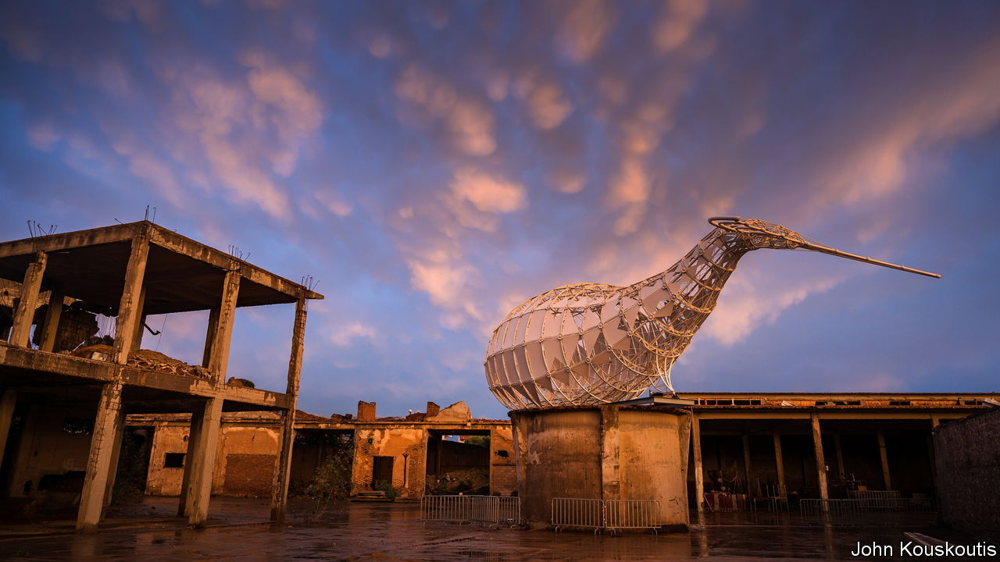

###### Soft power, then and now

# The ancient Eleusinian mysteries get a new incarnation 

##### Athens’s secret weapon reappears as festival 

 

> Nov 16th 2023 

In the perpetual rivalry between ancient Greek cities, one of the assets boasted by Athens was control of a numinous place called Eleusis, about 20km to its west. For centuries, seekers of illumination processed along the Sacred Way from the foot of the Acropolis to a seaside temple where they underwent a secret rite. It was forbidden on pain of death to disclose what happened. All that is known is that having fasted for three days, initiates would quaff a drink and then be presented with “things enacted, things shown, things said” that celebrated the return of the goddess Persephone from her abduction to the underworld. 

For the past year, modern Greece’s mandarins have tried to turn the location, now called Elefsina, into a new intangible asset, hosting their own wondrous variety of happenings, from multi-media installations and dance displays to a conference of scholars, including psychedelic medicine buffs, who debated the Eleusinian mysteries. Elefsina has been one of three European “capitals of culture” during 2023.

The year-long festival’s focus was not merely on the under-visited archaeological site, but also the hardscrabble new town of some 30,000 blighted by steelworks, cement factories and oil refineries, as well as a graveyard for ships. This grim backdrop has not deterred bold experimentation. Katerina Gregos, the doyenne of Greece’s contemporary-art curators, invited creative types from nine countries to assemble a show that used underwater film clips, random industrial artefacts, gravestones and wrappings from munitions to comment on migrant labour, shipwrecks and arms factories. 

Next month’s closing ceremony will be a beginning, not an end, insists Nana Spyropoulou, the festival’s administrator. The stress will be on the use of semi-ruined buildings which have been rehabbed. Buffing up the whole of the Sacred Way, part of it now a motorway, is not yet planned; but it should be.■

