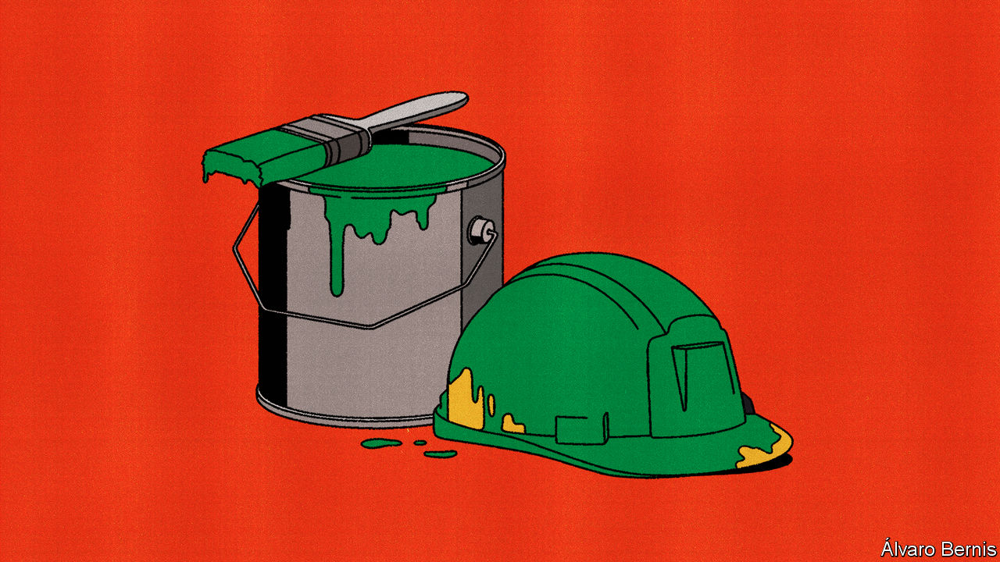

###### Free exchange

# The false promise of green jobs 

##### Modern industrial policy has a tension at its heart 

 

> Nov 14th 2023 

“When I think climate, I think jobs—good-paying, union jobs,” proclaims Joe Biden, America’s president. Ursula von der Leyen, the head of the European Commission, says that her “Green Deal” offers a “healthy planet” for future generations, as well as “decent jobs and a solemn promise to leave no one behind”. , Britain’s probable next prime minister, promises to back “a new energy company that will harness clean British power for good British jobs”. The state will intervene. The planet will be saved. Jobs will come. And they will be good. 

Politicians across the rich world agree that —wheezes which aim to alter the structure of the economy by boosting particular sectors—deserves to make a comeback. Just about all agree that it should focus on climate change. But is there actually any logic to combining the two? Industrial policy seeks prosperity in the form of economic growth and jobs; climate policy seeks lower emissions and the prevention of global warming. Marrying two aims often means neither is done well. As politicians pour trillions of dollars into green industrial policy, they will increasingly have to choose between the two objectives.

The argument in favour of any climate-change measure starts with externalities (those costs or benefits not borne by producers). There is a missing market for pollution, since emitting greenhouse gas is free. It is thus oversupplied, despite the fact that it hurts others. One way to tackle this is by putting a price on carbon, as many countries are doing. Yet doing only this might encourage investment in making dirty technologies more efficient, and as a result allow fossil fuels to extend their lead over clean tech. 

Hence the need to combine carbon prices with subsidies for clean-tech research. In a paper published in 2016, Daron Acemoglu of the Massachusetts Institute of Technology and colleagues argue that, under such a regime, subsidies would do most of the work in redirecting technological progress towards clean energy. Only after alternatives to polluting tech had become better and cheaper would carbon pricing take over by encouraging their uptake.

Would such a regime, prudent though it may be, satisfy the political desire for green jobs? Consider the lithium-ion battery, which powers electric vehicles. In 2019 the chemistry Nobel prize went to three scientists for developing it: John Goodenough, then at the University of Oxford, a British university; Stanley Whittingham of ExxonMobil, an American oil firm; and Yoshino Akira of Asahi Kasei, a Japanese chemical firm. Yet none of these countries dominates production of such batteries. China does. Research produces its own set of externalities (positive ones), since knowledge tends to be shared. As companies would rather not give competitors a leg-up, that makes it undersupplied.

The most efficient climate-change policy—taxing carbon and subsidising research—is unselfish. As Dani Rodrik of Harvard University, an advocate of industrial policy, has noted, not only is the social return from investing in green research higher than the private one, so is the international return higher than the national one—meaning that both companies and governments tend to underinvest in it. The greenest policies may therefore not create many jobs. By contrast, greenish policies that create jobs may at least have the merit of making climate action acceptable to voters leery of spending on things that benefit other countries.

But as the rich world proceeds along this path, difficulties will emerge. Economists have traditionally criticised industrial policy on the grounds that governments are bad at it. Their ineptitude comes in two forms. First, politicians struggle to “pick winners”. They lack the ability to identify which tech will win out. Although in the late 2000s the American government offered a loan guarantee to Tesla, which eventually emerged as a successful electric-vehicle maker, it also offered support to Solyndra, a solar-power firm that went bankrupt. This lack of knowledge among politicians contributes to the second problem: rent-seeking. Industrial policy offers a way for companies to capture public funds via lobbying. Governments fail to cut off weak businesses, since doing so means admitting that they wasted public money in the first place.

The new economics of industrial policy, as put forward by Reka Juhasz of the University of British Columbia, Nathan Lane of the University of Oxford and Mr Rodrik in a paper this year, rests on the idea that such problems can either be solved or have been exaggerated. A disciplined government that cuts off bad investment can avoid waste. Clarity and transparency when it comes to goals will help politicians jettison failing companies. 

Striking a blow

Maybe. But this is where climate and industrial policy become uncomfortable bedfellows. A firm could deliver good jobs while not being any greener than its competitors. Is that a failure or a success? Is an investment that cuts emissions while displacing workers a worthwhile one? Moreover, it is unclear whether, say, guaranteeing a loan to a loss-making clean-tech firm, such as the bail-out for Siemens Gamesa, a German wind-turbine maker, which was confirmed on November 14th, is throwing good money after bad or investing in the climate. Recent strikes by American carmakers were partly motivated by the idea that manufacturing cleaner electric vehicles will mean fewer jobs than assembling their petrol-powered counterparts—a difficult situation for a government committed to green industrial policy. Such policy seeks to improve international competitiveness, deliver high-paying work, make the economy grow, revitalise poorer regions and cut emissions at the same time. In reality, these goals are often opposed. 

The more ambitious industrial policy becomes, the more difficult it will be for politicians to exercise the control advocates say is required. Many governments, including America’s, also want industrial policy to bolster national security. Taken together, such aims risk an almighty mess. ■


