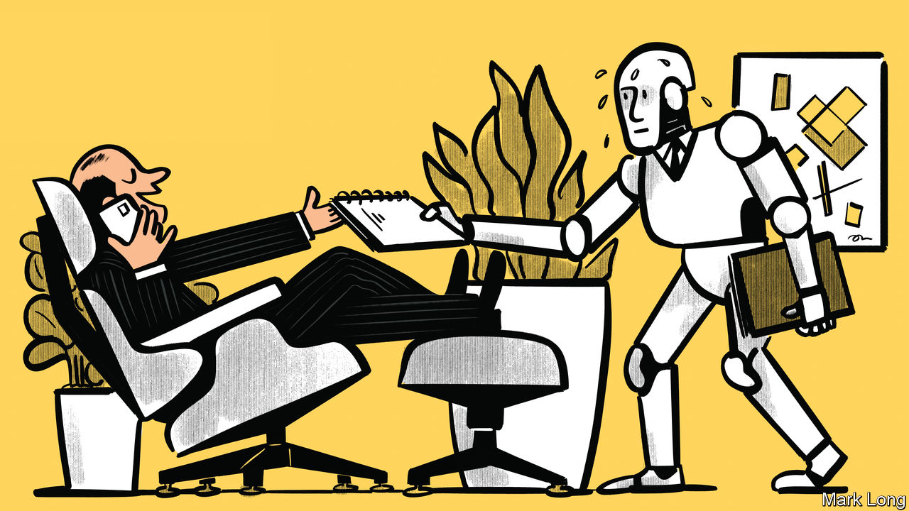

###### Reasons to be cheerful

# What will artificial intelligence mean for your pay? 

##### A dispatch from industries on the front line of economic transformation 

 

> Nov 16th 2023 

Around a decade ago Carl Benedikt Frey and Michael Osborne, two economists, published a paper that went viral. It argued that 47% of American jobs were at risk of automation. A deluge of research followed, which suggested the poorest and least-educated workers were most vulnerable to the coming revolution. Such fears have intensified as artificial-intelligence (ai) capabilities have leapt ahead. On November 2nd, speaking after Britain’s ai summit, Elon Musk predicted: “There will come a point where no job is needed.”

 


Yet at the same time, economists have become more . Recent studies have found that fewer workers are exposed to automation than Messrs Frey and Osborne supposed (see chart 1). In 2019 Michael Webb, then of Stanford University, showed that ai patents are more targeted at skilled jobs than those for software and robots. New ai seems better at coding and creativity than anything in the physical world, suggesting low-skilled jobs may be insulated. In March Shakked Noy and Whitney Zhang, both of the Massachusetts Institute of Technology (mit), published an experiment showing that Chatgpt boosted the productivity when writing of lower-ability workers more than that of higher-ability workers.

Although ai is still in its infancy, some industries have been eager adopters. A close look at three of these—translation, customer service and sales—is broadly supportive of the optimistic shift among economists, though not without complications. In translation, perhaps the first industry to be heavily affected by language modelling, workers have become copy editors, tidying a first draft undertaken by ai, which eases the path of newbies into the industry. In customer service, ai has helped raise the performance of stragglers. But in sales, top performers use the tech to find leads and take notes, pulling away from their peers. Will ai boost the incomes of  more than those of stragglers, much as the internet revolution did? Or will it be a “great equaliser”, raising the incomes of the worst off but not those of high flyers? The answer may depend on the type of employment in question.

Roll the dice

Roland Hall has been translating board games and marketing material from French to English for 27 years. He recalls that even in the 1990s software was used to render specific words from one language to another. Today the tools are more advanced, meaning the types of job available have split in two. One type includes texts where fluency is less important. An example might be a several-thousand-page manual for an aircraft, says Mr Hall, where readers simply need to know “what part to look for” and “do you turn it left or right”. The other type includes literary translations, where the finest details matter.

The first type has been most affected by ai. Many workers now edit translations that have gone through a machine similar to that underlying Google’s translation service. They are paid at a steep discount per word, but more work is available. Lucia Ratikova, a Slovakian who specialises in construction and legal translations, reckons that such work now makes up more than half of listings on job sites, up from a tenth a few years ago. A larger pool of businesses, many eager to expand into global markets, are taking advantage of the drop in price.

 


If machines are able to do what humans do more cheaply, employers will turn to computers. But as prices fall, overall demand for a service may rise, and possibly by enough to offset the increased use of machines. There is no law to determine which effect will dominate. So far in America the number of translators has grown, yet their real wages have fallen slightly (see chart 2)—probably because the profession now requires rather less skill. 

Customer service offers more difficult terrain for ai. Firms have been trying to automate it for years. Thus far they have mostly just annoyed customers. Who doesn’t try to game the chatbot in order to speak to an actual human? The American Customer Satisfaction Index has been falling since 2018, and workers also appear fed up. Turnover in American “contact centres” hit a record high of 38% last year. 

But there may be consolation: the workforce is becoming more welcoming to the low-skilled. Erik Brynjolfsson of Stanford, as well as Danielle Li and Lindsey Raymond of mit, studied the roll-out of an ai assistant to more than 5,000 customer-support agents earlier this year. The assistant offered real-time suggestions to workers. This lifted the productivity of the least-skilled agents by 35%, while the most-skilled ones saw little change. 

It would be reasonable to assume that the impact on salespeople would be fairly similar to the one on customer-service workers. But that is not the case. Marc Bernstein of Balto, a firm that creates ai software for both sales teams and call centres, notes that “style points” (ie, charisma and the ability to develop a relationship) matter much more in sales than in customer service, where the important thing is getting the right answer quickly. 

ai might even create sales superstars. Skylar Werneth has been in the industry for eight years and is now at Nooks, a startup that automates sales. Software analyses his calls, identifying which tactics work best. It also helps him call many people at once. Most customers do not pick up; dialling in parallel ensures Mr Werneth is talking more and listening to dial-tones less. He reckons the tools Nooks offers makes him three times more productive, earning him a solid amount more than before. 

What does this mean for labour markets? Sales representatives are given bonuses based on the number of clients they bring in over a threshold. When productivity grows across a firm, bosses tend to raise the threshold. Because not everyone is able to meet it, low performers are pushed out of the workforce, since demand for products does not grow in parallel with sales performance, as would be necessary to justify retaining them. The result is a shrinking set of highly productive salespeople. At least, given high turnover in the industry, the shift to this state of affairs might mean hiring fewer people, not mass firings.

AI caramba

If ai eventually becomes superhuman, as many attendees at Britain’s recent summit believed possible, all bets are off. Even if ai advances in a less epochal fashion, labour markets will see profound change. A study by Xiang Hui and Oren Reshef of Washington University in St Louis and Luofeng Zhou of New York University, published in August, found that earnings for writing, proofreading and copy-editing on Upwork, a freelancing platform, fell by 5% after Chatgpt was launched last November, compared with roles less affected by ai. A survey of 400 call-centre managers by Balto found that the share using at least some ai grew from 59% in April to 90% by October. Mr Bernstein thinks that although “today ai is not capable of replacing a human [in call centres]…in ten years, quite possibly five, it will be there.” 

The flipside of ai disruption is new jobs elsewhere. Modelling in 2019 by Daron Acemoglu of mit and Pascual Restrepo of Boston University suggests that the impact of automation is worst for workers when productivity gains are small. Such “so-so” automation creates little surplus wealth to increase the demand for workers in other parts of the economy. Our investigation of industries at the front line of ai change suggests that the new tech has a shot at leading to much greater efficiency. The picture on inequality remains murkier. Better to be a superstar than a straggler, then, even if only to be safe. ■


