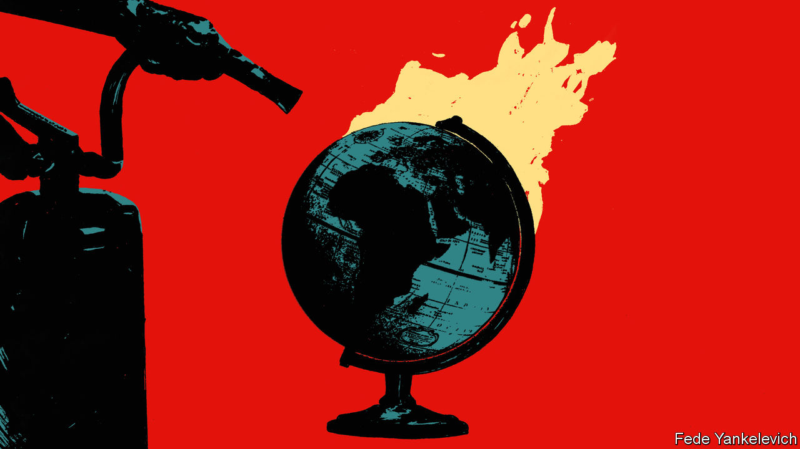
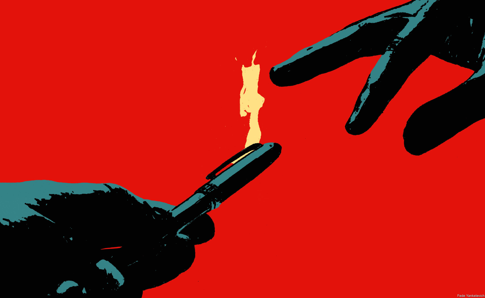
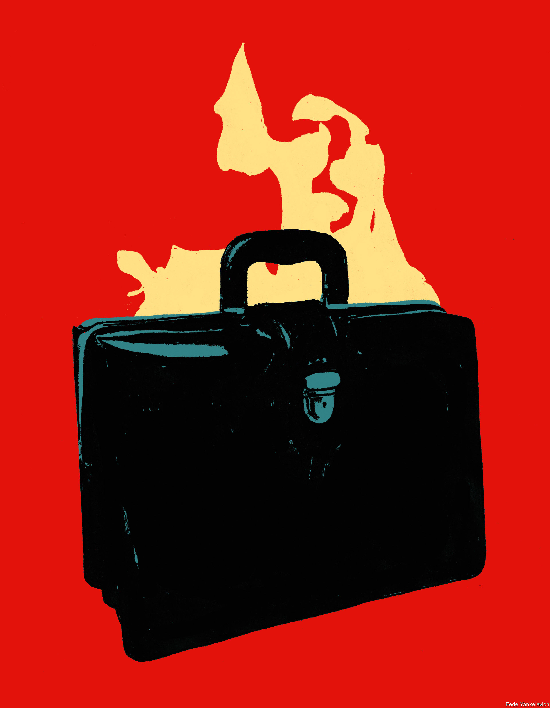

###### Everything, everywhere, all at once

# From Gaza to Ukraine, wars and crises are piling up 

##### How diplomats and generals are running out of bandwidth 

 

> Nov 13th 2023 

An Israel-Hamas war in Gaza threatens to spread across the Middle East, with America and Iran facing off in the background. The Ukraine war, Europe’s largest since 1945, shows no sign of ending. Chinese jets and warships now menace Taiwan in growing numbers and with increasing frequency. Looming elections on the island are likely to bring more tension. Civil conflict in Mali, Myanmar and Sudan has worsened in recent weeks, too. 


Such a concatenation of crises is hardly unprecedented. Sergey Radchenko, a historian, points to the examples of the Soviet invasion of Hungary and the Suez crisis overlapping in 1956, crises in Lebanon and the Taiwan Strait in 1958 and the tumultuous years of 1978-79, with the Chinese invasion of Vietnam, the Islamic revolution in Iran and the Soviet Union’s invasion of Afghanistan. In 1999, India and Pakistan, newly armed with nuclear missiles, waged a war over Kashmir while NATO bombed Serbian forces in Yugoslavia. 

But America and its allies cannot intervene in today’s crises as easily or cheaply as they once did. Adversaries such as China and Russia are more assertive, and working more and more together. So too are non-aligned powers, including India and Turkey, which have growing clout to shape distant events and believe that a new and more favourable order is emerging. And the possibility of a war directly between major powers hangs over the world, forcing countries to keep one eye on the future even as they fight fires today. The mix is stretching the capacity of Western diplomats, generals and leaders to its limits. 

The large powers are becoming more polarised on issues where they might once have pushed in the same direction. In the Middle East, for instance,  has moved closer to Hamas, tearing up years of careful diplomacy with Israel. , which in past wars issued bland statements urging de-escalation, has exploited the crisis to criticise America’s role in the region. Few Western countries talk to Russia any longer. And even dialogue with China is strained, despite the need to tackle joint problems like climate change—notwithstanding the fanfare which accompanied a meeting between Joe Biden and Xi Jinping in California on November 15th.

Another shift is growing convergence between America’s adversaries. “There really is an axis that is emerging between Russia, China, North Korea and Iran, which rejects their version of the American-led international order,” says Stephen Hadley. He sat on America’s National Security Council in the 1970s and the Pentagon in the 1980s before becoming national security adviser to George W. Bush in 2005. The war in Ukraine has cemented the partnership between Russia and China (although they are not formal allies).  have both supplied Russia with weaponry in return for military technology. The result is greater entanglement. A crisis involving one enemy is increasingly likely to draw in another. 

Massively multiplayer game

Moreover, each crisis not only involves more enemies, but also more players in general. The leaders of Australia, Japan, New Zealand and South Korea have all attended the past two NATO summits in Europe. Ukraine’s counter-offensive this year could not have happened without an infusion of South Korean shells. Turkey has established itself as an important arms supplier throughout the region, reshaping conflicts in Libya, Syria and Azerbaijan with its military technology and advisers. European countries are planning more intensively how they might respond to a crisis over Taiwan. Crises thus have more moving parts to them. 

That reflects a broader shift in the distribution of economic and political power. The idea of “multipolarity”, which refers to a world in which power is concentrated not in two places, as in the cold war, or in one, as in the American-dominated 1990s, but in several, has entered the diplomatic mainstream. In September, Subrahmanyam Jaishankar, India’s influential foreign minister, noted that America, facing the “long-term consequences of Iraq and Afghanistan”—a nod to two failed wars—and relative economic decline, “is adjusting to a multipolar world”. The argument is debatable. In a recent essay, Jake Sullivan, America’s national security adviser, argued that his country is actually in a stronger position now than it was while mired in those wars. But America’s image has undoubtedly suffered. 

The dial tone

A poll conducted in February by the European Council on Foreign Relations, a think-tank, found that more than 61% of Russians and Chinese, 51% of Turks and 48% of Indians expect a world defined by either multipolarity or Chinese dominance. In his final state-of-the-union speech in January 2016, Barack Obama, then America’s president, insisted that on “every important international issue, people of the world do not look to Beijing or Moscow to lead—they call us.” Seven years on, things are less clear-cut. 

The result of all this is a sense of disorder. America and its allies see growing threats. Russia and China see opportunities. Middle powers, courted by larger ones but concerned by the growing dysfunction of institutions like the World Trade Organisation and the United Nations, see both. “A kind of anarchy is creeping into international relations,” wrote Shivshankar Menon, who served as India’s foreign secretary and national security adviser, in an essay published last year. It was “not anarchy in the strict sense of the term”, he explained, “but rather the absence of a central organising principle or hegemon.” 

That tendency has been compounded by several other trends. One is the , which increases the risk of conflict in many parts of the world and, through the green transition, is creating new sources of competition, such as that for critical materials crucial for wind turbines and electric vehicles. The other is the pace of technological change, notably the advance of artificial intelligence at a breathtaking rate, with unpredictable consequences. A third is globalisation, which knits crises together in new ways. A war over Taiwan, for instance, would cause acute disruption to the semiconductor industry and thus to the world economy. 

The fourth is a rising tide of nationalism and populism, which infects attempts to solve all of these global problems. In a book published in 2021 Colin Kahl, who recently stepped down as the Pentagon’s policy chief, and Thomas Wright, a senior official in Mr Biden’s National Security Council, noted that international co-operation seized up during the covid-19 pandemic as countries rushed to close borders and shield themselves. “For all practical purposes the G7 ceased to exist,” they noted. “Pandemic politics ultimately dealt the final blow to the old international order.” 

The new world disorder is putting the institutional capacity of America and its allies under stress while stretching their military capabilities. Start by considering the institutional pressure. The cold war, Mr Hadley argues, was an “organised world”. There were global challenges, he acknowledges, but many were subsets of the larger superpower struggle. “For post-cold-war national security advisers,” he says, “it’s more like cooking on an eight-burner stove with every burner having a pot, and every pot just about to boil over.” 

A world in which more crises occur together poses two sorts of challenges to those tasked with managing them. One is the tactical problem of fighting several fires at once. Crises tend to have a centralising effect, says a former senior British diplomat, with prime ministers or presidents taking personal charge of issues that might otherwise be scattered among foreign and defence ministries. Even in powerful states, bureaucratic bandwidth can be surprisingly limited.

Diplomats, immersed in crises, often perceive that their own times are unusually chaotic. Catherine Ashton, who was the European Union’s de facto foreign minister from 2009 to 2014, points out that she was dealing with the Arab spring, Iran’s nuclear programme and the Serbia-Kosovo dispute at the same time. “I can remember very clearly, when the Ukraine crisis began,” she says, referring to a revolution in Kyiv in 2014, “that I just didn’t know if we would have the bandwidth for all of this.” 

One change is that competition has turned to conflict. The war in Ukraine has been especially debilitating for diplomacy. Baroness Ashton recalls that when the Ukraine crisis began in 2014, her negotiating team for nuclear talks with Iran in Vienna included Russia’s deputy foreign minister. She would travel to Kyiv to condemn Russia’s meddling and he to Moscow to condemn the European Union. “Then we’d fly back and all sit down and carry on with the Iran talks.” Such fleet-footed compartmentalisation would now be impossible.

 


America’s National Security Council is a bare-bones operation, in part because Congress is loth to fund White House staff. In an essay published in 2016, Julianne Smith, now America’s envoy to NATO, recalled her time as deputy national security adviser to Mr Biden when he was vice-president. “A typical day would often involve four to six hours of back-to-back meetings on anything from Syria to cybersecurity to North Korea,” followed by 150-500 emails per day. “My ability to plan, think beyond the next day in the office, or significantly deepen my knowledge of any single issue was virtually non-existent.” 

The expectation that top officials represent their country in a crisis often puts enormous pressure on a handful of people. Antony Blinken, America’s secretary of state, has spent almost every waking hour shuttling between Middle Eastern capitals over the past six weeks. He recently flew from the Middle East to Tokyo, for a meeting of G7 foreign ministers, then to India, and on to San Francisco. Mr Sullivan is also . 

Even if diplomats can successfully spin multiple plates, the concurrence of crises presents a larger, strategic problem when it comes to military power. The current crisis in the Middle East shows that military power is a scarce resource, much like diplomatic bandwidth. Even in recent years, Pentagon officials would boast that they were finally rebalancing naval power from the Middle East to Asia, after two decades of counterinsurgency in Afghanistan and Iraq. Now, under the pressure of events, the trend is reversing.

When the and its escorts entered the Red Sea on November 4th it was the first time an American aircraft-carrier had operated in the Middle East for two years. The exercises it conducted earlier with the  marked an unusually large show of force. If the war in Gaza drags on or widens, American naval forces may need to choose between sticking around, creating gaps in other parts of the world, including Asia, and emboldening Iran. 

Meanwhile, Western officials increasingly think the war in Ukraine could drag on for another five years, with neither Russia nor Ukraine prepared to give in, but neither capable of breaking the stalemate. As the 2020s roll on, the red lights begin to flash. Many American intelligence officials, and some Asian ones, believe that the risk of a Chinese attack on Taiwan is greatest in a window at the end of this decade. Earlier, China will not be ready. Later, China will face the prospect of demographic decline and a new generation of Western military technology.

Shelling out

Even without a war, the West’s military capacity will come under enormous pressure in the coming years. The conflict in Ukraine has been a reminder of both just how much ammunition is consumed in big wars, but also how meagre Western armouries—and their means of replenishment—really are. America is dramatically upping its production of 155mm artillery shells. Even then, its output in 2025 is likely to be lower than that of Russia in 2024.

The violence in Ukraine and Gaza illustrates these stresses. Israel and Ukraine are fighting two different sorts of war. Ukraine needs long-range missiles to strike Crimea, armoured vehicles to allow infantry to advance in the face of shrapnel, and demining gear to punch through vast minefields. Israel wants air-dropped smart bombs, including bunker-busters, and interceptors for its Iron Dome air-defence system, which are being fired at a prodigious rate. But there is overlap, too.

Last year America dipped into its stockpile of shells in Israel to arm Ukraine. In October it had to divert some Ukraine-bound shells to Israel. Both countries also use the Patriot missile-defence system, which takes out planes and larger missiles. So do other allies in the Middle East: on October 19th Saudi Arabia used a Patriot battery to intercept Israel-bound missiles launched from Yemen. Ukraine’s consumption of interceptors is likely to rise sharply over the winter as Russia, having stockpiled missiles for months, unleashes barrages against Ukraine’s power grid. 

America can probably satisfy both of its friends for the moment. In recent weeks France and Germany have both pledged to increase assistance to Ukraine. But if either war—or both—drags on, there will be a pinch. “As time goes on, there will be trade-offs as certain key systems are diverted to Israel,” writes Mark Cancian of the Centre for Strategic and International Studies, a think-tank in Washington. “A few systems that Ukraine needs for its counter-offensive may not be available in the numbers that Ukraine would like.”

The bigger problem is that, realistically, America could not arm itself and its allies at the same time. “If US production lines are already struggling to keep pace with the exigencies of arming Ukraine,” notes Iskander Rehman of Johns Hopkins University in Baltimore in a recent paper on protracted wars, “they would be completely overwhelmed in the event of an actual protracted, peer-to-peer conflict with an adversary such as China.”

 


These challenges point to deeper tensions in American defence strategy. From 1992 American military planners held to what was known as the “two-war” standard. America’s armed forces had to be ready to fight two simultaneous medium-sized wars against regional powers—think Iraq or Iran—rather than simply a single big war. In 2018 the Trump administration changed this to a “one-war” standard: in practice, a commitment to be able to fight either a war in Europe or in Asia, but not both at the same time. Mr Biden’s administration stuck with this approach. 

The aim was to instil discipline in the Pentagon and to bring ends into line with means: America’s defence budget is virtually flat in real terms, while Chinese defence spending has soared. But the risk, argued critics, was that the one-war standard would tempt enemies to open a second front—which could then force America to either back down or resort to unappealing options, like nuclear threats. 

What risks do America and its allies run by being so stretched across diplomatic and military realms? If the war in Ukraine stays an open sore in Europe and the Middle East remains ablaze, the West will struggle gravely should another serious crisis erupt. One risk is that adversaries simply capitalise on chaos elsewhere for their own ends. If America were bogged down in a Pacific war, for instance, Iran would surely feel more confident of getting away with a dash for nuclear weapons.

Even more worrying is the prospect of active collusion. European military planners give weight to the possibility that Russia might conduct menacing manoeuvres during a crisis over Taiwan in order to divert American attention and tie down its allies, preventing them from lending a hand in Asia. As in the cold war, each crisis, no matter how parochial or trivial, might come to be seen as a test of American or Chinese power, drawing each country in. 

Then there are the surprises. Western intelligence agencies have their hands full watching China and Russia. Few expected Hamas to throw the Middle East back into turmoil as it did on October 7th. Civil wars and insurgencies in the Democratic Republic of Congo, Mali, Myanmar, Somalia and Sudan have all been neglected, diplomatically, even as Russian influence in the Sahel continues to grow. Meanwhile on November 10th dozens of Chinese ships circled Philippine vessels, blasting one with water cannon, as the latter attempted to resupply an outpost on Second Thomas Shoal in the South China Sea, which China claims as its own. If the confrontations worsen, the terms of America’s defence treaty with the Philippines may eventually oblige it to intervene.

Dexterity needed

Amid disorder, strategists talk about the importance of “walking and chewing gum”. It is a uniquely American metaphor that once referred to performing two trivial activities at once, and now explains the importance of geopolitical multi-tasking. Others are available. In his forthcoming book, “To Run the World”, Mr Radchenko, the historian, quotes Zhou Enlai, China’s premier, identifying America’s predicament in 1964: “If there were just a few more Congos in Africa, a few more Vietnams in Asia, a few more Cubas in Latin America, then America would have to spread ten fingers to ten more places…we can chop them off one by one.” ■

