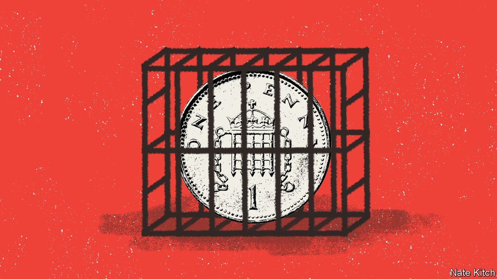

###### Governing Britain

# If Labour is to succeed in power, it must fix the Treasury 

##### The finance ministry protects the country from disaster—but also holds it back 

 

> Nov 16th 2023 

When David Cameron resigned as prime minister in June 2016, hours after Britain voted to leave the EU, he said the country needed “fresh leadership”. What it would like now is a nice lie-down. Rishi Sunak is the fourth Conservative to hold the top job since the then Mr Cameron quit. Jeremy Hunt is the sixth chancellor. In the 30 years before the Brexit referendum, big cabinet reshuffles happened about once every two years; since then they have occurred once every six months on average. The latest, to sack Suella Braverman as home secretary and bring the newly ennobled , has triggered another bout of Tory infighting. 

The Labour Party has its own fractures, most obviously over the war in Gaza. But in the face of sustained Tory tumult, it pitches itself as stability incarnate. It is more than 20 points ahead in polls, with a general election likely to take place next year; Sir Keir Starmer, its leader, and Rachel Reeves, the shadow chancellor, promise to rebuild Britain. Yet those hoping that a new government with a big mandate would be enough to solve Britain’s problems are misguided. The country’s malaise goes deeper than the individuals in office. Productivity has risen by a feeble 1.7% since 2008; in the previous 16 years it rose by a hearty 27%. There are also problems with the way that the institutions of state are run. None of these is more powerful than the Treasury. 

In most countries the power of the finance ministry is constrained. America has a separate budget office. In Germany there is a ministry of economic affairs, responsible for long-term growth, and the powerful regional . In Britain the Treasury reigns supreme. Its 2,000-odd officials exert an extraordinary degree of control over the best part of £1trn ($1.2trn) in public spending each year. It has sole responsibility for setting taxes. It doubles up as the economics ministry. 

No one doubts the Treasury’s competence. Its power attracts Whitehall’s brightest minds. Many who attack it simply want higher spending or are too sanguine about ballooning debt. Liz Truss, who was prime minister for seven weeks last year, blasted its failed “Treasury orthodoxy” because it doubted her plan to unleash growth through unfunded tax cuts. The unravelling of her premiership is testament to the value of Treasury rigour. 

But the disproportionate power of the Treasury means that its flaws ripple outward with particular force. And those flaws are . The department contributes to, and exemplifies, Britain’s deeper-rooted problems. 

One is that it is itself prey to the short-termism that both Mr Sunak and Sir Keir say plagues Britain. Ministers ultimately make the decisions. But the Treasury has a culture of frugality that goes back to William Gladstone, a Victorian statesman who, as chancellor, was known for “saving the candle-ends”. The way the mighty finance department works is to focus narrowly on keeping control of near-term spending, even if that means squashing projects that make sense in the long term. 

The woes of the National Health Service (NHS) are partly the result of decades of low capital investment. Britain has crumbling hospitals and the fifth-lowest number of CT scanners and MRI units per person in the OECD, a group of developed economies. Yet the Treasury has allowed billions to be plundered from NHS capital budgets to plug gaps in day-to-day spending. Its “green book” process of evaluating proposed spending leads to a bias against transformative projects. Treasury officials thought the M25 motorway around London should be two lanes wide, and opposed extending the Jubilee Line, on the London Underground. Ministers were the ones to overrule them; both of these upgrades are thought to have been good value for money. Many other projects, particularly outside the south-east, got nowhere. 

Another revealing problem is that the Treasury doesn’t worry enough about Britain’s measly rate of economic growth. This has many culprits, from Brexit to planning snarl-ups. But the Treasury is supposed to be the department that galvanises action. Instead, the path to promotion, say insiders, is to show that you can kill off spending bids. When interest rates were low, the Treasury passed up the chance to invest more. Twice-yearly fiscal events—Mr Hunt will deliver the next autumn statement on November 22nd—encourage fiddling and sow uncertainty. Capital allowances, an element of business taxation, have been changed on average every other year for the past four decades. 

Short-termism and the neglect of growth would not matter so much were it not for a third failing: the department is a micromanager. Britain is highly centralised and the Treasury is the uber-centraliser. Other government departments and local councils must jump through hoops just to show how they will spend piddling sums. In February the levelling-up department was banned from deciding any new capital projects without approval. One-third of the Treasury’s officials are under 30; bright Treasury graduates end up telling everyone from army generals to scientists how to do their jobs. Finance ministries in other countries avoid this combination of immense power and callowness. 

Checking the exchequer

Some argue that the answer is to break the Treasury up. That would be a mistake. It would be costly and disruptive. A failed attempt under Harold Wilson suggests a break-up might not stick. 

Instead, the Treasury needs reform. Short-termism can be reduced if chancellors accept constraints on their power. Big revisions to important infrastructure projects should require Parliament’s approval. Capital budgets should be fixed for five-year terms and tax changes limited to once a year at most. The Treasury’s grip on the purse-strings should be loosened. Once budgets and objectives are set, other government departments should have more scope to spend the money. Cities have a limited amount of fiscal freedom: they should have more. 

Hardest of all, the Treasury’s culture needs to adapt. Its commitment to disciplined spending is vital, and it often displays nimble thinking in a crisis. But that is not enough. Sir Keir and Ms Reeves say that revving up growth would be their number-one priority. So far they have had little to say about the department that could thwart them. That has to change. ■


