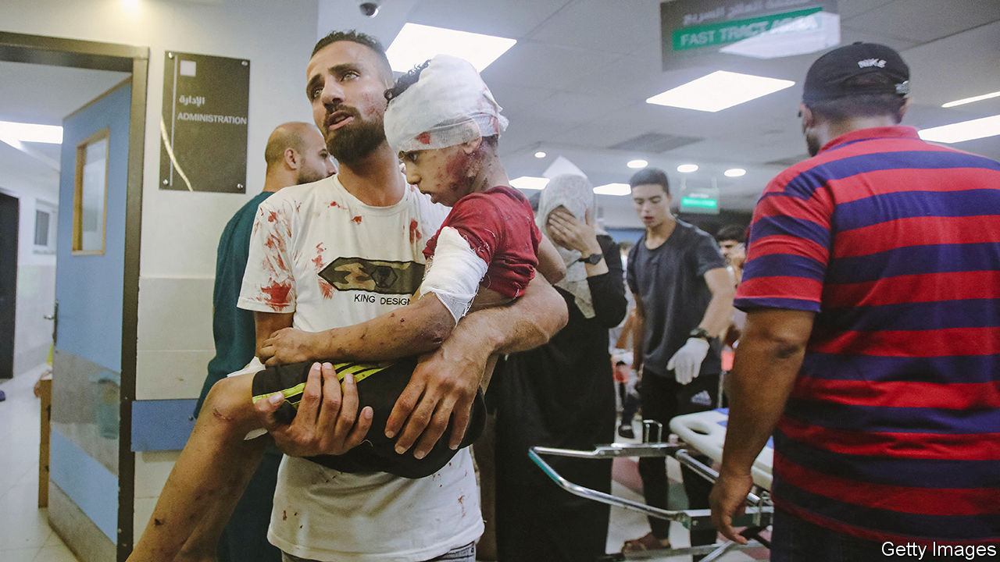

###### Gaza

# The rights and wrongs of Israel and Hamas at al-Shifa hospital 

##### Why Israel must meet and exceed the requirements of the laws of war 

 

> Nov 16th 2023 

The CRISIS at al-Shifa hospital in northern Gaza is a tragedy in its own right and a microcosm of the awful trade-offs created by Hamas’s atrocities and Israel’s invasion of Gaza. Some of Israel’s critics believe that any military activity near or in the hospital is a war crime because civilians may be killed. In fact, because it appears likely that the hospital has been used by Hamas as a military facility, Hamas has probably turned it into a legitimate military target. Still, as a matter of international law, morality and self-interest, Israel must do more to protect civilians. That matters at al-Shifa and beyond it. Even as Israel has won effective control in northern Gaza, the already grave humanitarian crisis is about to explode in the south where over 2m people are at risk as . 


Start with the hospital, a set of buildings near the centre of Gaza city. It is surrounded by the Israel Defence Forces (idf) which claims that it made a “precise and targeted” raid on the complex. Around 1,500 people are sheltering in the hospital’s grounds, including babies and critically ill patients. Because fuel and supplies are scarce, conditions are dire. Many innocent lives have been lost. Fighting may kill more civilians if they cannot get treatment or are hit by crossfire. 

Israel says tunnels beneath the hospital form a Hamas military headquarters. Hamas denies this, but it has a record of deceitfulness. There is also a pattern of violent activity: Amnesty International reported that in 2014 Hamas tortured people within al-Shifa’s grounds. On November 14th America said its intelligence indicates that Hamas uses the hospital and tunnels beneath it as “a command-and-control node”. 

Using a hospital as a military base, as Hamas may well be, is a war crime. But is attacking the fighters using it as a shield a war crime too? The laws of war establish that once a hospital is used as a military facility it may lose its special protection. Any attacking force must nonetheless take a high degree of precaution, by for example giving adequate notice to evacuate and ensuring evacuation is feasible. In 2016-17 an anti-Islamic State coalition attacked a hospital in Mosul that is used as a stronghold. But the coalition gave a substantial warning period, by the end of which time the hospital was essentially non-functional, and provided trauma centres within 10-15 minutes of the front lines. 

All this suggests al-Shifa is a legitimate military target for the idf, providing its intelligence is correct. On November 16th Israel said it had found an arms cache in the hospital; soon it will become clear if there is a Hamas tunnel complex, too. Israel says it has sought to evacuate the hospital and supply incubators and fuel to it. But in order for evacuation to be feasible, people need somewhere safe to go. Israel therefore needs to go further by providing more immediate support to the hospital, supplying trauma and other medical facilities nearby and ensuring those who are evacuated have an alternative refuge. 

This lesson of applying the letter of the law, and going beyond it, applies to Israel’s campaign more broadly. Security for Israel and a better future for Gazans will not happen under Hamas’s rule. The idf has now achieved some of its narrow military goals. It is in effective command of northern Gaza. Yet over 11,000 Gazans have died, according to the Hamas-run authorities. In the south over 2m people face appalling conditions. For Israel’s campaign to be legitimate and even partially succeed, two other tests must be met: civilians need a safety net and there must be a resumption of the peace process. 

A crucial step is to open its border point at Kerem Shalom to let in aid and fuel deliveries. Israel should also create emergency medical facilities, take patients to Israeli hospitals, and be prepared to set up temporary refugee camps in Israeli territory in the Negev desert. Israel is entitled to go to war with Hamas. But it must do more to rebut the charge that it is going to war against the Palestinian people. ■

