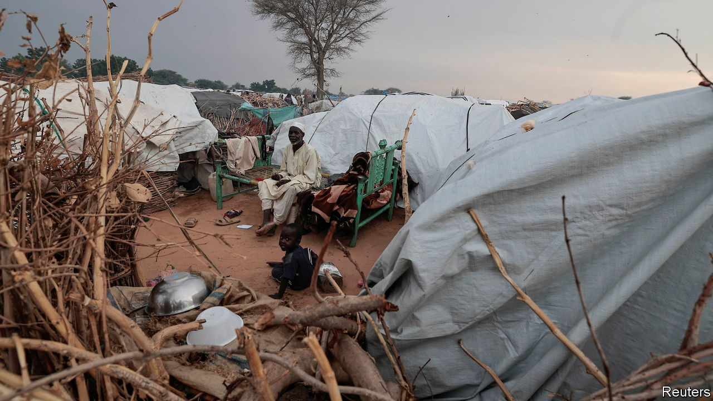

###### Dying in plain sight

# The world is ignoring war, genocide and famine in Sudan 

##### America is distracted, the UN is not interested 

 

> Nov 16th 2023 

The descriptions are harrowing, the suffering unimaginable. Earlier this month, genocidal gunmen went from home to home for three days in a refugee camp in Darfur, Sudan, looking for Masalit men and killing them. It was not the first such attack, but by the time they had finished, say locals, between 800 and 1,300 members of the black-African ethnic group had been killed. Unverified videos show streets filled with corpses and terrified people crowded into what appears to be a mass grave, or being beaten by fighters from the mainly Arab Rapid Support Forces (RSF), a paramilitary group, which denies the allegations. “There is a genocide happening around us,” says a weary aid worker. “It feels pretty hopeless.” This ethnic cleansing is just one of four horrors afflicting Sudan.

The second is civil war. Fighting broke out seven months ago between the RSF and the Sudanese Armed Forces (SAF), the official army, flattening parts of Khartoum, the capital, and claiming more than 10,000 lives. Front lines that had largely been stable have begun to  . Armed by regular shipments of weapons flown in from the United Arab Emirates (UAE), the RSF has since gained control of most of Darfur, where it seems intent on eradicating the Masalits. It also seems to be gaining control of Khartoum, where the remaining civilians are besieged. 

The conflict has forced about 6.3m people from their homes (in addition to the 3.7m who had fled during previous bouts of violence) and caused what the UN describes as “one of the worst humanitarian crises in recent history”. Almost three-quarters of hospitals and clinics in Khartoum have been shut because of bombing or fighting. The few still functioning in parts of the city controlled by the RSF have been starved of food and medical supplies by a blockade imposed by the rival SAF. “Now we are really seeing a siege situation,” says Claire Nicolet of Médecins Sans Frontières (MSF), an aid group.

There is little hope that either side will agree to a ceasefire. Each still thinks it has more to gain from fighting than talking. This is because the entire war is little more than a fight for absolute power between General Abdel-Fattah al-Burhan, who heads the SAF, and Muhammad Hamdan Dagalo (known as Hemedti), the leader of the RSF. The two had previously worked together in 2021, staging a coup to block the emergence of a civilian-led government after the ousting of the long-serving dictator, Omar al-Bashir. But in April each made a bid for absolute power.

The third affliction is hunger. The civil war has devastated Sudan’s economy, destroyed its banking system, displaced its people and divided it into rival areas of control, disrupting supply chains and driving up food prices. As a result, 20m people do not have enough to eat. Of these, 6m are on the verge of famine, with 40% of pregnant women and breast-feeding mothers already near to starving. Without help in the coming months, tens of thousands of people are at risk of starving. But aid agencies are struggling to bring in supplies. The SAF controls Port Sudan, the main import hub, and is blocking the flow of aid workers and supplies to RSF-controlled territory. 

The SAF is able to starve its people and the RSF is able to ethnically cleanse Darfur largely because of Sudan’s fourth affliction: the wider world’s utter indifference. The African Union appears to be unmoved by the catastrophe and is retreating to a policy of “non-interference” in the affairs of its members, having previously sat idle while 385,000-600,000 people died during a civil war over the Tigray region in Ethiopia. The UN Security Council has been just as toothless and held only informal consultations on Sudan. This is not because its hands are tied by strategic interests or deep divisions between great powers, as with Ukraine or Syria, but because of gross neglect. America has paid little attention, largely because it is distracted by Ukraine and, more recently, Gaza. “The silence has been deafening,” says Mathilde Vu of the Norwegian Refugee Council. 

Yet the world need not helplessly watch a disaster unfold. Governments should meet aid agencies’ requests for funds. Ahead of the climate-change summit in Dubai, America and its allies should press the UAE to halt its supply of weapons to a genocidal militia (the UAE claims the flights carry assistance). African leaders should redouble their diplomatic efforts. The Security Council, divided as it is, ought to be able to pass a resolution urging Sudan’s warring parties to protect civilians and let in aid. This would also signal that war crimes will be prosecuted.

The world is  of crises. But it is more complex and America holds less sway than in the 2000s, when it belatedly led efforts to curb ethnic cleansing in Darfur. Yet great powers are great in part because they pay attention. And Sudan is dying from neglect. ■

