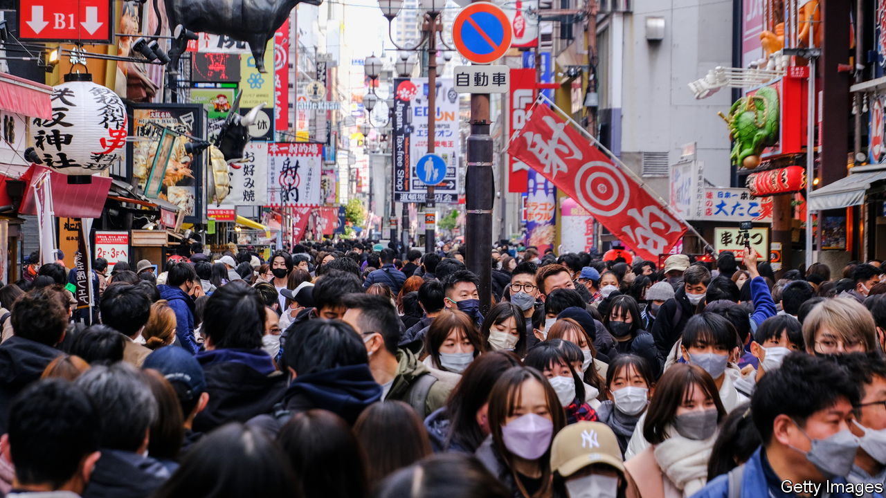

###### Inflated hopes

# Will Japan rediscover its dynamism? 

##### Rising prices and animal spirits give it a long-awaited opportunity 

 

> Nov 16th 2023 

Global investors are giddy about Japan again. Warren Buffett made his first visit to Tokyo in more than a decade this spring; he has built up big holdings in five trading houses that offer exposure to a cross-section of Japan Inc. Last month Larry Fink, CEO of BlackRock, the world’s biggest asset manager, joined the pilgrimage to Japan’s capital. “History is repeating itself,” he told Kishida Fumio, the prime minister. He likened the moment to Japan’s “economic miracle” of the 1980s. Even disappointing GDP figures released on November 15th will not dent investors’ .

Sceptics would say that the only history repeating itself is outsiders falling for yet another Japanese false dawn. The miracle of the 1980s ended with an asset bubble bursting and the country sliding into decades of deflation, or excessively low inflation, and stagnation. Every ten years or so since then, observers, this newspaper among them, have warmed to a new prime minister, identified promising signs of change and claimed to see the sun peeping over the horizon. Foreign investors flood back. Then a few years later they retreat, cold and disappointed. Is this latest promised dawn any different?

It really could be. Two external shocks and two internal shifts have coincided to change the landscape for the Japanese economy. The most palpable shock has to do with prices. Whereas most countries have been obsessed with keeping inflation down in recent years, Japan has been hoping it might finally pick up—and stay up. Global supply squeezes and a weak exchange rate have duly done what years of audacious monetary easing could not achieve, and pushed the headline inflation rate over the Bank of Japan’s 2% target. Admittedly, that is not the demand-driven inflation that the BoJ would like to see. Even so, it has changed how firms, workers and consumers think about prices and, crucially, wages. A path, albeit a narrow one, has opened to a healthier cycle of wage and consumption growth. 

The other shock is geopolitical. The war in Ukraine and the superpower stand-off between America and China have spurred a new wave of investment in critical industries and a reconfiguration of regional supply chains that Japan could benefit from.

The internal shifts are subtler, but no less important. Corporate-governance reforms that began under a previous prime minister, Abe Shinzo, have become entrenched. Indeed, they have entered a promising new phase, as Japanese institutional investors—and even the Tokyo Stock Exchange—are putting more pressure on big companies to enhance their value. 

Another underappreciated part of the story is generational change. At old firms, bosses attached to ways of doing business that worked during the glory days of the 1980s are exiting the scene. Young entrepreneurs want to build a new Japan Inc.

Yet much in the Japanese economy remains unchanged and unchanging. For Japan to make good on the promise of the moment, policymakers, executives and politicians must do more to nurture the green shoots of dynamism. For a start, the BoJ must execute a complex dance in the coming year. It must unwind unorthodox monetary policies that have outlived their usefulness, such as its yield-curve control, without suffocating the nascent inflation. In time the highly indebted government will probably have to find a way to cope with rising interest rates.

The process of corporate reform must also continue. Japanese firms are now well versed in the forms of good governance, but they need to get better at the substance. Around 40% of companies in the Topix 500 trade below book value. In an unstable world corporate leaders must do more than just preserve the status quo. Luckily they have plenty of room for manoeuvre, after years of hoarding cash on their balance-sheets.

Mr Kishida has promised to focus on “economy, economy, economy”. Compared with his predecessors, he has spoken more about supporting startups. Yet his latest economic package, announced earlier this month, is heavy on one-off tax cuts and stimulus measures that seem designed to boost his popularity, rather than long-term growth. He could turn words into deeds by revising tax codes to reward risk-taking investors and entrepreneurs and by withdrawing support for zombie incumbents. The prime minister is right to trumpet the need for new-company formation. But he also needs to play his part in clearing away corporate dead wood. ■

