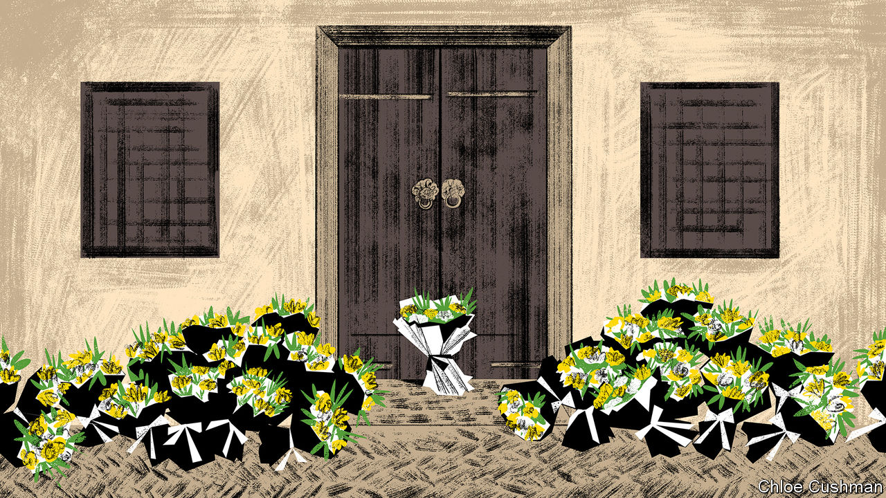

###### On Israel and Gaza

# Letters to the editor 

##### A selection of correspondence 

 

> Nov 16th 2023 

Tough choices on Gaza

 is unwilling to confront reality. Your argument in “” (November 4th) that an international coalition of Western and Arab countries is needed to govern Gaza is idealistic. Western and Arab countries do not have the will to occupy Gaza. You also call for fair elections in the West Bank, hoping for “moderate” leaders to emerge with a “democratic mandate”. According to the best available polling data, Hamas would win a fair election, a disastrous result. Lastly, you believe Israel should follow international law to sustain broad support over months of fighting. But regardless of how Israel fights, it will not enjoy broad support. 

Hamas is a political movement and cannot be destroyed with force alone. Either there will be a long, arduous, Israeli-led occupation of Gaza or Islamist militants will return to power there. Neither option is remotely appealing. It would be better if  provided a sober analysis of that more realistic scenario. 

Steven Baranko


The polarised, zero-sum way in which governments and media on both sides are depicting this conflict is frustrating. The debate is increasingly being monopolised by radicals; criticism of one side implies a defence of the other. 

There should be no debate about the atrocities and acts of terrorism committed by Hamas on October 7th. They were heinous. Trying to justify those atrocities with references to the wider conflict is akin to justifying rape by pointing to what the victim was wearing. You do not need to understand the wider context. Stating that Hamas’s atrocities were wrong does not make one anti-Palestinian. However, the manner in which the Israeli government is waging war is also wrong, and stating this does not make one anti-Israeli. Of course Israel has the right to defend itself and act, but this does not justify the tremendous loss of innocent civilian life. 

Hamas has acted monstrously and  has correctly called it so. The Israeli government is also acting monstrously, and this newspaper should have the courage to denounce it and call for different tactics.

Gabriel Sanchiz Garin


Far from seeking to strengthen Hamas, as you allege, Binyamin Netanyahu, Israel’s prime minister, hit Hamas hard in three large-scale military operations in 2012, 2014 and 2021. In 2005 he warned that Gaza would become “Hamastan”. In 2014 he said “Hamas is ISIS”. After the October 7th massacre of over 1,000 Israelis and over 200 taken hostage, Mr Netanyahu’s war cabinet directed the Israeli army to destroy Hamas. Once Gaza is free from Hamas, there may be hope for peace.

Dr Ophir Falk

Foreign policy adviser to the prime minister of Israel


If Hamas was hiding in Tel Aviv or Jerusalem, would Israel bomb those Israeli cities to bits to get at them? When Britain suffered from despicable IRA terrorism in the 1970s, was peace achieved by the British government reducing the supposedly IRA-supporting West Belfast to rubble? 

Kim Mathen


You refer to a social contract between the state of Israel and its people. You also advocate developing a moderate leadership among the Palestinians. But potential moderate leaderships in the past have been undermined by extremists on both sides. There is no evidence that either Israel or the Palestinians would have any confidence in a future moderate leader’s ability to resolve the issues. It is more likely that if Hamas is destroyed it would eventually be replaced by yet another extreme organisation. 

It may be anathema to the Israelis, but the only alternative is to start talking to Hamas now. Yes, Hamas would proclaim a victory, but does that really matter when the lives of civilians on both sides are at stake? Only by negotiating can Israel secure its social contract with its citizens.

John Davey


Mr Netanyahu is totally dependent on hardline, right-wing, Jewish supremacist, coalition partners to stay in power. The aim of these coalition partners is a full Israeli armed occupation of Gaza, followed by a re-founding of all the settlements that were destroyed when Israel pulled out of Gaza in 2005. Given the choice between doing what is good for the country or keeping his coalition partners happy Mr Netanyahu always chooses the latter. 

I look forward to the day when Israel is no longer governed by him and his supremacist supporters. Perhaps then, Israel will be able to engage with its partners and allies in the international community to rebuild Gaza free from the barbaric tyranny of Hamas and Islamic Jihad, and thus enable Israelis to live securely within our borders.

Andrew Goldman


 


The public in many countries tends to support the little guy against the big, the weak versus the strong, David against Goliath (”, November 4th). In its early days tiny Israel was the David and the much larger Arab states surrounding it were the Goliath. Now that is reversed and Israel, with its mighty army pounding Gaza is increasingly seen as the Goliath, fairly or unfairly.

Humphrey Taylor

Chairman emeritus

Harris Poll


You are correct to argue that Israel must fight on while adhering to international law. What Israel lacks is any clear idea of the result it is realistically trying to achieve. Mr Netanyahu has avoided any serious effort to make progress towards a two-state solution. In fact he endeavoured to weaken the moderate Palestinian leadership and has instead strengthened Hamas with the expectation that Israel could perpetuate the expansion of the West Bank settlements and keep the lid on incursions from Gaza. The only outcome that will be beneficial to Israel is a political agreement that ends Israel’s occupation and facilitates Palestinian self-determination.

Michael Hirst


Pity the job of a newspaper editor during war in the Middle East. I thought your leader was exceptional in not shying away from the fact that sometimes war is needed in order to make peace. The argument was a bold one, particularly when set against the chorus of rather troubling jihadi voices that have found purchase in our Western capitals. 

Evan Hoff


 


I appreciated the article questioning the feasibility of a two-state solution (“”, November 4th). I’m waiting for other news media to take an honest look at the viability of a Palestinian state: broken into pieces, lacking social cohesion and wretchedly poor. Demography, geography and the policies of Israel and its neighbours have all conspired to sink the plan. 

By continuing to hold out hope that it will work, aren’t we really allowing Israel to avoid the most important and hardest issues? True friends are honest when mistakes are being made. Who are Israel’s true friends today?

Ben Larrimer


 


Li the innovator

stated that Li Keqiang’s death symbolises the end of an era in which the Communist Party in China “sought legitimacy through technocratic performance” (November 4th). Even though the Chinese government downplays Li’s death, middle-aged and young Chinese still mourn him for his expertise and emphasis on facts and figures, not ideology.

We also mourn Li for his emphasis on fostering a culture of innovation. He spared no effort in encouraging both young and old to hail entrepreneurship and embrace the new. When WeChat first came out, the app endured attacks from many Chinese, especially those who were traditional and dubious of the positive impacts brought about by this platform. Li, at the time, refused to impose dogmatic regulations on WeChat, and instead gave it a greater freedom to develop on its own. Years later, when WeChat became viral, he mused that “if we used traditional ways to regulate WeChat, then it would not have been able to evolve to its current state.” He was patient and curious to see how innovation changed the lifestyle of the Chinese.

Jack Wang


A cultured argument

As a Hellenophile and feta aficionado (fetaficionado?) I was shocked at  disparaging of Greece’s national cheese (October 28th). Feta is far from insipid and varies from mild to salty and smooth to crumbly depending on the terroir, fermentation process and combination of sheep or goat milk used. Some fetas are so tangy as to raise eyebrows. But perhaps Bartleby was referring to the fake feta produced outside Greece which is often bland, innocuous and adulterated with cow milk. In which case I would urge him to experience the inspirational qualities of real feta although the slur will unfortunately remain a fet’accompli.

Lucie Wuethrich


