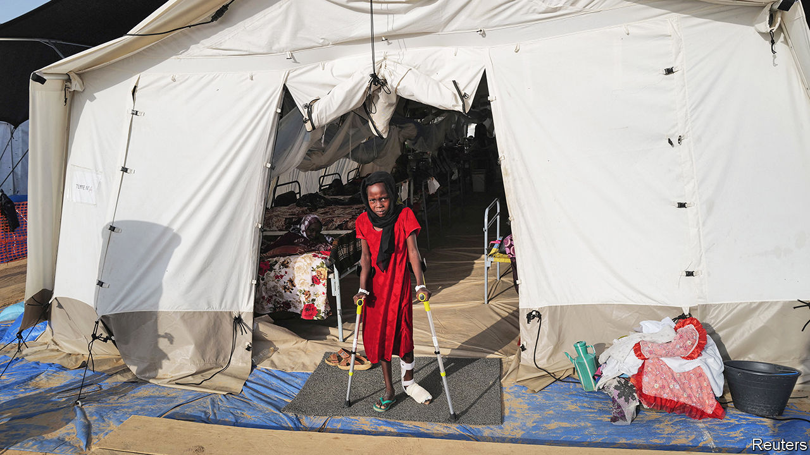
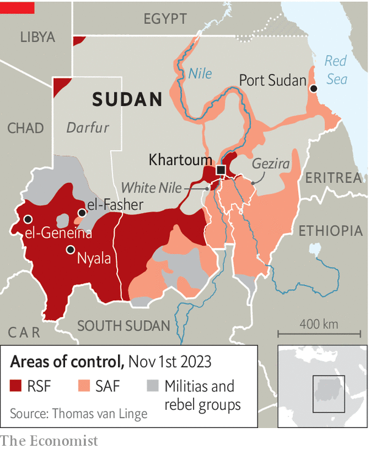
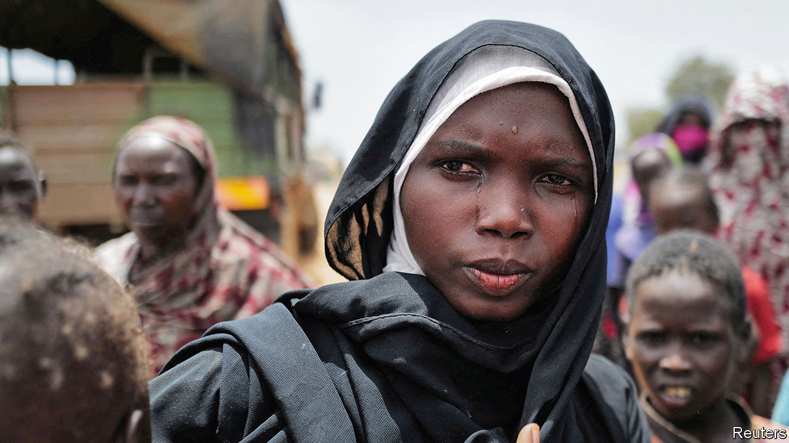

###### The forgotten war

# A genocidal militia is winning the war in Sudan 

##### The Rapid Support Forces are gaining territory 

 

> Nov 16th 2023 

A distracted world has paid little attention to Sudan since war broke out in Africa’s third-largest country in April. The West is focused on Ukraine’s counter-offensive, China’s war games and the war in Gaza. African leaders, preoccupied by their own domestic problems, have shown all the urgency of a camel crossing the Sahara. 

The consequences of neglect are becoming starker. The conflict between erstwhile bedfellows—the Rapid Support Forces (RSF), a paramilitary group, and the Sudanese Armed Forces (SAF), the regular army—is destroying the state they seized together in 2021, in a coup aimed at preventing a transition to democratic government. The IMF forecasts that Sudan’s economy will shrink by nearly a fifth this year. The war is deepening geopolitical rivalries in north-east Africa and the Persian Gulf. 

Sudan has the world’s largest number of internal refugees. About 6.3m have been displaced since April alone, adding to the 3.7m Sudanese who had already fled their homes in previous conflicts and the 1.1m foreigners who had taken refuge in Sudan. Some 1.4m Sudanese have fled to neighbouring countries since the war began. Aid agencies say that more than 6m people are “one step away from famine”. Two decades after ethnic cleansing in Darfur, a region in the west of the country about twice the size of Britain, there is again credible evidence of genocide—by the RSF, which metastasised from the Janjaweed militia that slaughtered black Africans in the 2000s. 

And things could soon get worse. In recent weeks the RSF has chalked up several major victories. Military analysts suggest it could try to take the rest of the country. Conflict monitors fear more genocidal violence. For those paying attention, the stakes are only getting higher. 

When war broke out, many foresaw stalemate. Yet today the RSF is winning. In August, in a sign of the RSF’s tightening grip on Khartoum, General Abdel Fattah al-Burhan, the SAF’s head, fled from his army headquarters in the capital. “Khartoum is not the capital city any more,” says Entisar Abdelsadig of Search for Common Ground, an international NGO based in Washington and Brussels. There is heavy fighting within the city. The RSF is reported to be close to capturing the army’s remaining positions in the capital. 

 


Though the SAF controls most of the agricultural lands in the east and the oil terminal in Port Sudan on the Red Sea, the RSF has the gold mines in the west and control over the borders with Chad and the Central African Republic (CAR). It is extending its control of the oil pipeline from South Sudan, on which Sudan’s government depends for transit fees. In recent weeks the RSF has been sighted in White Nile and Gezira states, historically two of the army’s strongholds (see map).

The RSF’s gains have been most dramatic in Darfur. Since the end of the rainy season about a month ago it has taken three of the region’s five main cities. Major military bases have been captured by the group or deserted by SAF soldiers.

In October the RSF took Nyala, Sudan’s second-largest city and a staging post for arms from the CAR. SAF defences collapsed after a pitched battle with a  force led by Abdelrahim Hamdan Dagalo, the brother and deputy of the RSF’s commander, Muhammad Hamdan Dagalo (better known as Hemedti). Three days of looting ensued. Salah al-Din Limouni, a lawyer in Nyala, says much of the city has been laid to waste. Residents are without electricity and water supplies are disrupted. 

In early November a renewed assault by the RSF brought the fall of a SAF garrison in the town of Ardamata, some 10km to the north of el-Geneina, the capital of west Darfur state. The attacks by the RSF’s new armed drones, which made short work of the army’s heavy artillery, followed clashes earlier in the war that had forced the SAF to retreat to its base. 

Mass murder

Not for the first time, in the days that followed the RSF and allied Arab militias carried out a vicious campaign of killings against the local Masalit people, a black African ethnic group. Men were separated from women, rounded up and shot. Tribal leaders were arrested or assassinated. Videos show young men crawling on all fours as soldiers beat and whip them; some show bodies scattered on the streets. UN officials estimate that at least 800 people were killed; local monitors put the toll as high as 1,300. These attacks follow earlier systematic massacres in el-Geneina, peaking in June, that coincided with a mass exodus of refugees to Chad. The UN is investigating more than a dozen mass graves. The RSF denies any involvement in attacks on civilians and said it is “firmly against any abuses or violations against any person”.

Zakia Zakaria Alsafi, a local journalist, says that the paramilitary troops headed to Adarmata after the army base had fallen, preventing Masalit men from leaving and “searching for people by name to be killed”. She says she saw 25 civilians being lined up and shot. Hafez Idris, a lawyer in Ardamata, says that at night the RSF has been burying the corpses that litter the street. “There are piles of bodies which are visible from outer space,” says Nathaniel Raymond, a conflict monitor at Yale University. 

The RSF is at the gates of el-Fasher, North Darfur’s capital. Some of its troops are on the north side, terrifying locals and looting homes. All the while, a much larger force is closing in from the south. “They are mobilising,” warns Nimr Mohammed Abdul-Rahman, the state governor. 

Meanwhile, the SAF is holed up in barracks. Supplies of water, food and medicine are running out. Frightened residents are trying to flee. If Mr Dagalo conquers el-Fasher he will be able to claim control of all of Darfur and to secure a critical route for supplies of fuel and arms from Libya. A Western diplomat adds: “It is a matter of time before it goes.” 

The presence of tens, if not hundreds, of thousands of civilians displaced from other parts of Darfur, as well as heavily armed militias from the Zaghawa, another ethnically African group, raise the prospect of a humanitarian catastrophe in el-Fasher. “If there were to be a fight it would likely be very, very bloody and put civilians in grave peril,” warns the UN’s Toby Harward. Antony Blinken, America’s secretary of state, says an RSF attack would put hundreds of thousands in “extreme danger”.

Death on the Nile

The RSF’s advances in large part reflect the uneven support outsiders have given the two sides. The United Arab Emirates (UAE) reportedly provides the RSF with weapons, armoured vehicles and drones via Chad, though there has been a UN arms embargo on Darfur since the early 2000s. By one count there were 168 airlifts from the UAE between May and September. (The UAE has denied sending arms to “any of the warring parties”.) Anti-aircraft missiles, reportedly supplied by the Wagner Group, a Russian mercenary outfit, have helped the RSF to erode the SAF’s advantage in air power. 

Though Egypt has sporadically helped its fellow military regime—most recently, say sources, by bombing a bridge used by the RSF in Khartoum—it has done much less than the Emiratis. Its government has been distracted by an economic crisis at home, which it wants the UAE’s help to fix, and then by the war in Gaza to its north. 

What might come next? Some analysts fear a “Libya scenario” where the country is cleft into two parts, one on either side of the Nile. Yet Hemedti may not settle for a landlocked Darfur and a shell-shocked capital. If the RSF takes Khartoum, then the next stop could be Port Sudan on the Red Sea, a key location for both the RSF and its Emirati backers. “The RSF cannot declare victory without access to the sea,” says Kholood Khair of Confluence Advisory, a Sudanese think-tank. 

Even if the RSF makes further advances, however, its writ is unlikely to stretch across the whole country. Myriad smaller rebel groups would survive. The SAF will not evaporate; its hitherto reluctant backers may stiffen their backbone if the SAF is about to lose its de facto capital on the Red Sea. And the RSF militiamen are not exactly administrators. “They don’t have a governing strategy,” says Ms Khair. “They can rule but they can’t govern.” 

Anarchy, one way or another, would have profound consequences. A European diplomat describes a scenario in which a fractured Sudan is torn apart by a broader regional rivalry from the Gulf to the Horn of Africa. On one side there is a bloc backed by the UAE—potentially encompassing Abiy Ahmed, Ethiopia’s prime minister, the RSF’s Sudan, chunks of Somalia and Chad. On the other is a Saudi-supported camp, embracing the SAF’s Sudan, Djibouti, Eritrea and Egypt. 

Cameron Hudson, a former American official, imagines a scenario in which “tens of millions of Sudanese flee across the continent and the Red Sea to escape the country’s descent into warlordism and ethnic-militia violence.” Sudan’s ungoverned spaces could draw in jihadists, who are currently fighting in the Sahel, and Russian mercenaries who are keen to give the Kremlin its long-sought foothold in Port Sudan. (CNN has reported that, in response to Russian activity in Sudan, Ukraine’s special forces may have carried out missions against the RSF.) “While ongoing conflicts in Gaza and Ukraine have captured the attention of the world,” he argues, “the geopolitical ripple effects of Sudan’s collapse are being woefully underestimated.”

 


International efforts to try to stop the bloodshed have begun. Last month Saudi Arabia, alongside America, restarted talks in Jeddah between representatives of the RSF and the SAF. On paper there was an agreement to improve access for humanitarians. But it is hard to see how it has made much difference. 

Fighting was raging in Darfur while the belligerent bigwigs talked in Saudi Arabia. The RSF, and, according to Emirati officials in private, its backers, see no point in a truce in a war it is winning. The SAF, meanwhile, maintains that its foe must disarm and withdraw to its bases. “There is a glaring mismatch between the weakness of [the SAF’s] military position and their hilarious maximalist negotiating position,” says another European diplomat. 

No expert thinks it is easy to find a deal that would suit such mendacious and self-interested combatants, never mind one that would also take account of the civilian victims of the generals’ greed. Even so, the international response has still been “anaemic and ad hoc”, says Mr Hudson. The UN Security Council is paralysed and the organisation’s leadership has shown far less interest in Sudan than it has in Gaza. A joint African Union (AU)-UN peacekeeping mission to Darfur withdrew in 2021 in the belief that blue helmets were no longer necessary. The AU and the continent’s leaders have been all but silent in the face of the sort of atrocities it once pledged to stop. IGAD, a regional group, has been weak, though Kenya’s president, William Ruto, is keen to resume its efforts. He met Mr Burhan in Nairobi on November 13th. Neither the UAE nor Egypt has taken part in the talks in Jeddah.

Western officials claim that they have not neglected the conflict, noting that the world is more complex than it was in the 2000s, when America could more easily lead international responses such as the one in Darfur and in what would become South Sudan. Yet it is hard to make the case that Sudan has attracted sufficient urgency or creativity. The White House has adopted a de facto “do not disturb us” policy, says Alex de Waal, a British researcher. Sudan is not going to be high on America’s agenda in its discussions with the UAE or Saudi Arabia, especially since Hamas erupted from Gaza on October 7th.

The wars in Ukraine and the Middle East have drawn global attention. Meanwhile in Africa the grim effects of a huge state’s collapse are passing almost unnoticed. “Sudan has died,” says Mr Raymond. “And nobody wrote the obituary.” ■

