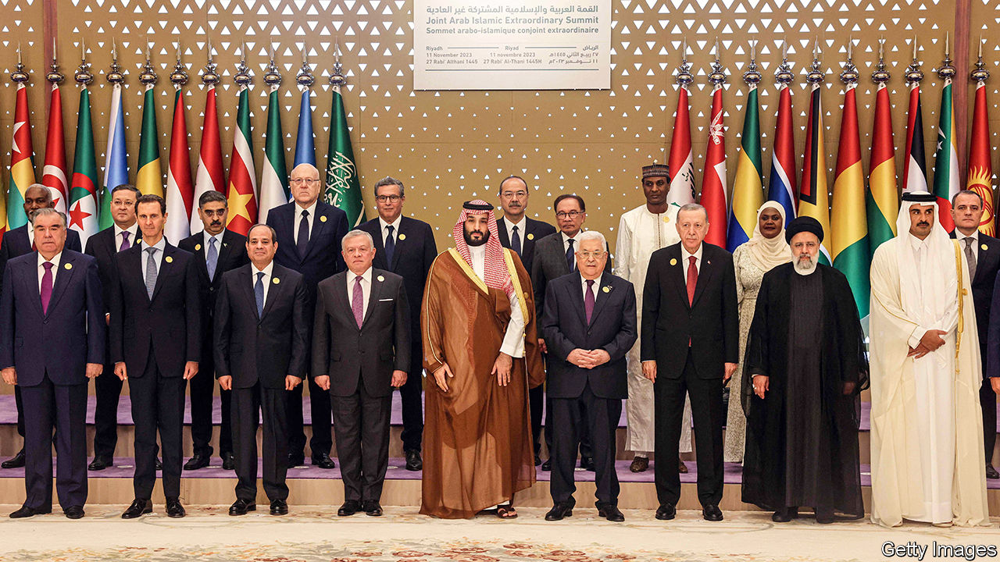

###### The region reacts

# Many Arab governments would like to see Hamas gone 

##### And they worry that the war in Gaza will upset their economic plans 

 

> Nov 16th 2023 

THEY all want the war to end. And they all want someone else to end it. That was the message, at once banal and controversial, from the leaders of the 22-member Arab League and the Organisation of Islamic Co-operation (OIC), a grouping of 57 mostly Muslim-majority states. It was all to show from an extraordinary summit on November 11th in Riyadh, the Saudi capital. 

The meeting came more than a month into a Gaza war that remains a fixture on television screens and in conversations across the Middle East. The plight of the Palestinians captures Arab attention and inflames emotion in a way that the plight of Sudanese or Yemenis or Syrians does not. The joint summit ended with a sharp statement reflecting that anger: it called for an immediate ceasefire, implored member-states to “break the siege on Gaza” and urged an arms embargo on Israel.


It would be easy to dismiss the gathering as a talking-shop, which the Arab League often is. Several leaders denounced the West’s double standards when it comes to Palestinians. Fair enough. Yet they did so at a summit where Bashar al-Assad, one of this century’s worst war criminals, was invited to pontificate about Israeli war crimes: their own bit of hypocrisy. Parts of the final communiqué were similarly ironic. Far from breaking Gaza’s siege, Egypt has helped maintain it for almost two decades. No one in the OIC sells weapons to Israel—though some member-states do buy them from Israel.

Read between the lines, though, and the summit was revealing. Deep contradictions sit beside the regional reaction to the war. Many Gulf states, for example, would like Israel to get rid of Hamas, even as they fear that doing so will awaken extremism in their own countries. They want to see Iran’s “axis of resistance” of proxy militias wounded, but worry about being caught in the crossfire. For several years they have promoted the narrative of a new Middle East, focused on economics rather than ideology. They fret that a long war in Gaza will upset such plans.

Ebrahim Raisi, Iran’s hawkish president, spoke for almost 40 minutes at the summit; beneath his clerical robe he wore a , the headscarf that is a symbol of Palestinian identity. At one point he urged Muslim countries to send weapons to the Palestinians. That suggestion was politely ignored. Several other participants urged diplomatic and economic sanctions on Israel but those, too, were swatted away.

A few Arab countries have recalled their ambassadors to Israel, but those with diplomatic ties are unwilling to sever them. They have also ruled out using oil as a weapon, as they did in 1973, when OPEC imposed an embargo on countries that supported Israel during the Yom Kippur war. “That is not on the table today,” said Khalid al-Falih, the Saudi investment minister, at another conference earlier this month. The Saudis need many years of stable oil revenue to finance their plans for economic diversification. The last thing they want to do is force an embargo that would spur Western countries to accelerate their transition away from oil.

The outcome of the summit was divisive. Some Arabs were pleased with the tough rhetoric; others complained that their governments are too passive about the war. Take away military threats or economic sanctions, and all that is left is tough talk.

Everyone is acting out of self-interest. The Saudis decided to go ahead with Riyadh Season, an annual festival that is part of Muhammad bin Salman’s plan to loosen the kingdom’s cultural strictures. That has brought them a heap of criticism: the crown prince wants people in Riyadh to have fun while people in Gaza are dying. Such condemnation rankles with the Saudis, who feel that they are being singled out, as if they alone are partying while the rest of the region mourns.

Yet much of the region is trying to act as if it is business as usual. Even Iran has so far allowed a measure of pragmatism to restrain its actions. Though its militias have carried out regular attacks on Israeli and American targets, it has decided not to waste Hizbullah, the Lebanese Shia group that is its most powerful proxy, on an all-out battle to support the Palestinians. On the sidelines of the summit Prince Muhammad held talks with Mr Raisi, their first face-to-face meeting and the first visit to the kingdom by an Iranian president since 2012. It was a sign that the detente they struck in March still stands. No one wants a regional war—at least not now.

In the long run, though, the events of the past six weeks are a reminder that the Middle East’s recent calm is fragile. The region is still at a crossroads between endless conflict and ending its conflicts, and the Gaza war has only sharpened the choice. “If the peace camp fails, it is only a matter of time” before a wider war comes, says Mohammed Alyahya, a Saudi fellow at the Belfer Centre at Harvard University. But for it to succeed, Israel would have to make concessions. That may seem far-fetched. Although nothing would undermine Iran and its proxies more than a peace deal with the Palestinians, a right-wing Israeli government and a discredited Palestinian one do not seem poised to revive the moribund peace process. 

However peace talks are the best hope other Arab states can muster. America has pushed them to commit to a multinational force to secure Gaza after the war. At a press conference after the Riyadh summit an exasperated Faisal bin Farhan, the Saudi foreign minister, told reporters to stop asking him about plans for a post-war Gaza. “The only future, and this is the unifying position of the Arab [world], is an immediate ceasefire,” he said. The longer the war drags on, Arab diplomats argue, the harder it will be to imagine what comes next. ■

