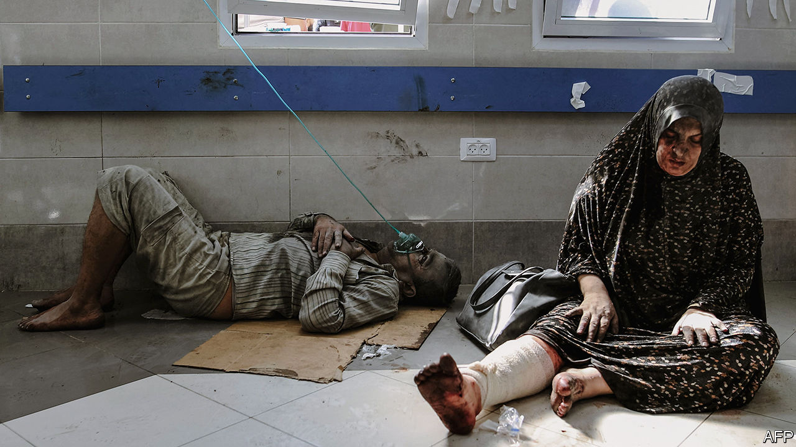
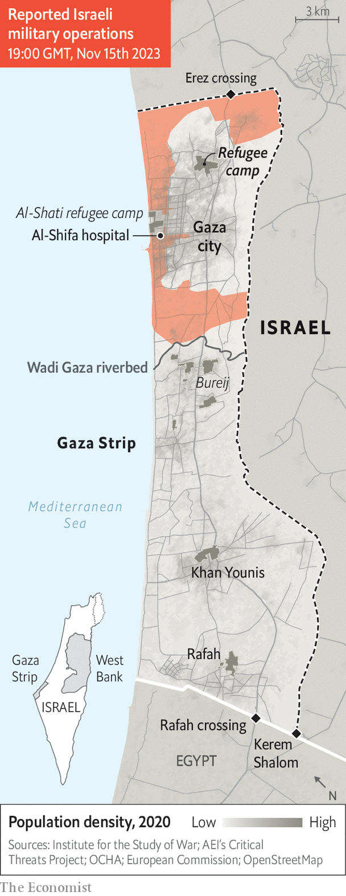

###### The end of the beginning

# The battle of northern Gaza is almost over 

##### But a dire humanitarian situation in the south is getting worse 

 

> Nov 15th 2023 

A CITY which, six weeks ago, was home to nearly 1m people is now a hollow shell. When was invited on November 14th to join an Israeli military-supply convoy to al-Shati, a once-cramped refugee camp in northern Gaza, none of its 90,000 residents was there. Many of the camp’s dense apartment buildings had been destroyed; others were badly damaged. Armoured columns of the Israel Defence Forces (IDF) had torn up roads. Electricity, water and sewage infrastructure no longer exist. The situation is similar in much of Gaza city and in outlying towns.

After six weeks of war and three weeks of ground fighting, Israel now has effective control of the area north of Wadi Gaza, a riverbed that bisects the 45km-long strip (see map). The devastation heralds the end of one phase of Israel’s war against Hamas, which began on October 7th after the Palestinian Islamist group carried out a massacre that ended with around 1,400 Israelis killed or kidnapped. Weeks of Israeli action have killed more than 11,000 Palestinians in Gaza. They have also, in effect dislodged Hamas from power, at least in the north of the enclave: the group that has controlled Gaza since 2007 is now scattered and reeling.


All this raises two important questions. First, and most pressing, is how to alleviate a humanitarian disaster in southern Gaza. Almost all of the territory’s 2.2m people are now kettled in the south. A total siege imposed by Israel on its border crossings to Gaza, and the anaemic flow of aid across Gaza’s border with Egypt, have left Gazans desperately short of food and water. Fuel shortages have crippled hospitals and aid agencies. And winter has arrived, bringing cold temperatures and rain that will further add to the misery.

Second is what happens next on the battlefield. It is not just civilians who fled to southern Gaza: some of Hamas’s fighters no doubt did the same. Israel has yet to find the group’s leader in Gaza, Yahya Sinwar, or its military chief, Muhammad Deif, both of whom are thought to be hiding in the maze of tunnels beneath the enclave. Israeli troops will spend the coming weeks blowing up the entrances to those tunnels and scouring the north for arms and militants. At some point, though, Israel will have to turn its attention to the south. How much it will be able to do there will depend on domestic politics and diplomatic pressure.

 


In recent days attention has been focused on al-Shifa hospital, the largest in Gaza, and other such facilities. Israel says Hamas has an underground headquarters beneath al-Shifa. It also believes that some of its 239 hostages were hidden there, at least temporarily. On November 15th, after encircling it for six days, Israeli troops entered the hospital compound.

The situation was still unfolding as went to press, but initial reports suggest the IDF found neither the leadership of Hamas nor any of the hostages. Most of the 60,000 or so Palestinians who had been sheltering at the hospital in the early days of the war had also vanished. When Israeli troops entered, only 1,500 or so people remained, a mix of medical staff, patients and displaced people.

Most fled south—as did everyone else. Once home to more than half of Gaza’s population, the north is now a deserted wasteland. The Israeli troops in al-Shati report only a few encounters with small groups of civilians. There are no accurate figures for how many people remain, clustered around hospitals and relief centres. Israeli and foreign sources believe they number only in the tens of thousands.

The population of southern Gaza has doubled over the past month, an increase that would strain basic services even without a near-total blockade of the enclave. An estimated 1.5m people have been forced from their homes, mostly from the north but also from the south.

Since October 21st, when Israel consented to allow in aid deliveries via Egypt, around 1,200 trucks have brought food, medicine and other essentials through the Rafah crossing (before the war, around 500 entered Gaza each day). Many people in the south are skipping meals and struggling to find clean water. With shipments of fuel almost totally prohibited by Israel, some Palestinians have taken to burning furniture as firewood to cook.

The lack of fuel has paralysed basic services. Almost two-thirds of health-care facilities have stopped working. Sewage-pumping stations are offline. The International Rescue Committee says that waterborne diseases like cholera and typhoid will inevitably start to spread. On November 14th the un said that aid deliveries would soon cease; it lacked enough fuel even to operate forklifts.

The next day a tanker with 23,000 litres of diesel entered Gaza from Egypt, the first such shipment Israel has allowed since the war began. That was better than nothing—but barely. Israeli restrictions mean the fuel can be used only by the UN, not by hospitals, where generators have run dry. Tom White, the director of the UN aid agency in Gaza, says the delivery covered just 9% of his organisation’s daily needs.

Heavy winter rains have also arrived. Some Palestinians found their tents had collapsed during a downpour on November 14th; others are sleeping in the mud. December and January are reliably cold and wet in Gaza, with night-time temperatures dipping to 8°C.

Before the war began, around two-thirds of the trucks entering Gaza went through Kerem Shalom, a crossing with Israel. It has been closed since October 7th. There is little support in Israel for helping Gazans after Hamas’s atrocities, and the far-right parties in Binyamin Netanyahu’s government are adamantly opposed to it.

So supplies must take a circuitous route through Egypt. They arrive in its North Sinai province. Then they are trucked to an Israeli border crossing, to be inspected for arms, and then back to Rafah. The detour adds 100km to the journey, and Rafah is open for only a few hours each day. “Relief organisations find it very difficult to operate in Egypt, which is why they have usually done so in Israel, where the distances are shorter and procedures used to be more efficient,” says Tania Hari, the director of Gisha, an Israeli ngo that lobbies for more access to Gaza. “Kerem Shalom has to be reopened for Gazans to survive.”

The next step

Whether to do that is one question for Israel as it decides how to proceed with its war. Accompanied by tanks, sniffer dogs and demolition squads, soldiers have spent over two weeks going from house to house, searching for weapons and shafts leading to Hamas’s tunnels. An officer explains the methodical procedure. Suspect buildings are targeted with tanks or air strikes. Then, along with the dogs and sappers, soldiers conduct inspections. They are not allowed to venture into the tunnels. More shafts are constantly being found.

Weapons and explosives left behind in houses indicate that Hamas fighters left in a hurry. It is unclear where they have gone. Some may be trying to survive in what is left of the tunnels. Others may have fled south or retreated to the very centre of the city. “We deal with about 90 or 100 buildings a day,” says Lieutenant Commander Oz, a battalion commander. Dozens of battalions are on similar missions in and around Gaza city.

Israeli generals know that they will not be able to act in southern Gaza with the same ferocity as in the north. Instead, they are planning a “more mobile” offensive. But any operation will probably hamper relief efforts and cause an international outcry, which is already mounting.  in Saudi Arabia this month Arab and Muslim countries demanded an end to the fighting.

Some Western leaders have begun to echo that demand. Emmanuel Macron, the French president, called for a ceasefire in an interview with the BBC. Joe Biden still rejects a permanent truce, though he is under pressure from some in his party to push for a ceasefire. Talks are taking place about a pause in the fighting in exchange for the release of some of the hostages.

A less brutal war could ease that pressure. The Palestinian death toll shot up by hundreds each day during the first weeks of the war. In recent days, though, the casualty rate has decreased significantly, as there is almost no one left in the north. That could buy Israel more time to continue its ground campaign. So would a greatly expanded humanitarian effort.

Israel must also consider what comes next in Gaza, something Mr Netanyahu has so far refused to do. For now, Hamas has lost its ability to rule. It may also have lost the support of the people it once governed. “[Gazans] blame Hamas for bringing this tragedy upon them,” says an Israeli intelligence officer accompanying troops inside the strip. That is what one would expect the IDF to say—but it rings true.

Even before the war, it was difficult to gauge public opinion in Gaza: Hamas ruled as an authoritarian one-party state, and the last Palestinian parliamentary elections were in 2006. It is even harder now. Anecdotal evidence, though, suggests that many people in Gaza are furious at their ostensible rulers. Reached by phone in southern Gaza in recent days, numerous Palestinians described scenes of anger aimed at Hamas. Policemen have been cursed and beaten while trying to jump queues for food and water.

That is not to say desperate Gazans feel any warmth for Israel. Hamas was born in Gaza; its most influential leaders, Mr Sinwar and Mr Deif, grew up in the refugee camp near Khan Younis, the city that now hosts untold Gazans displaced from the north. Israel may have dealt the group a fatal blow. But a long period of miserable displacement would ensure that something else rises in its stead. ■

