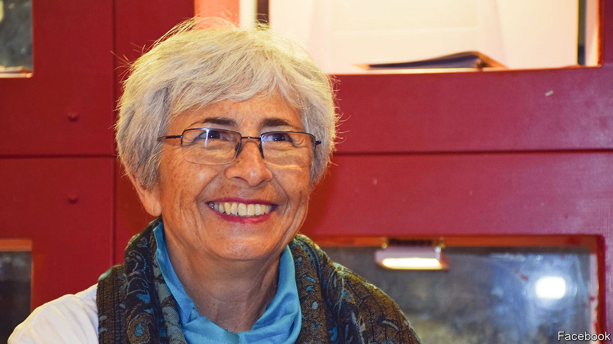

###### A hundred ways to peace

# Vivian Silver knew no good could ever come of war 

##### The veteran Canadian-Israeli peace activist has been confirmed killed on October 7th, aged 74 

 

> Nov 15th 2023 

Sometimes truth could come from the mouths of babes. This time it came from Vivian Silver’s two small sons. They had made a friend of Nassar, a Palestinian labourer who worked at their kibbutz, and wondered why, after the second intifada, he wasn’t working for them any more. She explained that he had no permit to come over now. “Why not?” one son wondered. “Because there is a big conflict between the Palestinians and the Israelis.” “What is it over?” “Land,” she told him.

In Hebrew the words for “earth” and land” were the same. So her son went off, fetched a bucket, filled it with earth, and returned. “Here,” he said. “Give it to Nassar, so he can come back.” 

How simple peace could be, she thought. How uncomplicated, if it were only a matter of talking, sharing and helping. She spent 50 years with that thought in her head, trying all the ways she could think of to bring neighbours together. For neighbours they were, with only four and a half kilometres separating her kibbutz, Be’eri, from the Gaza Strip. What was home to her was also home to them. No one intended to move anywhere. It made no sense to fight, only to live in mutual respect and freedom. On the other side were women like herself, mothers with children, who wanted nothing more than to bring them up happy, healthy and in peace. 

She would tell friends from Tel Aviv how quiet it was in the kibbutz. Yet she endured four wars. In the conflict of 2009 she was walking in the fields when bombs began falling round her. She knew at once this was not a stray raid; a war had started. With no safe place near, she simply had to run, in terror, the several kilometres home. In 2018 Palestinian kite-bombs torched other green places she loved, the Tel Gama archeological site and her local nature reserves. They were all turned to ash. Israel’s retaliation, as usual, was fierce. But what good did that do? 

At the kibbutz they tried to live normally. There was no guard on the gate, and most people did not bother to lock their doors. They got shelters later, which made them feel safer; but they were not safe. The war with Gaza in 2014 was the worst. It lasted 50 days, the killing and maiming, the destruction and deep psychological damage on both sides. Yet the idea that war would bring peace had been proved false time and time again. When were the two parties going to come to their senses, and stop this? 

She had never expected to become a peace activist, though she knew some cause would consume her. When she was younger, growing up in Canada and, for a while, in New York, women’s rights were her chief passion. But a stint at Hebrew University in Jerusalem convinced her in 1974 to move to Israel, where her interests began to expand. She became one of the few female secretaries, or chief decision-makers, at her first kibbutz, Gezer, and took charge of building both there and at Be’eri, not usually a woman’s job. She also began to help the Bedouin she found camped almost in her front yard at Be’eri, as poor as if they were in some pocket of India or Africa. And she started to work with Palestinians in any way she could, because that gave peace more of a chance. 

Her work burgeoned. She gave Palestinians jobs on the kibbutz, and founded a group called “Creating Peace” which encouraged cross-border links between traders and artisans. In 1998 she became executive director of the Negev Institute for Strategies of Peace and Development, later in partnership with Amal Elsana Alh’jooj, a Palestinian; in 2011 they won an international award. She spent a lot of time in Gaza in the late 1990s, making friends there; it infuriated her when people said that Israel had “no partner on the other side”. But when Hamas took over the strip in 2007, everything became hard. The Friday night phone calls she had organised, gathering her neighbours in a field to chat to Gazan friends, had to stop. To make sure her Palestinian workers, who now could not cross, were not destitute, she had to take their money to the checkpoint. She had to go there, too, to pick up the sick Palestinians she would then drive to hospitals in Jerusalem. 

By 2014 she felt that nothing was working. It was a momentous year for her. She turned 65, retired, and became a grandmother: a good time for soul-searching. For 40 years now she had been a peace activist, and a proud member of the Left for just as long. But the Left had not managed to end the seemingly eternal conflict between Israelis and Palestinians. What was the answer? As her feminist brain eagerly suggested, it was to turn to woman-power. She would help build up a movement of Israeli and Palestinian women who would work together if they could, and would also keep in the public eye by marching and appealing (including every Monday outside the Knesset), for negotiated agreement rather than war. 

Her branch, the Israeli side, now with around 45,000 Jewish and Arab-Israeli women, was called Women Wage Peace. From the moment she joined, she lived and breathed it. The Palestinian branch was called Women of the Sun. In a mass rally on October 4th this year they gathered at the “separation wall” in Bethlehem, walked hand in hand to the Haas Promenade in Jerusalem and mustered on the shore of the Dead Sea, the WWP members in white shirts with turquoise ribbons and the slogan “Peace is possible”. At the Dead Sea beach, against a fence hung with peace quilts, sympathetic female diplomats and representatives of Israel, Palestine, the United States and several European countries sat at a round table to talk. It was a symbolic, triumphant moment. The peace-wagers dispersed with hugs and laughter. 

Three days later, Hamas broke into the Be’eri kibbutz. Her son Yonatan, now in his 30s and in Tel Aviv, had called his mother to check she was safe. Even as the terrorists rampaged through, shooting from house to house, she made light of it. Then, wary of making any sound, she switched to WhatsApp. She was typing in a cupboard in her safe room; the terrorists had now barged in. 

What, an interviewer asked Yonatan later, would she have said about this new war, and the atrocities that had launched it? He knew the answer at once, without equivocation. “That this is the outcome...of not striving for peace.” ■

