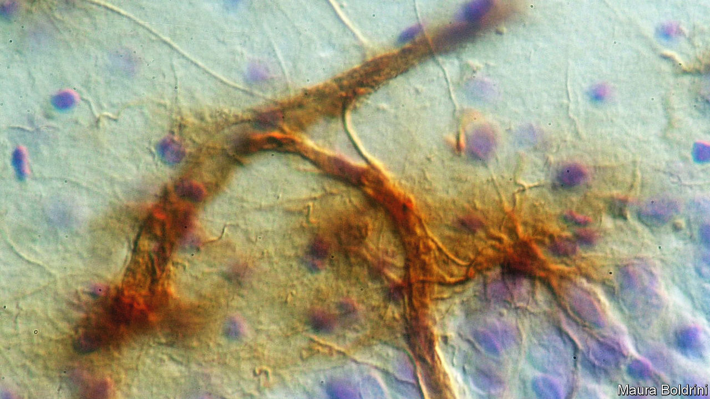

###### The wisdom of youth

# Could newborn neurons reverse Alzheimer’s? 

##### Some scientists think so. Others doubt the cells even exist 

 

> Nov 15th 2023 

ONE OF THE first signs of Alzheimer’s disease is confusion. Most people can park their car in a different space every morning and find it again in the evening. Those with Alzheimer’s find this type of problem much harder. Memories of things they do often, like eating or taking medication, become tangled in their minds. 

The ability to distinguish between similar memories depends on a tiny strip of brain tissue called the dentate gyrus. Studies in mice have shown that the dentate gyrus is one of the few bits of the brain to generate new neurons even in adulthood. Those new neurons are thought to help keep similar memories distinct.

Whether something similar happens in humans is less clear. But a clutch of new results described this week at the Society for Neuroscience’s conference in Washington, DC, suggest that it might. And if it does, then encouraging the process might offer a new treatment for Alzheimer’s disease. 

Until the 1960s scientists thought adult brains did not produce new neurons. Then evidence began to emerge of young neurons in the brains of adult rats and mice—specifically in the olfactory bulb, which processes smell, and the dentate gyrus. These new neurons had developed from neural progenitor cells, a type of undifferentiated neuron akin to a stem cell, in a process scientists call neurogenesis.

And there seems to be a link, at least in mice, between these new neurons and Alzheimer’s disease. Mice genetically engineered to have Alzheimer’s-like symptoms also have fewer young neurons in their brains. Two studies published in 2021 and 2022 showed that encouraging neurogenesis could improve memory in such animals. And a paper published in April this year found that boosting neurogenesis also caused other cells known as microglia to begin cleaning up tangles of protein, called amyloid-beta plaques, that are characteristic of Alzheimer’s disease.

So far so promising—if you are a mouse. But studying neurogenesis in humans is tricky. MRI scanners cannot watch the growth of individual neurons. Scientists must take samples of brain tissue from cadavers and either stain them with chemicals that bind only to young neurons, or measure the genes that have been expressed within brain cells to look for the hallmarks of youth. 

Dozens of such papers have been published. But for every one that has found evidence of neurogenesis, another has failed to do so. The pro-neurogenesis camp thinks the null results are down to poor-quality brain tissue or crude preservation techniques. The antis argue that either humans do not grow these neurons in the dentate gyrus, or if they do, there are too few of them to be useful. 

The research presented in Washington strengthens the case for human neurogenesis. Maura Boldrini of Columbia University, María Llorens-Martín of the University of Madrid, Orly Lazarov at the University of Illinois at Chicago and Hongjun Song of the University of Pennsylvania presented evidence of young neurons in the dentate gyruses of humans—though most of their findings have not yet been peer reviewed. 

Three of these researchers also studied the brains of healthy older people or people with Alzheimer’s disease. Their results suggested that the production of the supposed new neurons slows with age, and falls precipitously in Alzheimer’s disease. Previous studies by two of the groups also found that Alzheimer’s patients with more of these neurons had better memories. 

But while the new research strengthens the case for human neurogenesis, it is not yet definitive. One group of researchers from Yale University questioned whether the staining technique used in one of the studies was accidentally tagging other brain cells such as astrocytes. They are also concerned that the studies tend to find very few progenitor cells. “Where are all the mothers of these baby neurons?” asked Jon Arellano, one of the sceptics. 

There are other wrinkles. Dr Song found a different set of genes expressed in the supposedly young human neurons from those seen in neurons from other animals. And the few young neurons that both Dr Song and Dr Lazarov found in the brains of Alzheimer’s patients looked very different from the same neurons in healthy brains. If the new cells are somehow defective, increasing their number may not help. 

But although not all the scientists at the conference were convinced, some drug-makers appear to be. In April, Biomed Industries, a pharmaceutical firm based in California, said that results from an early clinical trial suggested that a new drug that the firm claims increases neurogenesis in mice improved memory in people with moderate Alzheimer’s. If subsequent trials prove to be equally encouraging, that could be further evidence that the neurogenesis theory of Alzheimer’s may indeed have something to it. ■


