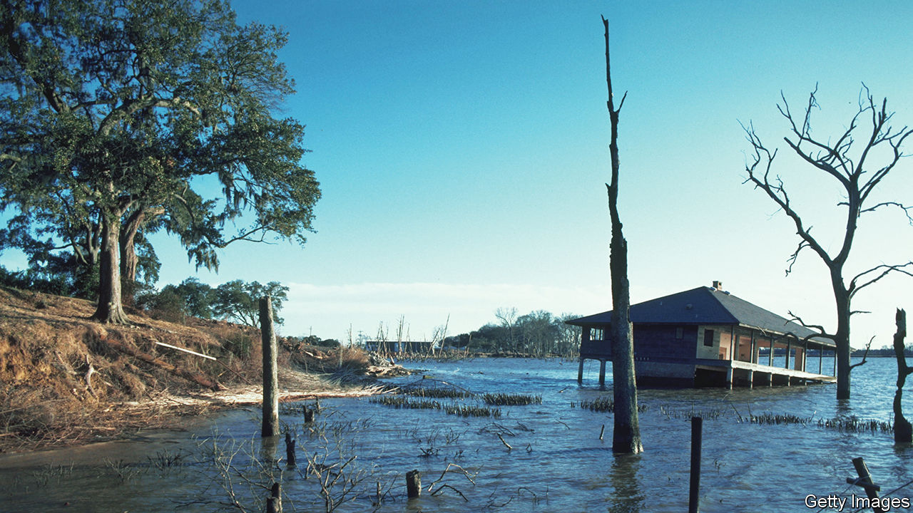

###### Rip van Winkle, the microbe

# Was an ancient bacterium awakened by an industrial accident? 

##### What lies beneath a Louisiana lake 

 

> Nov 15th 2023 

New species are generally found rather than awakened. And they are typically discovered in remote places like rainforests or Antarctic plateaus. But not so a species of bacterium described in a paper just published in . As Russell Vreeland and Heng-Lin Chui, the paper’s authors, point out, the bug is new to science. But it is not new to Earth. In fact the microbe may have been slumbering for millions of years before being awakened by an industrial disaster. 

The bacterium in question lives below Lake Peigneur in southern Louisiana. The ground beneath the lake is rich in natural resources. In 1980 it boasted a mine producing rock salt, while a drilling rig run by Texaco was moving about on the surface looking for oil. But on November 20th, the two operations came together accidentally—and spectacularly. The oil rig’s drill penetrated the third level of the salt mine, creating a drain in the lake’s floor. 

Over the next few days the resulting man-made sinkhole swallowed up the oil rig, 11 barges, a tugboat, 35 hectares of land and part of a house. A canal that drained the lake into the Gulf of Mexico began flowing backwards as the water level fell, briefly creating the tallest waterfall in Louisiana, while muddy geysers erupted from mine shafts. Somehow, all 50 people working in the mine managed to get out ahead of the rising floodwaters.

An official report could not determine whether the oil rig had been drilling in the wrong place, or whether the maps of the mine were inaccurate. Either way, the disaster created an entirely new environment. The water that flowed into the mine contained less than 2% salt. But rock salt dissolves readily in water. When Dr Vreeland, then at the University of New Orleans, was granted access to part of the flooded mine in 1987, he found the water within contained 32% salt, about nine times more than seawater.

For most creatures, that much salt would be lethal. But Dr Vreeland found a species of bacteria, one of a salt-loving group called , in his samples. The bug grew best in water containing 18% salt—and died when concentrations fell below 10%. Since the bacterium could not have survived in the lake, how did it get into the water in the mine?

Having access to only a small lab, and with comparatively few resources, Dr Vreeland decided to shelve the mystery and move on to other projects. During a visit to China in 2016, though, he met Dr Chui, another expert in salt-loving microbes, and decided to return to his cold case. 

In the intervening years, scientists have found that some bacteria possess exceptional powers of self-preservation. When times are hard they can enter a form of stasis, shutting down all biological activity until things improve. The salt beneath Lake Peigneur was formed by the evaporation of a previous body of salty water. Some of the salt is 125m years old, meaning it was laid down during the heyday of the dinosaurs. The new species, the researchers suggest, is therefore antediluvian both literally and metaphorically. It was there before the mine was flooded, trapped in water pockets within the salt crystals—and it may have been there for millions of years. 

Exactly how long bacteria can remain in suspended animation is difficult to test, because experiments cannot reasonably run for more than a few decades. But Dr Vreeland claimed in  in 2000 that he and his colleagues had succeeded in reviving another salt-loving bacterium that was 250m years old. A study published last year argued that, in some circumstances, a particularly resilient species called might be able to manage 300m years in stasis.

And Dr Vreeland points out that the conditions in the salt mine might have helped this latest species while away the aeons in relative safety. One problem faced by a somnolent organism is the gradual accumulation of damage to its DNA. Oxygen is one source of such damage. But the element does not exist inside rock-salt crystals, and is only very slightly soluble in brine. Ultraviolet light is another danger, but none penetrates below the ground. 

Background radiation can also damage genomes. But the only radioactive atom found in brine is potassium-40. With a half-life of over a billion years, it is only mildly radioactive. And bacteria that live in harsh environments, including , contain plenty of DNA-protecting proteins to prevent damage. Now, thanks to a human mistake, Dr Vreeland’s bacterium has been given an entire mine in which to live, where it can finally reap the rewards of its prodigious patience. ■


