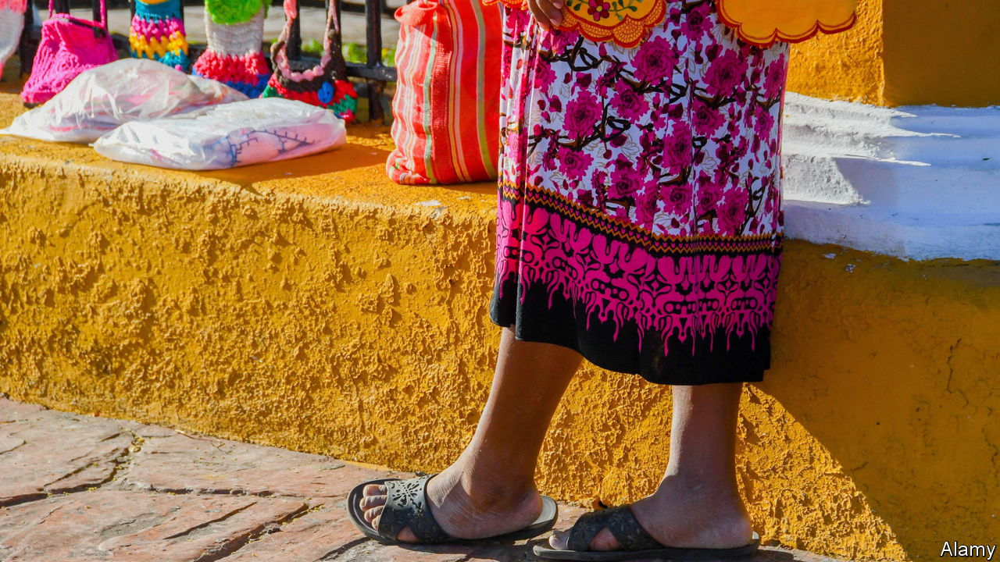
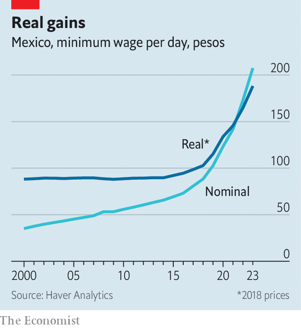
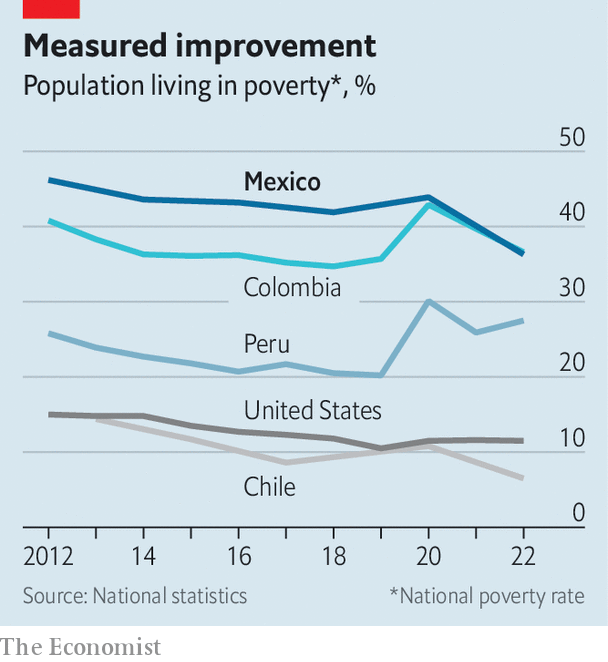

###### A rare success

# Andrés Manuel López Obrador has reduced poverty in Mexico 

##### But he could have done better 

 

> Nov 16th 2023 

When he came to office in 2018, Andrés Manuel López Obrador pledged to put the poor first. It is one promise Mexico’s president has managed, in part, to keep. The number of Mexicans living in poverty has fallen from 52m to 47m during his term, according to measurements made by the National Council for the Evaluation of Social Development Policy, an independent government body. That would count as success at the best of times. That it coincided with a pandemic and Mexico’s biggest economic contraction since the Depression makes it remarkable. 

 


Labour reforms were critical. The minimum wage was stagnant in real terms for years before Mr López Obrador took office. Since then, he has increased it by 90% to 207.45 pesos ($11.97) per day. Although only the 45% of workers who hold formal jobs benefit directly, the increase does drag pay up for others, says Alice Krozer of Colegio de México, a university. The president also cracked down on outsourcing, which firms were abusing to avoid the legal requirement to share profits with their employees. When the law came into force, in April 2021, it stood to benefit the 2.9m workers believed to be in illegal schemes.

Mr López Obrador’s handouts are a second factor. Although his government’s social spending did not exceed that of his predecessor until this year, more money has been spent on the handouts themselves. He managed this by slashing the number of programmes and abolishing Prospera, a lauded cash-transfer programme that was conditional on children attending school and medical appointments, and thus expensive to administer. 

That left more money for rural people who plant trees and young people on apprenticeships, his signature programmes. He also brought in a universal old-age pension of 4,800 pesos, paid every two months. That rises to 6,000 pesos from January, as Mr López Obrador ups spending in an election year. All told, the new arrangements reach fewer people, but those in receipt get twice as much cash on average compared to previous schemes. 

 


As ever with Mr López Obrador, there is a flip side. Extreme poverty has edged up on his watch. Although the incomes of the most vulnerable went up, their access to health care declined. Mr López Obrador did not follow through on his campaign promise to create a universal health-care system to replace the current formal joblinked programme. But he nonetheless abolished Seguro Popular, an insurance programme for those without formal jobs, hurting the poorest. That left 39% of the population, some 50m people, without health care, up from 16% in 2018. The cost of treatment for illnesses such as cancer pushes many Mexicans into poverty, or stops them escaping it, says Ms Krozer. 

Although distributing money more efficiently did let Mexico’s president dole out more cash overall, it also meant that the number of the very poorest households covered by handouts has dropped. Gerardo Esquivel, an economist and former adviser to the president, says Mr López Obrador could have avoided this by using the data from Prospera to target his handouts. Instead, he drew up a list of his own, which was aligned with his political goals. 

The poverty rate is likely to drop again in 2024. The economy is recovering, and handouts have been increased, too. But Mr López Obrador’s tools are reaching their limits. The minimum wage cannot keep rising at the current rate. Social programmes are already unaffordable.

In any case the handouts are just a , a plaster, says Manuel Ramírez of Juventudes Manos en Acción, an NGO based in Chiapas, Mexico’s poorest state. Candelaria López Gómez, a 48-year-old from Chiapas, says she would prefer the government to pave roads and pipe in drinking water, so she doesn’t have to buy it in bottles. More and better quality health and education services are needed, too.

Claudia Sheinbaum, Mr López Obrador’s likely successor, will have to raise taxes to afford the increasing cost of handouts (though she claims she will not do so). More to the point, her government needs to quicken Mexico’s economic growth. GDP has expanded at a paltry average of 2% a year over the last four decades. It would also behove the next president to put an end to the clientelistic nature of the handouts on which much of Mr López Obrador’s popularity rests.■

