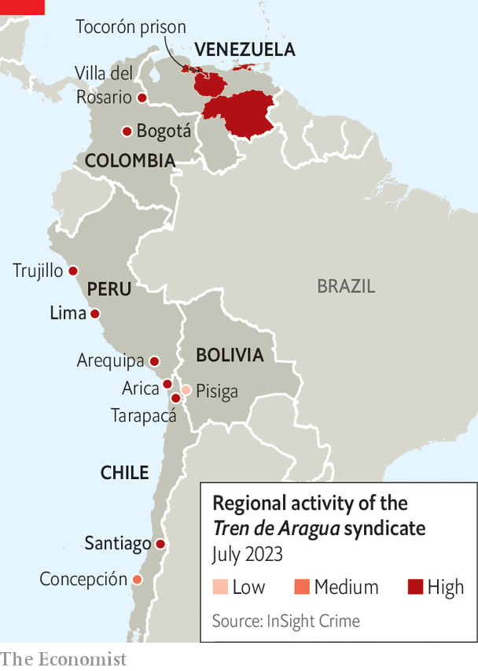

###### The exodus economy

# Latin America’s most powerful new gang built a human-trafficking empire 

##### It took advantage of millions of Venezuelan migrants 

 

> Nov 16th 2023 

By the time Venezuela’s army poured into Tocorón prison, on September 20th, its target had already escaped. For more than a decade Héctor Guerrero Flores, better known as Niño Guerrero, ran Tren de Aragua, the country’s largest gang, from his cell. Mr Guerrero left behind a prison with all the hallmarks of a narco-lair: restaurants and bars, a casino, a baseball ground and a small zoo. 

But Tren de Aragua is no drug gang. Its main earner is the movement of people. Mr Guerrero built his empire by exploiting many of the nearly 8m Venezuelans who left the country in the past decade, as hyperinflation and dictatorship took hold. The syndicate has industrialised human trafficking on a scale not seen before in South America, according to a recent report by InSight Crime, a think-tank in Washington, DC. It is active in six countries, with a network that stretches from the Caribbean to the Southern Cone.

 


The gang got its start in 2011 after the government handed over the policing of jails to inmates in exchange for a reduction of violence. Mr Guerrero took charge at Tocorón. His first revenue stream was a tax called , charging each prisoner a monthly “stipend”. Upon release, gang members started extorting from shops and jacking cars. By 2018 Tren de Aragua had taken control of illegal crossings at the border with Colombia. With thousands of Venezuelans leaving their country every day, the gang had found a new business. 

At first it merely charged smugglers a fee to shepherd their human cargo out of Venezuela. But when the pandemic closed borders in 2020 and those fees shot up, Tren de Aragua saw an opportunity. The gang set up its own smuggling operation, hiring buses, laying on food and booking accommodation. Within months they had bought their own transport companies and hostels, and were soon offering multi-leg, multi-country packages. A few dollars got you a journey into Colombia on foot. For $500 you would be driven across the continent to Chile. To facilitate all this, the gang started taking over border towns and bribing local officials.

Having control enabled the gang to get into a new, more lucrative industry: human trafficking. As clients, migrants only ever paid once, and for a service with big overheads and slim margins. As victims, they could be exploited indefinitely. Realising this, the gang spread into cities and savagely monopolised the sex trade. They murdered local pimps and any sex workers who refused to work for them, dumping dismembered corpses on street corners and spreading videos of the killings on social media. Would-be migrants became a pool of new forced prostitution. Thousands of young Venezuelan women were trafficked to Bogotá, Lima and Santiago. Most were promised jobs abroad. Others were tricked by “boyfriends” they had met online. Once they arrived, the women were told they owed the gang money, and forced to work in brothels and on webcam sites. 

Orders came direct from Tocorón, where Mr Guerrero ran Tren de Aragua like a multinational. He vertically integrated by controlling the migrants’ recruitment, transport and sexual exploitation. He dispatched managers to run foreign operations, rotating them to new countries when the police caught on. Those lieutenants were just as enterprising, says Ronna Rísquez, who published a book about Tren de Aragua this year. In Bolivia they chased efficiencies by forcing migrants to smuggle drugs. In Brazil they formed a partnership with First Capital Command, the country’s largest gang.

Neighbourhood thugs were impressed. Many joined Tren de Aragua, opening up a more diverse array of criminal activities, from loan-sharking to phone scams. Through them, Tren de Aragua’s ranks have swelled to 5,000 members, according to Ms Rísquez, making it one of the largest crime outfits in South America today.

The reasons for the army’s invasion of Tocorón are unclear. Tren de Aragua has run amok for years. The gang may have become an embarrassment for Nicolás Maduro, Venezuela’s dictator, souring relations with its neighbours. Negotiations with the United States on the removal of sanctions may be one plausible incentive for a showy clampdown. In the past two months the government has retaken six other criminal-controlled prisons, all without bloodshed.

It is likely that the assault on Tocorón was pre-negotiated, says Humberto Prado of the Venezuela Prisons Observatory, an NGO. “We counted 3,000 prisoners. They said they found 1,500. So where are the other 1,500?,” he asks. There was no shooting during the raid and only one (accidental) death. Inmates said Mr Guerrero and his men had moved out days earlier. Their whereabouts are a mystery. 

Mr Guerrero is being hunted by governments across South America, worried that he is hiding out in their country. Wherever he is, the gang leader must diversify fast. Tren de Aragua’s expansion was only possible because of the Venezuelan exodus, the largest in Latin America’s history. A quarter of the population has now left, leaving a smaller pool of emigrants on which the gang can prey. Those still moving are mostly headed to the United States, beyond the extent of the gang’s network. If Mr Guerrero is to survive the loss of his prison headquarters amid a pan-continental crackdown, it may well be with a less spectacular kind of criminality.■


