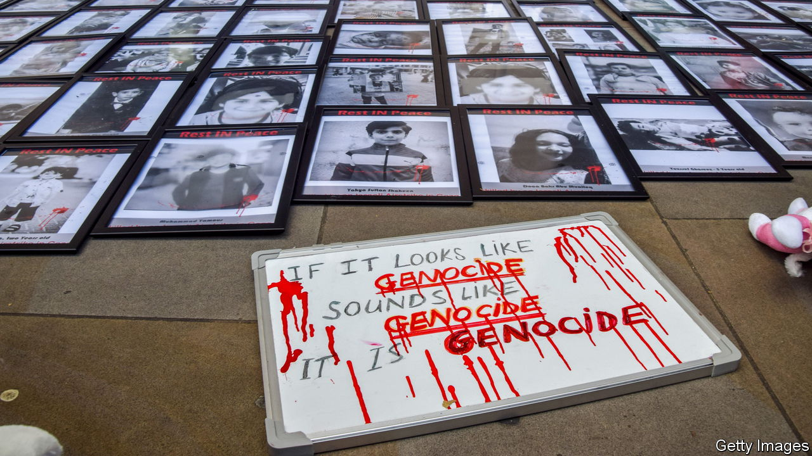

###### The Economist explains

# How the term “genocide” is misused in the Israel-Hamas war 

##### Accusations of the heinous crime abound 

 

> Nov 10th 2023 

MANY GOVERNMENTS and citizens are appalled by the civilian casualties from Israel’s bombardment and invasion of Gaza, which is its response to Hamas’s attack on Israel. On October 10th the Palestinian envoy to the UN, Riyad Mansour, described Israel’s actions as “nothing less than genocidal”. Iran and Iraq have also accused Israel of genocide. Politically, it is clear why Israel’s enemies should invoke the heinous crime. But the allegation has also been made by countries that have usually been friendly to Israel. Colombia, Honduras and South Africa have all withdrawn their ambassadors from Israel, accusing its government of committing “genocide”. 


Protesters and commentators in the West use the term too. “It is now clear that Israel is engaging in a genocide of the Palestinian people,” argued M. Muhannad Ayyash, a professor of sociology at Mount Royal University in Calgary, Canada. Craig Mokhiber, director of the New York office of the UN High Commissioner for Human Rights, wrote on October 28th that “This is a text-book case of genocide.” Israel has both denied genocide and accused Hamas of the crime. Gilad Erdan, Israel’s permanent representative to the UN, said on October 26th that “This is not a war with the Palestinians. Israel is at war with the genocidal Hamas terrorist organisation.” What exactly is genocide, and how, if at all, is the term applicable to the current conflict? 

In December 1948, in the aftermath of the second world war, the UN adopted the Convention on the Prevention and Punishment of the Crime of Genocide. The convention defines a genocide as acts intended “to destroy, in whole or in part, a national, ethnical, racial or religious group”. Contrary to the common understanding of the term, the UN says not only killing counts. “Deliberately inflicting on the group conditions of life calculated to bring about its physical destruction” does too, as does inflicting “serious bodily or mental harm”, “measures intended to prevent births”, and “forcibly transferring children of the group to another group”. Categorising atrocities as genocide has legal implications. The International Criminal Court is able to indict someone for the crime, for example. 


Interpretations of the convention differ because it is so broadly framed. So which atrocities constitute genocide? The systematic murder of 6m Jews by the Nazis was genocide. The organised butchery of perhaps 500,000 ethnic Tutsis by Hutu militias in Rwanda in 1994 was too. In both cases the intent, to destroy a people, was clear. Yet the case of Darfur, in Sudan, where about 300,000 people died in the years after fighting broke out there in 2003, is less clear. America called this a genocide. But in 2005 a UN commission concluded that Sudan’s government had “not pursued a policy of genocide” (although some individuals may have acted with “genocidal intent”). Donald Trump’s administration called the Chinese government’s treatment of the Uyghurs in Xinjiang a genocide but others disagreed. This newspaper concluded that China’s persecution of the Uyghurs was “horrific”, but not genocidal.


By the UN definition, Hamas is a genocidal organisation. Its founding charter, published in 1988, explicitly commits it to obliterating Israel. Article 7 states that “The Day of Judgment will not come about until Moslems fight Jews and kill them”. Article 13 rejects any compromise, or peace, until Israel is destroyed. Hamas fighters who burst into Israel on October 7th and killed more than 1,400 Israelis (and other nationalities) were carrying out the letter of their genocidal law. 

Israel, by contrast, does not meet the test of genocide. There is little evidence that Israel, like Hamas, “intends” to destroy an ethnic group—the Palestinians. Israel does want to destroy Hamas, a militant group, and is prepared to kill civilians in doing so. And while some Israeli extremists might want to eradicate the Palestinians, that is not a government policy. 

Neither do the Israelis display any obvious intent to prevent Palestinian births. But those who accuse it of genocide point to the large number of civilians killed, at least 10,000 so far, and claim its blockade of the strip meets the “conditions-of-life” criterion. The Israelis have clearly inflicted “serious bodily or mental harm” on the Palestinians. They have also displaced people from the north of the strip. If those people are not allowed to return, this could be considered a partial destruction of their territory or, as Jan Egeland, a former UN head of humanitarian and relief efforts, has warned, a forcible population transfer.

Even if an army’s actions do not pass the threshold of genocide, they can still be wrong. As the UN concluded during its report into Darfur, “crimes against humanity and war crimes that have been committed…may be no less serious and heinous than genocide”. ■

