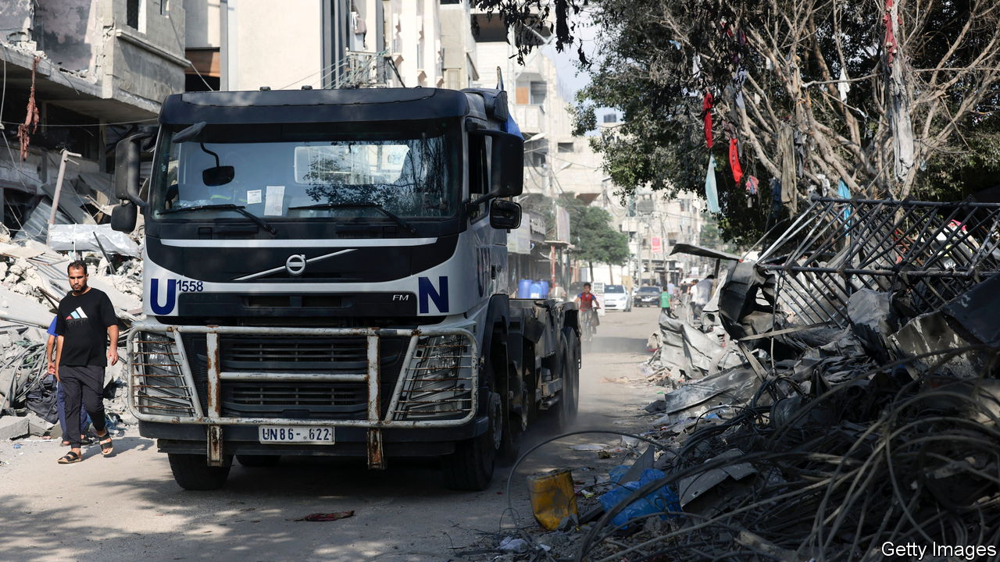

###### The Economist explains

# The difference between a “ceasefire” and a “humanitarian pause” 

##### And why it matters 

 

> Nov 14th 2023 

AS THE FIGHTING in the Gaza Strip between Israel and Hamas intensifies, so do the calls for a “ceasefire”—or a “humanitarian pause”. An emergency joint summit of the  and the Organisation of the Islamic Conference in Saudi Arabia on November 11th, for instance, called for the former. Two days later the 27 member states of the  reiterated their support for the latter.  will also only support pauses, as will the G7 group of rich countries. The UN, by contrast, has backed a ceasefire.  itself categorically rejects a ceasefire, but on November 9th agreed to implement daily four-hour “humanitarian pauses” in northern Gaza. So what is the difference between the two, and why does this divide countries and international organisations?

It is not just a matter of semantics. The phrases suggest different approaches to ending the conflict. The UN defines a “humanitarian pause” as a “temporary cessation of hostilities purely for humanitarian purposes”. Such pauses are usually limited to a defined period and to a specific area where the humanitarian activities are to be carried out. In the case of Gaza, the pause, which only applies to specific neighbourhoods in the north of the enclave, should allow civilians to evacuate from combat areas and permit the UN and NGOs to bring in supplies of food and water.

A ceasefire, by contrast, goes further. The UN defines it as a “suspension of fighting agreed upon by the parties to a conflict, typically as part of a political process”. The goal is to “allow parties to engage in dialogue, including the possibility of reaching a permanent political settlement”. It is thus a longer-term arrangement, in which both sides stop fighting, often in the entire area of the conflict.

To give two recent examples: at the start of the most recent Sudanese civil war in April, the UN negotiated “pauses” lasting a few hours to deliver desperately needed aid, on the clear understanding that the two sides would resume fighting immediately afterwards. The nationwide “ceasefire” in Yemen in April 2022, however, was agreed on very much as a prelude to political negotiations and subsequent prisoner swaps.

In the context of Gaza, calls for a “pause” or “ceasefire” have divergent political motivations. People who back Israel’s right to destroy Hamas after the militant group’s devastating assault on October 7th oppose a ceasefire at this point. Antony Blinken, America’s secretary of state, argues that it would “simply leave Hamas in place, able to regroup and repeat what it did”. Humanitarian pauses, however, will help to minimise civilian casualties and distress, while allowing Israel to continue its military assault. Meanwhile, those who support a ceasefire, such as many , usually accompany this with calls for Israel to lift its siege of Gaza and relaunch negotiations for a Palestinian state. Such an immediate ceasefire would give Hamas the opportunity to regroup and rebuild—something Israel and its backers firmly oppose. That goes some way towards explaining the fury of Israel’s leaders when France’s president, Emmanuel Macron, called for a ceasefire on November 12th.

As outrage mounts over civilian casualties in Gaza, some advocates of pauses are calling for them to be longer and to cover a wider area. Some, including the British government on November 14th, have proposed breaks of a few days during which Hamas would release hostages. But Israel fears that such longer pauses could, under enormous international pressure, become a de facto ceasefire.

Although long pauses could come to resemble a ceasefire, the two phrases remain rhetorical proxies used to differentiate between those who see Israel’s attacks on Gaza as self-defence and those who view them as Israeli aggression. In many countries the conflict has reopened old wounds. Take Britain’s Labour Party, which has recently striven to overcome a reputation for antisemitism. Its leader, , supports a pause, while some pro-Palestinian left-wingers, who demand a ceasefire, have resigned from their positions.  routinely deride supporters of a ceasefire as “pro-Hamas”; a vast majority of Democratic voters back a ceasefire. Advocates of pauses and ceasefires both speak the language of humanitarianism, but they mean very different things by it. ■

