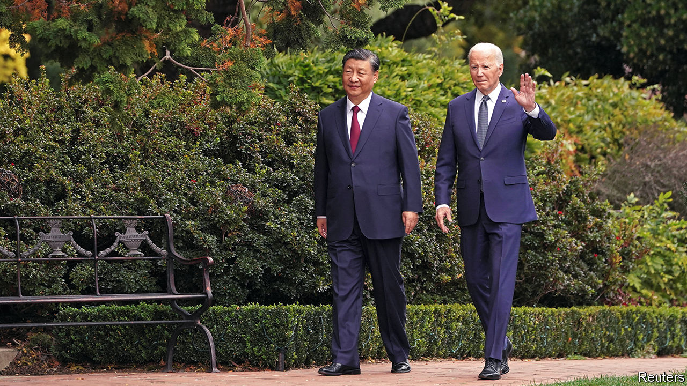

###### The world this week

# Politics 

#####  

 

> Nov 16th 2023 

 troops entered biggest hospital. Israel and America say that Hamas militants operate from tunnels underneath the buildings. So far small caches of arms have been found. Israel now has effective control in northern Gaza. In the south a  is escalating. Meanwhile Israel lowered the death toll of the number of people murdered by Hamas on October 7th from 1,400 to 1,200. The authorities are still identifying the remains of the deceased. 

America carried out fresh air strikes on facilities in eastern  that it says are being used by militias aligned with Iran to carry out drone attacks on American forces. American and coalition troops have been attacked at least 40 times in Syria and Iraq since early October, though there have been no casualties.

Josep Borrell, the European Union’s chief diplomat, warned of “another genocide” in  Darfur region after the paramilitary Rapid Support Forces and Arab militias murdered between 800 and 1,300 black Africans there.

A former doctor from  went on trial for his role in the genocide against Tutsis in 1994, 28 years after complaints were first laid against him in France in 1995. Sosthene Munyemana denies wrongdoing.

More than 100,000 people marched in Paris against . The demonstration brought together leaders from across the political spectrum, except the hard left, which boycotted the event. Similar marches took place in other French cities. In Washington 290,000 people took part in a March for Israel, according to the organisers, the largest pro-Israeli demonstration ever in America. 

He’s baaaack

Rishi Sunak, Britain’s prime minister, shocked pundits by bringing  back into government, appointing him foreign secretary and giving him a peerage. Lord Cameron led the country from 2010 to 2016, resigning after losing the fateful Brexit referendum. Because he sits in the House of Lords he cannot answer questions from MPs in the House of Commons. Some of those MPs have raised concerns about Lord Cameron’s past cosiness with China. 

As Lord Cameron was appointed foreign secretary, his predecessor, James Cleverly, was moved to the home office to replace , who was sacked. Ms Braverman had become a thorn in Mr Sunak’s side, most recently for her outspoken opposition to what she describes as “hate marches” in London in support of Palestine.

MPs in Parliament easily defeated a motion calling for a ceasefire in Gaza. However, 56 opposition MPs defied the instructions of their leader, Sir Keir Starmer, and voted for the amendment. Eight shadow ministers in the party quit their positions rather than be sacked by Sir Keir for rebelling. 

Britain’s Supreme Court ruled against the government’s policy of sending to Rwanda to be processed and settled there. The court decided there was a significant risk that they might be returned to unsafe countries. Mr Sunak said he would forge a treaty with Rwanda and introduce emergency legislation to bring the plan to fruition.

The German government’s plan for spending on  was in disarray, after the Constitutional Court ruled that shifting €60bn ($65bn) into an off-budget fund earmarked for the policies was unlawful. 

Huge protests, sometimes violent, took place across  against a plan by Pedro Sánchez, the prime minister, to offer an amnesty to separatists in Catalonia who organised an illegal referendum on independence in 2017. Mr Sánchez has forged a left-wing coalition to stay in power after an inconclusive election in July in which his Socialist party came second to the conservative People’s Party. The PP failed to form its own coalition, but wanted a new election, rather than “a dictatorship through the back door”. 

Germany’s defence minister, Boris Pistorius, admitted that the EU’s goal of providing  with 1m artillery shells by March next year will not be met. The commitment has been bogged down by bureaucracy and delays as EU countries pool their ammunition, rather than pledge the shells individually. Russia has sometimes fired up to 30,000 shells a day in the war; Ukraine launches about a quarter of that number. 

 prime minister accused  of channelling migrants over their border. Petteri Orpo said the migrants were being “escorted or transported” to the border, and that Finland would protect its territorial security.

 declared a state of emergency in anticipation of a volcanic eruption, which has been preceded by a series of earthquakes. The town of Grindavik, which lies 53km (33 miles) from Reykjavik, the capital, has been evacuated. 

 


 spoke for four hours at a retreat near San Francisco, only their second face-to-face meeting as leaders of America and China. They agreed to restore direct contacts between their armed forces. China also promised to help curb the flow of precursor chemicals to make fentanyl, a synthetic opioid that has killed tens of thousands of Americans.

 two main opposition parties, the Nationalist Party (KMT) and Taiwan People’s Party, agreed to field a single candidate in January’s presidential election. Both parties favour closer relations with China than the ruling Democratic Progressive Party. The DPP’s candidate, William Lai, the current vice-president, is leading the polls. 

 opened three new border crossings with Afghanistan to expedite the expulsion of  living in the country illegally. Pakistan blames Afghan migrants for a spate of terrorist attacks. More than 280,000 have left Pakistan since the order was announced in early October.

The buck stops here

 Supreme Court ruled that the country’s recent economic collapse was the fault of Gotabaya Rajapaksa, who was president from 2019 to 2022, his brother Mahinda, who was prime minister, and several former senior officials. The court held that they had violated the constitution with their “complete undermining of the rule of law”, a decision that could leave them open to lawsuits. 

America’s House of Representatives passed a bill that again postpones a , but only until early next year. The bill was supported by 209 Democrats and 127 Republicans; 93 Republicans opposed it. It was the first big test for the new speaker, Mike Johnson. His predecessor, Kevin McCarthy, was booted out of office amid bickering among Republicans about a similar bill. 

 announced that he won’t seek another term in the Senate, putting the slim Democratic majority at risk in next year’s election. Mr Manchin has represented West Virginia, an increasingly Republican state, for the Democrats since 2010, though he often scuttled Democratic bills by withholding his vote. 

Responding to allegations that two of its justices had not declared gifts they received, America’s  issued its first-ever official code of ethics, sort of, to clear up any “misunderstanding” about the rules. The document is largely “a codification of principles” that the court has long lived by, but said nothing about how the rules would be enforced. 

