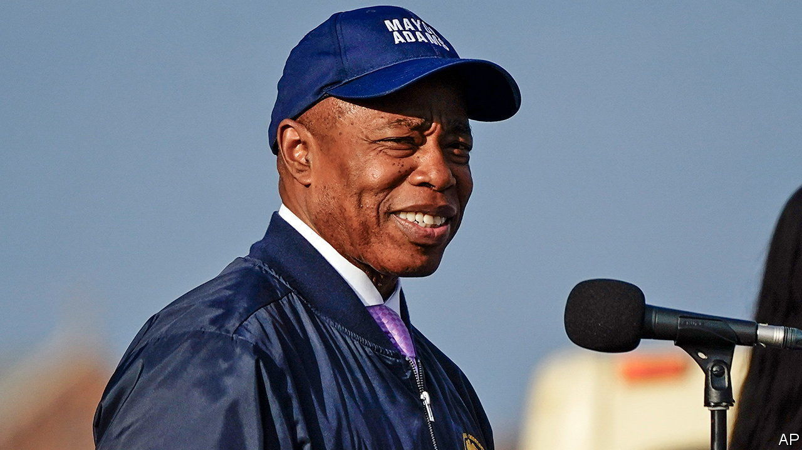

###### Mayor culpa?

# An FBI investigation raises questions about Eric Adams 

##### New York City is left wondering about Hizzoner’s honour 

 

> Nov 16th 2023 

“SOMETHING’S ALWAYS going to be going on in the city and you have to be focused, no distractions and grind,” said Eric Adams, New York City’s mayor, recently. That is no easy task at the best of times. It is especially hard to do while dodging questions about an alleged FBI investigation. 

The probe is reportedly looking into questionable donations made to Mr Adams’s 2021 mayoral campaign, including possible illegal foreign donations from people with ties to Turkey. During a press briefing on November 14th Mr Adams said: “We don’t do quid pro quo. We follow the law.” He is not accused of any wrongdoing.

New Yorkers first got wind that something was up on November 2nd, when FBI agents searched the home of Mr Adams’s top fund-raiser. That morning the mayor had landed in Washington, DC, to meet lawmakers and White House officials to discuss his city’s migrant crisis. For more than a year Mr Adams has called on the federal government to help the city cope with 130,000 refugees. Mr Adams abruptly cancelled his meetings and returned to New York. Then on November 10th the  revealed that the FBI had seized Mr Adams’s mobile devices. The FBI is also said to be looking into whether Mr Adams pressed the fire department to fast-track the opening of the new Turkish consulate, despite some unresolved safety issues. Mr Adams pooh-poohed any impropriety. 

New York City has strong campaign-finance laws. “They work because otherwise we would not know about these contributions,” says Susan Lerner of Common Cause, a watchdog. The Adams administration is not the first to be the subject of investigations. Back in 1932 Jimmy Walker, who also prided himself on promoting city nightlife, resigned amid corruption allegations. More recently, prosecutors looked at whether Bill de Blasio’s campaign tried to dodge contribution limits.

At the same press briefing Mr Adams warned that upcoming budget cuts would be steep because housing migrants is expensive. “It’s going to be extremely painful for New Yorkers, and that is why we continue to say we need help.” But it may be harder to stay focused and grind while the feds are sniffing around. ■


