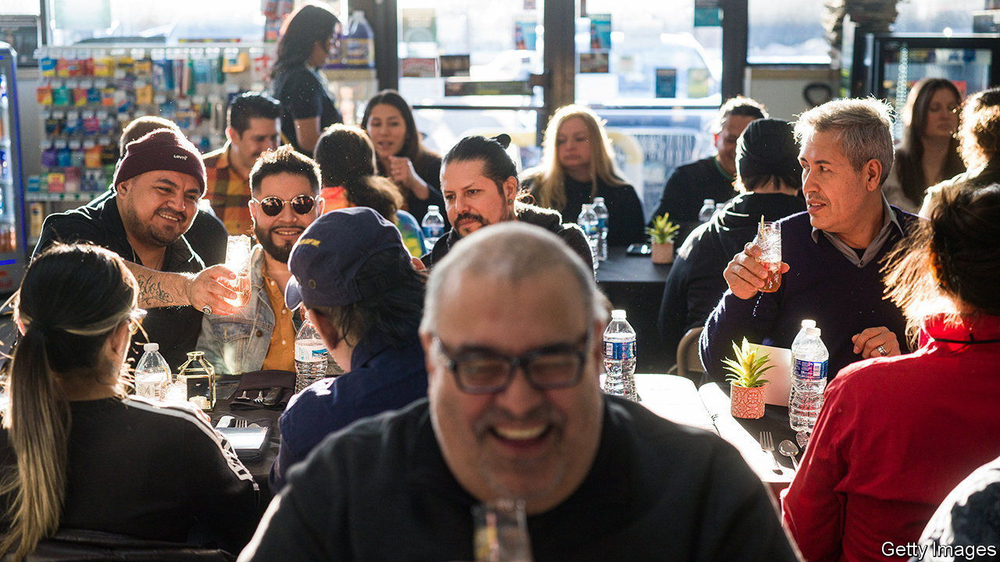

###### Sup on that

# Higher wages are spurring innovation in dinner 

##### Pop ups and supper clubs are booming in America 

 

> Nov 16th 2023 

Before the main course comes out on a Friday night, the diners are asked to pause for some entertainment. “I’m not one to just throw a dinner party with nothing,” says the host, and then a musician stands up and sings. The assembled guests, seated along two long tables, whoop. Each person attending has paid $90 for the meal, which consists of six courses plus paired wines and cocktails. The banquet is themed loosely around Shabbat, the Friday evening meal for observant Jews. The scene is not, however, at a fancy restaurant, but in an art gallery. Paintings depicting different foods line the walls. The host, Allan Weinberger, who is also the gallerist, notes which have already sold, and that the painter is among the crowd.

The meal at Mr Weinberger’s gallery was provided by TxaTxaClub, a business started in Chicago in 2021 by two restaurateurs, Liz Bendure and Daniel Parker. The two met working at an organic restaurant in Logan Square, the heart of Chicago’s hipster belt. But when the pandemic closed dining places, their lives were thrown into chaos. “We kind of lost everything,” says Ms Bendure. Starved of work, they started running supper clubs for a dozen or so people in their garden. Within a year they were serving larger crowds in “underused” spaces. Art galleries work well because they are empty at night, and the owners like to bring in punters with fancy taste. But they have also cooked in warehouses and at a furniture store.

The past few years have been tough for the restaurant industry. Last year there were roughly a tenth fewer eating places open in America than there were in 2019. Supper clubs and the like are thriving, however. Yelp, which runs a table-reservation website, says openings of “pop-up” restaurants (without permanent premises) more than doubled in the year to March. One reason why is simple: spending is back, but costs have soared. Wages in “food and drinking places’‘ have climbed by a third since 2020, according to the Bureau of Labour Statistics. In restaurants, says Mr Parker, “the financial always becomes the focus”. Staff must be paid all day long, even when tables are empty. A pop-up is far more efficient, and less risky. Just try not to damage the art.■


